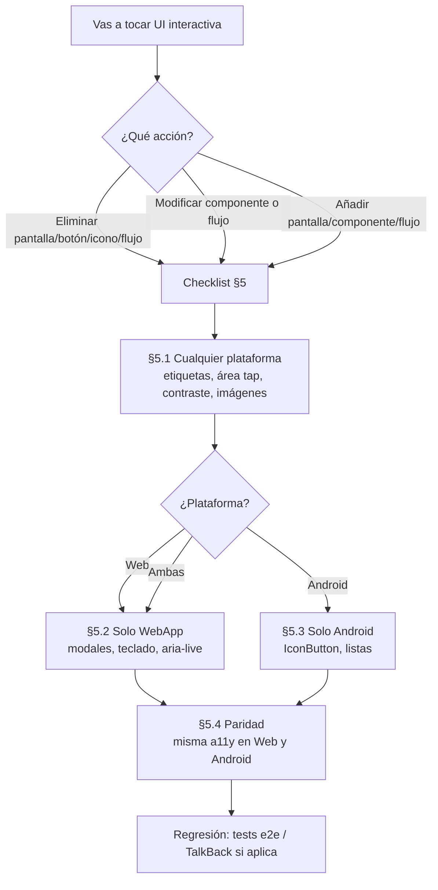

# Accesibilidad WebApp y Android — Revisión y guía operativa

**Estado:** vivo  
**Última actualización:** 2026-03-14  
**Ámbito:** WebApp (`webApp/`), Android (`app/`).

**Propósito:** Criterios mínimos de accesibilidad, revisión de lo cubierto en ambas plataformas, huecos detectados y **checklist obligatorio** al eliminar, modificar o añadir funcionalidades. Este documento es la única fuente de verdad para a11y; consultarlo siempre que se toquen pantallas, componentes interactivos o flujos de usuario.

---

## 1. Criterios mínimos (Web y Android)

### 1.1 Botones e iconos — descripción para lectores de pantalla

- **Web:** Todo botón o control que solo muestre un icono debe tener `aria-label` descriptivo (ej. "Cerrar", "Añadir entrada", "Buscar", "Notificaciones", "Volver").
- **Android:** Todo `Icon`, `IconButton` o `FloatingActionButton` que sea accionable debe tener `contentDescription` (ej. "Añadir entrada", "Buscar usuarios", "Notificaciones"). No usar `null` en iconos interactivos.

Paridad: mismo nivel de información para lectores de pantalla en ambas plataformas.

**Dónde revisar:** Navegación inferior (tabs), TopBar (atrás, favorito, notificaciones, búsqueda, menú), FAB y acciones primarias, listas con acciones (eliminar, editar, seguir), modales/sheets (cierre y acciones).

### 1.2 Tamaño de área de tap

- **Mínimo:** 44×44 px (Web) / 48 dp (Android). WCAG 2.5.5 recomienda al menos 44×44 CSS pixels.
- **Web:** Botones e iconos clicables con `min-width`/`min-height` 44px o padding que lo garantice.
- **Android:** `Modifier.size(48.dp)` para `IconButton` o `minimumInteractiveComponentSize()`. Chips y botones de texto con altura suficiente (p. ej. 48.dp).

Revisar en paralelo: equivalente en la otra plataforma no debe ser mucho menor (evitar 32.dp para acciones críticas en Android).

### 1.3 Contraste de texto

- **Estándar:** WCAG 2.1 nivel AA: 4.5:1 texto normal, 3:1 texto grande.
- **Modo día:** Texto oscuro sobre fondo claro (`#f7f7f7`, blanco); ej. `#1a120b`, `#3c2a21`.
- **Modo noche:** Texto claro sobre fondo oscuro (`#212121`, negro); blanco o gris claro (`#bdb7b2`) según jerarquía.
- **Tokens:** Seguir `docs/DESIGN_TOKENS.md` para colores de texto y que las combinaciones cumplan el ratio en ambos temas.

### 1.4 Resumen de criterios

| Criterio | Web | Android |
|----------|-----|---------|
| Iconos/botones sin texto con etiqueta | `aria-label` en controles interactivos | `contentDescription` en Icon/IconButton |
| Área de tap mínima | ≥ 44px (min-width/height o padding) | ≥ 48.dp (IconButton / minimumInteractiveComponentSize) |
| Contraste texto/fondo | WCAG AA (4.5:1 normal, 3:1 grande) día y noche | Mismo criterio con MaterialTheme y tokens |

---

## 2. Documentos de referencia

| Documento | Contenido |
|-----------|-----------|
| `webApp/docs/ACCESSIBILITY_AUDIT.md` | Auditoría WebApp (dialogs, aria-label, teclado, focus trap, tests e2e). |
| `docs/DESIGN_TOKENS.md` | Colores y contraste; asegurar que combinaciones cumplan ratio en día/noche. |

### 2.1 Páginas estáticas públicas (landing y legal)

Las rutas `/landing/` y `/legal/*.html` son **públicas** (acceso sin login). Cualquier HTML que se añada en `webApp/public/` con el mismo carácter público debe cumplir este checklist:

- **Estructura:** `lang="es"`, `<main id="main-content">`, enlace "Ir al contenido" (skip-link) que en foco sea visible.
- **Viewport:** Sin `user-scalable=no` (permitir zoom).
- **Controles:** Enlaces con `aria-label` si el texto no es suficiente (ej. "Volver al inicio"); área de tap ≥ 44px en el enlace Volver.
- **Contenido:** Encabezados jerárquicos (h1, h2, h3), `meta name="description"` para SEO y resumen.

Ver `webApp/public/landing/index.html` y `webApp/public/legal/*.html` como referencia.

---

## 3. Lo que ya está cubierto

### 3.1 WebApp

- **Modales y sheets:** `role="dialog"`, `aria-modal="true"`, `aria-label` en overlays (Auth, Notificaciones, Opciones lista, Editar lista, Eliminar lista, **Compartir lista (invitar usuarios)**, Opciones perfil, Eliminar cuenta, Editar stock, Tu opinión, Añadir a lista, etc.).
- **Navegación:** `nav` con `aria-label="Navegación principal"`; tabs con `aria-current="page"` y `aria-label`/`title` en rail.
- **TopBar:** Iconos con `aria-label` (Atrás, Buscar usuarios, Guardar, Volver, Notificaciones, Opciones de perfil, Añadir a listas, Añadir a stock, **Añadirme a esta lista** en listas públicas, etc.); chip de periodo con `role="group"` y botones con `aria-label`.
- **Contenido dinámico:** `aria-live="polite"` en sección principal y en fallbacks de carga ("Cargando...").
- **Focus:** Outline solo en `:focus-visible` (teclado); focus trap en sheets; cierre con Escape.
- **Imágenes:** La mayoría con `alt` descriptivo (nombre café, "Tu reseña", "Imagen reseña", "Logo Cafesito"); decorativas con `alt=""` y `aria-hidden="true"` donde corresponde.
- **Área de tap:** `buttons.css` y `features.css` con `min-width`/`min-height` 44px en icon-button y controles clave.
- **Notificaciones LIST_INVITE:** En `NotificationRow`, la invitación a lista tiene `role="group"` y `aria-label="Invitación a lista"`; botones "Rechazar" y "Añadir" con `aria-label` descriptivos; contenedor de acciones con clase `.notifications-list-invite-actions` (gap con tokens).
- **Tests e2e:** `accessibility-smoke.spec.ts` (botón principal por teclado), `modal-accessibility.spec.ts` (dialog auth, focus trap).

### 3.2 Android

- **Iconos y botones:** En muchas pantallas ya hay `contentDescription` (Timeline, Diary, AddDiaryEntry, Search, BrewLab, Detail, Notifications, Profile, Followers/Following, CompleteProfile, **ListDetailScreen** "Opciones de lista", **ShareListBottomSheet** avatares "Avatar de @username" e "Invitar", etc.).
- **Imágenes:** Cafés y avatares con descripción (nombre café, "Avatar de...", "Imagen del café", "Entrada de agua", etc.).
- **Área táctil:** Uso de `Modifier.size(48.dp)` o superior en IconButton; `minimumInteractiveComponentSize()` en DiaryScreen (selector de periodo) y en ProfileComponents (acción concreta).
- **Tema:** MaterialTheme y tokens para contraste (Design Tokens).

---

## 4. Huecos detectados (pendientes de cerrar)

### 4.1 Android — contentDescription = null (cerrado 2026-03-14)

Se sustituyeron todos los `contentDescription = null` en iconos e imágenes interactivas por descripciones útiles para TalkBack en: `ProfileComponents.kt` (avatares, listas, favoritos, opciones Editar/Eliminar), `ProfileScreen.kt` ("Actividad vacía"), `DiaryComponents.kt` ("Ver más", "Café"), `DetailScreen.kt` ("Nota"), `HistorialScreen.kt` ("Sin cafés terminados"), `CoffeeListItem.kt` ("Ver café"), `RecommendationCarousel.kt` ("Café").

**Regla:** No dejar `contentDescription = null` en ningún `Icon`, `IconButton` o `Image` que sea **interactivo** o que aporte información (iconos decorativos dentro de un control ya etiquetado pueden ser null si el padre tiene semántica).

### 4.2 Android — Área táctil (cerrado 2026-03-14)

- **SearchScreen.kt:** El `IconButton` "Limpiar" (búsquedas recientes) usa ahora `Modifier.minimumInteractiveComponentSize()` para área táctil ≥ 48 dp; el icono mantiene tamaño visual 24.dp.
- En futuros cambios, revisar que los IconButton de acciones críticas sigan teniendo al menos 48.dp de área efectiva.

### 4.3 WebApp — Posibles mejoras

- **Imágenes con `alt=""` sin contexto:** Algunas imágenes de café en listas usan `alt=""` (ej. `CafesProbadosView.tsx` thumb, `DiaryView.tsx` barista coffee img, `ProfileView.tsx` avatar/activity). Si la imagen es informativa (ej. café en una fila), valorar `alt={coffee.nombre}`; si es puramente decorativa junto a texto que ya nombra el café, `alt=""` es aceptable.
- **Botones sin aria-label:** Revisar que todo `<button>` que solo lleve icono o imagen tenga `aria-label` (ya cubierto en TopBar y navegación; verificar sheets y listas que se añadan).
- **Inputs:** Los inputs de búsqueda y formularios deben estar asociados a `<label>` o tener `aria-label`; en TopBar y búsqueda ya se usa `aria-label="Busqueda"` y similares.

### 4.4 Contraste y temas

- Revisar periódicamente al añadir nuevos estilos o temas que las combinaciones texto/fondo sigan cumpliendo WCAG AA (4.5:1 texto normal, 3:1 texto grande). Referencia: `docs/DESIGN_TOKENS.md` y sección 1.3 de este documento.

---

## 5. Checklist obligatorio (eliminar / modificar / nuevas funcionalidades)

### 5.0 Cuándo usar este checklist

Usar **siempre** que vayas a:

- Eliminar o modificar una pantalla, un botón, un icono o un flujo interactivo.
- Añadir una nueva pantalla, componente reutilizable o flujo.

### 5.1 Cualquier plataforma

- [ ] **Lectores de pantalla:** Todo control interactivo (botón, enlace, icono clicable) tiene etiqueta: **Web** `aria-label` o texto visible; **Android** `contentDescription` en Icon/IconButton/Image accionables. No usar `null` en iconos interactivos en Android.
- [ ] **Área de tap/clic:** Mínimo **44px (Web)** o **48 dp (Android)** para botones e iconos. Web: `min-width`/`min-height` 44px o padding que lo garantice; Android: `Modifier.size(48.dp)` en IconButton o `minimumInteractiveComponentSize()`.
- [ ] **Contraste:** Texto sobre fondo cumple WCAG AA (4.5:1 normal, 3:1 grande). Usar tokens de diseño; comprobar en modo día y noche.
- [ ] **Imágenes:** Informativas → alt/contentDescription descriptivo (ej. nombre del café); decorativas → `alt=""` / `contentDescription = null` solo si el elemento padre ya da contexto.

### 5.2 Solo WebApp

- [ ] **Modales/Sheets:** `role="dialog"`, `aria-modal="true"`, `aria-label` descriptivo. Focus trap (Tab/Shift+Tab dentro) y cierre con Escape.
- [ ] **Navegación por teclado:** Los controles principales son alcanzables con Tab; focus visible con `:focus-visible` (no solo `:focus`).
- [ ] **Contenido dinámico importante:** Mensajes de carga o error que deban anunciarse → `aria-live="polite"` o `role="alert"` según el caso.

### 5.3 Solo Android

- [ ] **IconButton / FAB:** Siempre `contentDescription`; área táctil ≥ 48.dp (IconButton por defecto ya la da; si usas `Modifier.size()` menor, combinar con `minimumInteractiveComponentSize()`).
- [ ] **Listas y cards:** Iconos de acción (editar, eliminar, favoritos, más opciones) con `contentDescription` que describa la acción ("Editar", "Eliminar", "Añadir a favoritos", "Opciones").

### 5.4 Paridad

- [ ] Si la funcionalidad existe en **ambas** plataformas, el mismo flujo debe ser **igual de accesible**: misma información para lectores de pantalla (etiquetas equivalentes) y tamaños de objetivo táctil/click comparables (44px vs 48 dp).

---

## 6. Regresión y tests

- **WebApp:** Mantener y ampliar cuando toques accesibilidad:
  - `webApp/e2e/accessibility-smoke.spec.ts` (acceso por teclado al botón principal).
  - `webApp/e2e/modal-accessibility.spec.ts` (dialog auth, focus trap).
- **Android:** No hay tests e2e de a11y en el repo; al añadir pantallas críticas, considerar pruebas manuales con TalkBack y comprobar que no se introduzcan `contentDescription = null` en controles interactivos.
- **Lint/analizadores:** En Web se puede valorar axe-core o eslint-plugin-jsx-a11y en CI; en Android, revisar que no queden contentDescription null en componentes interactivos (búsqueda en código antes de merge).

---

## 7. Resumen para el agente / desarrollador

- **Antes de eliminar** un botón, icono o pantalla: comprobar que no se rompe la única etiqueta accesible de ese control (por ejemplo, no quitar un `aria-label` o `contentDescription` sin mover la semántica a otro elemento).
- **Antes de modificar** un componente: aplicar el checklist de la sección 5; si se cambia el tamaño de un botón/icono, mantener ≥ 44px / 48 dp.
- **Al añadir** una nueva funcionalidad: cumplir todo el checklist 5.1–5.4 según plataforma; documentar aquí cualquier excepción acordada (con justificación).
- **Documentos complementarios:** `webApp/docs/ACCESSIBILITY_AUDIT.md` (auditoría Web), `docs/DESIGN_TOKENS.md` (colores y contraste). Este doc es la fuente de verdad única para criterios y checklist a11y.
