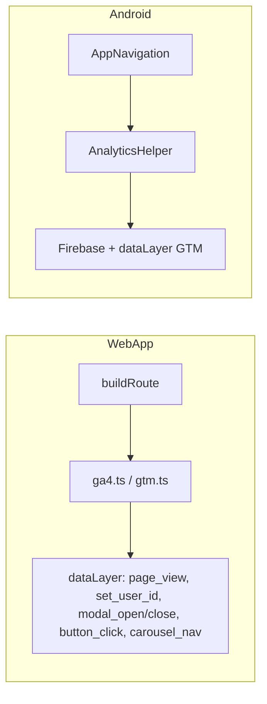

# Analíticas — Fuente de verdad

**Estado:** vivo  
**Última actualización:** 2026-03  
**Propósito:** Documentación única de analíticas (GA4, GTM, WebApp y Android): qué se recoge, dónde está el código, cómo configurar GTM y GA4, y checklist al cambiar funcionalidad.

Consultar **siempre** este documento antes de eliminar o modificar pantallas/rutas/flujos, o al añadir nuevas acciones relevantes para producto.

---

## 1. Resumen y mapa de documentación

| Qué | Dónde |
|-----|--------|
| **Este documento** | Flujo de datos, resumen por plataforma, configuración GA4, checklists, **audiencias/conversiones/segmentos** (§11) y eventos sugeridos (§10). |
| **Configuración GTM paso a paso** | [docs/gtm/GUIA_PASO_A_PASO_WEB.md](gtm/GUIA_PASO_A_PASO_WEB.md) (Web), [docs/gtm/GUIA_PASO_A_PASO_ANDROID.md](gtm/GUIA_PASO_A_PASO_ANDROID.md) (Android). |
| **Referencia de contenedores** | [docs/gtm/CONTAINER_REFERENCE_WEB.md](gtm/CONTAINER_REFERENCE_WEB.md), [docs/gtm/CONTAINER_REFERENCE_ANDROID.md](gtm/CONTAINER_REFERENCE_ANDROID.md) — variables, disparadores, etiquetas, valores de `modal_id` y `button_id`. |
| **Carpeta GTM** | [docs/gtm/README.md](gtm/README.md) — índice de la carpeta, export/import de contenedores. |

**Contenedores:** Web **GTM-WLXN93VK** · Android **GTM-T9WDBCBR** · GA4 **G-BMZEQNRKR4**

---

## 2. Flujo de datos



Con GTM activo, ambos envían al **mismo GA4** (User-ID unificado, user property `platform` para segmentar).

---

## 3. Resumen por plataforma

| Qué | WebApp | Android |
|-----|--------|---------|
| **Producto** | GA4 vía GTM (contenedor `VITE_GTM_CONTAINER_ID`); no se usa gtag directo | Firebase Analytics + dataLayer GTM si `GTM_CONTAINER_ID` |
| **Vistas** | `page_view` (`page_path`, `page_title`, `page_location`); GTM puede enviar además `screen_view` para paridad | `screen_view` (`screen_name`, `screen_class`) |
| **Eventos custom** | `set_user_id`, `modal_open`, `modal_close`, `button_click`, `carousel_nav` (vía dataLayer) | Los mismos + `login_success`, `profile_completed`, `notification_action_*` |
| **Usuario** | `setGa4UserId(id)` → evento `set_user_id` en dataLayer (GTM envía a GA4) | `setUserId(id)` + push `set_user_id` al dataLayer |
| **Plataforma** | User property `platform` = `"web"` | User property `platform` = `"android"` |
| **PWA** | `?pwa=1` en `page_path` y `page_location` | N/A |

Listas completas de `modal_id` y `button_id`: [CONTAINER_REFERENCE_WEB.md](gtm/CONTAINER_REFERENCE_WEB.md) y [CONTAINER_REFERENCE_ANDROID.md](gtm/CONTAINER_REFERENCE_ANDROID.md).

---

## 4. Configuración GA4 (Admin)

- **User-ID:** Admin → Recogida de datos → Recogida de User-ID activada para que el mismo usuario se reconozca desde web y Android.
- **Plataforma:** Crear en GA4 una **dimensión personalizada de ámbito usuario** para la user property `platform` (segmentar informes y audiencias).
- **Vinculación Firebase ↔ GA4:** Los eventos de la app Android llegan a la misma propiedad GA4 que la web.
- **Eventos:** No es necesario crear los eventos en GA4 de antemano. Cualquier evento que GTM envíe a la propiedad se registra automáticamente. En GA4 solo se configura opcionalmente: marcar algunos como conversión, dimensiones personalizadas para parámetros, o eventos personalizados derivados (para audiencias e informes).

---

## 5. GTM: variables de entorno y contenedores

| Plataforma | Variable | Contenedor |
|------------|----------|------------|
| WebApp | `VITE_GTM_CONTAINER_ID` (ej. en `.env`) | GTM-WLXN93VK |
| Android | `GTM_CONTAINER_ID` (Gradle / `gradle.properties`) | GTM-T9WDBCBR |

**Configurar los contenedores:** seguir las guías paso a paso en [docs/gtm/](gtm/) (variables, disparadores, etiquetas). No es necesario importar JSON en Android; se configura a mano según las guías.

**Android — cargar el contenedor en la app:** Para que el contenedor móvil procese el dataLayer, hay que cargar el contenedor publicado (p. ej. descargar desde GTM, colocar en `app/src/main/res/raw/` y llamar a `TagManager.getInstance(context).loadContainerPreferNonDefault(BuildConfig.GTM_CONTAINER_ID, R.raw.gtm_container)` en el arranque de la app). Si no se carga, los eventos siguen yendo a Firebase pero GTM no los procesa.

**Cookie consent (WebApp):** El envío a GA4/GTM en la WebApp depende del consentimiento del usuario. La primera vez que accede se muestra un banner con "Solo esenciales" y "Aceptar todas". Si elige **Solo esenciales**, no se carga el snippet de GTM ni se envían analíticas. Si elige **Aceptar todas**, se carga GTM y se envían todos los eventos. La decisión se guarda en `localStorage` (`cafesito_cookie_consent`) y no se vuelve a mostrar el banner. Código: `webApp/src/core/consent.ts` (getConsent/setConsent/canLoadAnalytics), `webApp/src/features/consent/CookieConsentBanner.tsx`; `main.tsx` solo llama a `initGa4()` cuando `getConsent() === 'all'`; `ga4.ts` comprueba `canLoadAnalytics()` antes de enviar cualquier evento.

---

## 6. Paridad Web / Android en GA4

Con la etiqueta **GA4 - screen_view** en el contenedor Web (ver [GUIA_PASO_A_PASO_WEB.md](gtm/GUIA_PASO_A_PASO_WEB.md) paso 3.2b), GA4 recibe los **mismos nombres de evento y parámetros** desde ambas plataformas:

| Concepto | Android | Web (vía GTM) |
|----------|---------|----------------|
| Navegación | `screen_view` + `screen_name`, `screen_class` | `screen_view` (etiqueta en `page_view`) + `screen_name` normalizado (mismo valor que Android: p. ej. "detail", "profile/list"), `screen_class` = page_title |
| Usuario | `set_user_id` + `user_id` | Igual |
| Modales / botones / carrusel | `modal_open`, `modal_close`, `button_click`, `carousel_nav` + mismos parámetros | Igual |

Detalle en [CONTAINER_REFERENCE_WEB.md §4](gtm/CONTAINER_REFERENCE_WEB.md).

---

## 7. Dónde está el código

| Plataforma | Inicialización | Vistas | Eventos | Usuario |
|------------|----------------|--------|---------|--------|
| WebApp | `main.tsx` → `initGa4()` solo si consent = "all"; `ga4.ts`, `gtm.ts`, `consent.ts` | `AppContainer.tsx` → `sendPageView()` | `sendEvent()` en componentes; `gtm.ts` `pushEvent()` | `setGa4UserId()` en `AppContainer` |
| WebApp estáticas | — | GTM snippet en HTML + `dataLayer.push({ event: 'page_view', ... })` en cada página (landing, legal) | — | — |
| Android | `AnalyticsModule.kt` (Firebase) | `AppNavigation.kt` → `trackScreenView(currentRoute)` | `AnalyticsHelper.trackEvent()` en pantallas | `AppSessionCoordinator` → `setUserId`; `AnalyticsHelper.setUserId()` |

**Rutas (page_path) y screen_name Web:** Definidas en `webApp/src/core/routing.ts` (`buildRoute`, `normalizePathToScreenName`). El `page_view` enviado por `gtm.ts` incluye `screen_name` normalizado para la etiqueta GA4 - screen_view. Tabla de rutas en §8.

---

## 8. Rutas (page_path) Web y pantallas Android

**Web — `page_path` y `screen_name`:** La WebApp envía `page_path` completo (p. ej. `/coffee/achicoria-expres/`) y además **`screen_name` normalizado** en el mismo evento `page_view` del dataLayer, para paridad con Android. La normalización está en `webApp/src/core/routing.ts` (`normalizePathToScreenName`). En GTM Web la etiqueta **GA4 - screen_view** debe usar la variable **DLV - screen_name** (no `page_path`) como `screen_name`. Valores típicos de `screen_name`: `home`, `search`, `search/users`, `brewlab`, `diary`, `diary/cafes-probados`, `profile`, `detail`, `profile/favorites`, `profile/list`, `profile/list/options`, `historial`, etc.

**Android — `screen_name`:** Se envía la ruta **normalizada** (sin placeholders tipo `{coffeeId}`), para que en GA4 aparezca p. ej. `detail`, `profile/list`, y no `detail/{coffeeId}`. La normalización se hace en `AppNavigation.kt` (`normalizeRouteForAnalytics`). Mismos valores típicos que Web (paridad).

Al **añadir o quitar** una pantalla o ruta, actualizar `buildRoute`/`parseRoute` (web) o el composable en `AppNavigation.kt` (Android) y, si aplica, este documento o las referencias en `docs/gtm/`.

---

## 9. Checklist: eliminar, modificar o añadir funcionalidad

### 9.1 Al eliminar una pantalla o flujo

- [ ] **WebApp:** Ajustar `buildRoute()` / `parseRoute()` en `routing.ts` y el efecto de `sendPageView` en `AppContainer.tsx`.
- [ ] **Android:** Quitar el `composable()` en `AppNavigation.kt`.
- [ ] Si esa pantalla era la única que disparaba un evento, actualizar este doc y/o las referencias en `docs/gtm/`.
- [ ] **GTM:** Revisar disparadores/etiquetas que dependan de `page_path` o `screen_name` y ajustar condiciones.

### 9.2 Al modificar rutas o nombres

- [ ] **WebApp:** Actualizar `buildRoute()` y `parseRoute()`; revisar títulos en `AppContainer.tsx`.
- [ ] **Android:** Cualquier cambio en el `route` del composable cambia el `screen_name` enviado.
- [ ] **GTM/GA4:** Actualizar condiciones que usen `page_path` o `screen_name`.

### 9.3 Al añadir una nueva pantalla o pestaña

- [ ] **WebApp:** Añadir ruta en `routing.ts` y título en el efecto de GA en `AppContainer.tsx`.
- [ ] **Android:** Añadir `composable(route = "...")` en `AppNavigation.kt`.
- [ ] Actualizar este documento o las referencias en `docs/gtm/` con la nueva ruta/pantalla.
- [ ] **GTM (opcional):** Crear o ajustar etiquetas/disparadores si se desea evento o audiencia específica.

### 9.4 Al añadir un evento de analíticas

- [ ] **Android:** `analyticsHelper.trackEvent("nombre_evento", bundleOf(...))`; documentar en [CONTAINER_REFERENCE_ANDROID.md](gtm/CONTAINER_REFERENCE_ANDROID.md).
- [ ] **WebApp:** `sendEvent("nombre_evento", { param: "valor" })` desde `ga4.ts` (dataLayer); documentar en [CONTAINER_REFERENCE_WEB.md](gtm/CONTAINER_REFERENCE_WEB.md).
- [ ] **GTM:** Añadir variable (si aplica), disparador y etiqueta GA4 según la guía paso a paso del contenedor correspondiente.

### 9.5 Al publicar o cambiar el contenedor GTM

- [ ] **Web:** Vista previa GTM; comprobar que `page_view`, `set_user_id` y eventos custom se disparan y las variables se rellenan.
- [ ] **Android:** Verificar que los pushes al dataLayer lleguen; si se publica nueva versión del contenedor, probar etiquetas.
- [ ] **GA4:** Vista de depuración para confirmar eventos y `user_id` desde web y/o app.

---

## 10. Eventos y audiencias sugeridos en GA4

Los eventos que envía GTM (`page_view`, `screen_view`, `modal_open`, `button_click`, etc.) **llegan a GA4 sin tener que crearlos antes** en la interfaz de GA4. Lo siguiente es opcional:

- **Conversiones:** En Admin → Eventos, marcar como conversión los que interesen (p. ej. `login_success`, `profile_completed`). Ver §11.2.
- **Eventos personalizados derivados (opcional):** Crear en GA4 eventos basados en condiciones (ej. “Vista detalle café” cuando `page_path` contiene `/coffee/` o `screen_name` contiene `detail/`), útiles para audiencias e informes. Para unificar web y app, definir condición para cada plataforma y en audiencias combinar con “o”.
- **Audiencias:** Usuarios Web (`platform` = `web`), Usuarios Android (`platform` = `android`), Usuarios PWA (`page_path` contiene `pwa=1`), “Vieron detalle café”, “Usan Elabora”, “Usan diario”, “Completaron perfil”, “Multiplataforma”. Detalle en §11.3 y en [CONTAINER_REFERENCE_WEB.md](gtm/CONTAINER_REFERENCE_WEB.md).

---

## 11. Recomendaciones de configuración en GA4 (audiencias, conversiones, segmentos)

Configuraciones concretas recomendadas en **GA4 > Admin** y **Exploración** para sacar partido a los datos que ya envía la app.

### 11.1 Dimensiones personalizadas (obligatorio para segmentar)

| Dónde | Qué crear | Uso |
|-------|------------|-----|
| **Admin → Definiciones personalizadas → Crear dimensión personalizada** | **Ámbito:** Usuario · **Nombre:** Plataforma · **Propiedad de usuario:** `platform` | Segmentar informes y audiencias por web vs Android. Sin esto, no podrás filtrar por “solo app” o “solo web”. |

### 11.2 Marcar eventos como conversión

En **Admin → Eventos**, marcar como **conversión** los que quieras usar en objetivos y comparativas:

| Evento | Recomendación | Motivo |
|--------|----------------|--------|
| `login_success` | Sí | Onboarding / registro. |
| `profile_completed` | Sí | Perfil completado. |
| `button_click` (filtrar por `button_id` = `brew_save_to_diary`) | Opcional | “Guardó una elaboración en el diario” como conversión de uso. |
| `screen_view` / `page_view` | No como conversión global | Usar mejor eventos personalizados derivados (vista detalle café, etc.) si quieres conversiones por pantalla. |

### 11.3 Audiencias recomendadas (GA4 > Admin > Audiencias)

Crear con **Condición de pertenencia a la audiencia**; periodo típico 30–90 días según uso.

| Audiencia | Condición (resumen) | Uso |
|-----------|----------------------|-----|
| **Usuarios Web** | User property `platform` = `web` | Solo tráfico web. |
| **Usuarios Android** | User property `platform` = `android` | Solo tráfico app. |
| **Usuarios PWA** | Evento `page_view` con parámetro `page_path` que contiene `pwa=1` | Web instalada como app. |
| **Vieron detalle café** | Usuario que generó evento `screen_view` con `screen_name` que contiene `detail/` **o** evento `page_view` con `page_path` que contiene `/coffee/` | Interés en ficha de café (web + app). |
| **Usan Elabora (Brew Lab)** | `screen_view` con `screen_name` que contiene `brewlab` **o** `page_view` con `page_path` que contiene `/brewlab` | Uso de elaboración. |
| **Usan diario** | `screen_view` con `screen_name` que empieza por `diary` **o** `page_view` con `page_path` que contiene `/diary` | Engagement con el diario. |
| **Completaron perfil** | Usuario que generó evento `profile_completed` | Onboarding completado. |
| **Login en últimos 30 días** | Usuario que generó evento `login_success` | Actividad reciente. |
| **Multiplataforma** | Incluir usuarios que en el periodo tengan al menos 1 evento con `platform` = `web` **y** al menos 1 con `platform` = `android` | Usan web y app. |
| **Inactivos 7 días** | Excluir usuarios con cualquier evento en los últimos 7 días | Reactivación. |

### 11.4 Segmentos en Exploración

En **Exploración** (Informes o Exploración), usar como **segmento**:

- **Comparar:** “Usuarios Web” vs “Usuarios Android” para ver diferencias de uso.
- **Embudo:** Secuencia `screen_view`/`page_view` → `brewlab` → `button_click` (brew_save_to_diary) para “empezaron elaboración y guardaron”.
- **Segmento por evento:** Usuarios que generaron `modal_open` con `modal_id` = `add_to_list` (añadieron a listas).

### 11.5 Comprobaciones tras configurar

- [ ] **Vista de depuración (DebugView):** Ver que llegan `screen_view`, `page_view`, `set_user_id`, `modal_open`, `modal_close`, `button_click` con los parámetros esperados desde web y Android.
- [ ] **Informes en tiempo real:** Filtrar por dimensión “Plataforma” (una vez creada) y comprobar que se ven sesiones web y app.
- [ ] **Audiencias:** Tras 24–48 h con tráfico, comprobar en Admin > Audiencias que las nuevas audiencias empiezan a tener “Usuarios en la audiencia” (puede tardar según volumen).

---

## 12. Referencia rápida de archivos

| Plataforma | Archivo | Uso |
|------------|---------|-----|
| WebApp | `webApp/src/core/gtm.ts` | `initGtm()`, `pushPageView()`, `pushUserId()`, `pushEvent()`. |
| WebApp | `webApp/src/core/ga4.ts` | `initGa4()` (inicializa GTM), `sendPageView()`, `setGa4UserId()`, `sendEvent()` (todos vía dataLayer; GA4 se configura en GTM). |
| WebApp | `webApp/src/app/AppContainer.tsx` | `sendPageView(gaPagePath, pageTitle)`, `setGa4UserId()`. |
| Android | `app/.../analytics/AnalyticsHelper.kt` | `trackScreenView()`, `trackEvent()`, `setUserId()`, push al dataLayer GTM. |
| Android | `app/.../navigation/AppNavigation.kt` | `trackScreenView(currentRoute)`, `onTrackEvent` en pantallas. |

---

## 13. Direct Share — Logging backend y dashboard base

Además de GA4/GTM, se recomienda persistir `share_*` en Supabase para auditoría y métricas internas.

### 13.1 Script SQL (backend)

- Script: `docs/supabase/direct_share_event_logging.sql`
- Crea:
  - tabla `public.share_event_logs`
  - índices por `created_at`, `event_name`, `platform`, `user_id`
  - RPC `public.log_share_event(...)`
- Eventos soportados:
  - `share_opened`
  - `share_target_shown`
  - `share_target_clicked`
  - `share_completed`
  - `share_failed`

### 13.2 KPIs mínimos (dashboard)

- **Aperturas de share**: total de `share_opened`.
- **Tasa de éxito**: `share_completed / share_opened`.
- **Tasa de fallo**: `share_failed / share_opened`.
- **CTR destinos directos**: `share_target_clicked / share_target_shown`.
- **Rendimiento por plataforma**: comparación `android` vs `web`.
- **Top pantallas origen**: `origin_screen` con más `share_opened`.

### 13.3 Queries base (Supabase SQL Editor)

```sql
-- 1) Embudo diario (últimos 30 días)
select
  date_trunc('day', created_at) as day,
  count(*) filter (where event_name = 'share_opened') as opened,
  count(*) filter (where event_name = 'share_target_shown') as target_shown,
  count(*) filter (where event_name = 'share_target_clicked') as target_clicked,
  count(*) filter (where event_name = 'share_completed') as completed,
  count(*) filter (where event_name = 'share_failed') as failed
from public.share_event_logs
where created_at >= now() - interval '30 days'
group by 1
order by 1;
```

```sql
-- 2) Conversión por plataforma (últimos 30 días)
with base as (
  select
    platform,
    count(*) filter (where event_name = 'share_opened') as opened,
    count(*) filter (where event_name = 'share_completed') as completed,
    count(*) filter (where event_name = 'share_failed') as failed
  from public.share_event_logs
  where created_at >= now() - interval '30 days'
  group by platform
)
select
  platform,
  opened,
  completed,
  failed,
  round((completed::numeric / nullif(opened, 0)) * 100, 2) as success_rate_pct,
  round((failed::numeric / nullif(opened, 0)) * 100, 2) as fail_rate_pct
from base
order by platform;
```

```sql
-- 3) Top origen de share (últimos 30 días)
select
  coalesce(origin_screen, 'unknown') as origin_screen,
  count(*) filter (where event_name = 'share_opened') as opened,
  count(*) filter (where event_name = 'share_completed') as completed
from public.share_event_logs
where created_at >= now() - interval '30 days'
group by 1
order by opened desc
limit 20;
```

```sql
-- 4) CTR de destinos directos (últimos 30 días)
with c as (
  select
    count(*) filter (where event_name = 'share_target_shown') as shown,
    count(*) filter (where event_name = 'share_target_clicked') as clicked
  from public.share_event_logs
  where created_at >= now() - interval '30 days'
)
select
  shown,
  clicked,
  round((clicked::numeric / nullif(shown, 0)) * 100, 2) as ctr_pct
from c;
```

```sql
-- 5) Verificación rápida Android/Web (últimas 24h)
select
  platform,
  event_name,
  count(*) as total
from public.share_event_logs
where created_at >= now() - interval '24 hours'
group by platform, event_name
order by platform, event_name;
```

### 13.4 Checklist de activación

- [ ] Ejecutar `docs/supabase/direct_share_event_logging.sql` en Supabase.
- [x] Confirmar llamadas a `log_share_event(...)` en Android/WebApp o Edge Function.
- [x] Verificar llegada de eventos en `public.share_event_logs`.
- [ ] Construir panel inicial con las queries de §13.3.
- [ ] Revisar retención y privacidad de datos (`metadata`) trimestralmente.

---

**Mantener este documento** como única fuente de verdad: al cambiar pantallas, rutas o eventos, actualizar aquí y, cuando corresponda, en [docs/gtm/](gtm/).
