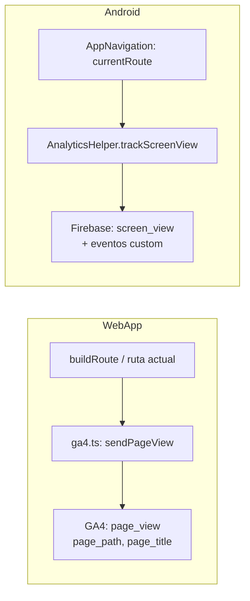
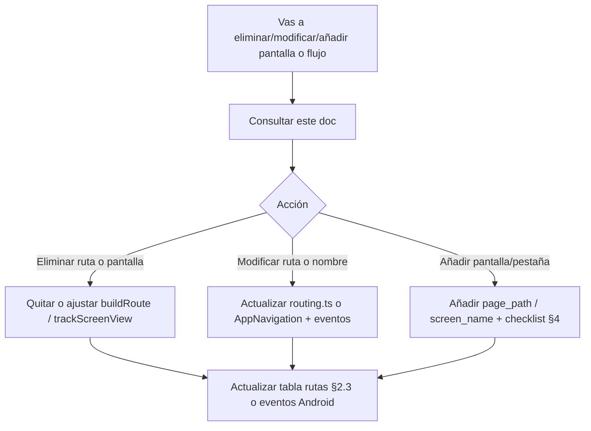

# Analíticas: WebApp y Android

**Estado:** vivo  
**Última actualización:** 2026-03-04  
**Propósito:** Documentar qué se recoge en cada plataforma, dónde está el código y qué hacer al eliminar, modificar o añadir funcionalidades para no perder trazabilidad ni romper analíticas.

**Consultar siempre este documento** antes de:
- Eliminar una pantalla, ruta o flujo.
- Modificar rutas, nombres de pestañas o flujos de login/perfil/notificaciones.
- Añadir una nueva pantalla, pestaña o acción relevante para producto.

---

## Esquema: flujo de datos de analíticas

### Workflow: al eliminar / modificar / añadir funcionalidad

---

## 1. Resumen por plataforma

| Qué | WebApp | Android |
|-----|--------|---------|
| **Producto** | Google Analytics 4 (GA4) | Firebase Analytics |
| **Vistas/pantallas** | `page_view` con `page_path` y `page_title` | `screen_view` con `screen_name` = ruta actual |
| **Eventos custom** | No (solo page_view) | Sí: login_success, profile_completed, notification_action_* |
| **Usuario** | No se envía userId a GA desde web (opcional vía GA4 config) | `setUserId` al autenticar / null al cerrar sesión |
| **PWA** | `?pwa=1` en page_path y page_location para segmentar | N/A |

---

## 2. WebApp (GA4)

### 2.1 Dónde está el código

| Archivo | Uso |
|---------|-----|
| `webApp/src/core/ga4.ts` | Inicialización (`initGa4`), envío de `page_view` (`sendPageView`), detección PWA y parámetro `pwa=1`. |
| `webApp/src/main.tsx` | Llama a `initGa4()` al arranque (solo si hay red). |
| `webApp/src/app/AppContainer.tsx` | Calcula `gaPagePath` con `buildRoute(...)` y llama a `sendPageView(gaPagePath, pageTitle)` en un `useEffect` cuando cambia la ruta. |

### 2.2 Qué se envía

- **Evento:** `page_view` (evento estándar GA4).
- **Parámetros:** `page_location` (origin + pathname del navegador), `page_path` (path lógico construido por `buildRoute`), `page_title` (ej. "Cafesito - Diario").
- **PWA:** Si la app se ejecuta en modo standalone (añadida al escritorio), se añade `?pwa=1` a `page_path` y `page_location` para segmentar en GA4.

### 2.3 Rutas (page_path) que se envían

Definidas por `buildRoute()` en `webApp/src/core/routing.ts`:

| Tab / contexto | page_path enviado |
|----------------|-------------------|
| Inicio | `/home` |
| Explorar cafés | `/search` |
| Explorar usuarios | `/search/users` |
| Elabora | `/brewlab` |
| Diario | `/diary` |
| Diario → Cafés probados | `/diary/cafes-probados` |
| Perfil propio | `/profile` |
| Perfil de otro | `/profile/{username}` |
| Perfil → Historial | `/profile/historial` o `/profile/{username}/historial` |
| Perfil → Seguidores/Siguiendo/Favoritos/Lista | `/profile/.../followers`, `.../following`, `.../favorites`, `/profile/list/{id}` |
| Detalle café | `/coffee/{slug}/` |

**Importante:** Si añades o quitas un `TabId` o una subruta (ej. nueva pestaña o nueva vista dentro de diario/perfil), hay que actualizar `buildRoute()` y, si aplica, el `useEffect` de GA en `AppContainer.tsx` para que el `page_title` siga siendo correcto.

### 2.4 Lo que NO se recoge en WebApp

- No se envían eventos custom (login, completar perfil, clics en notificaciones, compartir, añadir a diario, etc.). Solo vistas de página.
- No se usa `setUserId` desde el código actual (GA4 puede tener usuario por cookie/sesión).

---

## 3. Android (Firebase Analytics)

### 3.1 Dónde está el código

| Archivo | Uso |
|---------|-----|
| `app/src/main/java/com/cafesito/app/analytics/AnalyticsHelper.kt` | `trackScreenView(screenName)`, `trackEvent(name, params)`, `setUserId`, `setUserProperty`. Sanitiza nombres de eventos (solo a-z0-9_, máx. 40 caracteres). |
| `app/src/main/java/com/cafesito/app/di/AnalyticsModule.kt` | Proporciona `FirebaseAnalytics` (singleton). |
| `app/src/main/java/com/cafesito/app/navigation/AppNavigation.kt` | En cada cambio de ruta: `analyticsHelper.trackScreenView(currentRoute)`. Eventos: `login_success`, `profile_completed`. |
| `app/src/main/java/com/cafesito/app/startup/AppSessionCoordinator.kt` | `analyticsHelper.setUserId(userId)` al autenticar, `setUserId(null)` al cerrar sesión. |
| `app/src/main/java/com/cafesito/app/notifications/NotificationActionReceiver.kt` | Eventos: `notification_action_reply`, `notification_action_follow_back`, `notification_action_save_post`. |

### 3.2 Qué se envía

- **Screen views:** Cada vez que cambia la ruta del `NavController`, se envía `screen_view` con `screen_name` y `screen_class` = valor de `currentRoute` (ej. `"timeline"`, `"profile/123"`, `"detail/abc"`, `"addStock?origin=brewlab"`).
- **Eventos custom:** Ver tabla siguiente.
- **Usuario:** `setUserId(id)` al iniciar sesión; `setUserId(null)` al cerrar.

### 3.3 Inventario de eventos custom (Android)

| Evento | Dónde se dispara | Parámetros |
|--------|-------------------|------------|
| `login_success` | Tras login correcto en `LoginScreen` | `is_new_user` (Boolean) |
| `profile_completed` | Tras guardar perfil en `CompleteProfileScreen` | — |
| `notification_action_reply` | Acción "Responder" en notificación | — |
| `notification_action_follow_back` | Acción "Seguir" en notificación | — |
| `notification_action_save_post` | Acción "Guardar post" en notificación | — |

### 3.4 Rutas que generan screen_view (Android)

El `screen_name` es el `destination.route` del back stack. Ejemplos:

- `login`, `completeProfile?googleId=...`, `timeline`, `notifications`, `searchUsers`, `search`
- `brewlab`, `diary?navigateTo=...`, `cafesProbados`
- `addStock?origin=...`, `editCustomCoffee/{id}`, `editNormalStock/{id}`
- `addDiaryEntry?type=...`, `addPantryItem?onlyActivity=...&origin=...`
- `profile/{userId}`, `profile/{userId}/followers`, `profile/{userId}/following`, `profile/{userId}/favorites`, `profile/{userId}/list/{listId}?listName=...`
- `detail/{coffeeId}`, `historial`

**Importante:** Si añades o quitas un `composable()` en `AppNavigation.kt`, el nombre de pantalla que se envía a Analytics cambia o deja de enviarse. Mantener coherencia con la documentación y con GA4/FA si se comparan plataformas.

---

## 4. Gaps y recomendaciones

### 4.1 Posibles gaps

- **WebApp:** No hay eventos de login, completar perfil ni acciones desde notificaciones. Si se quieren métricas equivalentes a Android, habría que añadir llamadas a `gtag('event', ...)` (o una función tipo `sendEvent` en `ga4.ts`) en los flujos correspondientes.
- **Android:** No hay eventos explícitos para “añadir entrada a diario”, “empezar elaboración”, “compartir café”, etc. Solo pantallas y los eventos listados arriba.
- **Paridad:** Las “pantallas” en web son paths lógicos (`/diary`, `/profile`); en Android son rutas de navegación (`diary`, `profile/0`). Al informar o filtrar en GA/FA hay que tener en cuenta esta diferencia de formato.

### 4.2 Recomendación al añadir funcionalidad nueva

- **Nueva pantalla o pestaña (web):** Actualizar `routing.ts` (`parseRoute`, `buildRoute`, `isKnownRoute`) y, si hay nuevo tab/título, el objeto `titles` en `AppContainer.tsx` para el `page_title` de GA.
- **Nueva pantalla (Android):** Añadir el `composable(route = "...")` en `AppNavigation.kt`; el `trackScreenView(currentRoute)` ya enviará la nueva ruta.
- **Nueva acción relevante (ej. “compartir”, “añadir a favoritos”):** Valorar si debe registrarse un evento en Android (y, si se quiere paridad, en web con GA4).

---

## 5. Checklist: eliminar, modificar o nuevas funcionalidades

Usar este checklist siempre que vayas a tocar rutas, pantallas o flujos críticos.

### 5.1 Al eliminar una pantalla o flujo

- [ ] **WebApp:** Si se elimina un tab o ruta, quitar o ajustar su caso en `buildRoute()` y en `parseRoute()` en `webApp/src/core/routing.ts`. Revisar `AppContainer.tsx` (títulos y efecto de `sendPageView`).
- [ ] **Android:** Si se elimina una pantalla, quitar el `composable()` correspondiente en `AppNavigation.kt`. No hace falta tocar `AnalyticsHelper`: dejará de enviarse esa ruta en `screen_view`.
- [ ] Si esa pantalla era la única que disparaba un evento (ej. `profile_completed`), decidir si el evento se elimina o se mueve a otro flujo y actualizar este doc.

### 5.2 Al modificar rutas o nombres

- [ ] **WebApp:** Actualizar `buildRoute()` y, si cambian URLs, `parseRoute()` y `getAppRootPath()` para que el `page_path` enviado a GA4 siga siendo correcto.
- [ ] **Android:** Cualquier cambio en el `route` de un `composable()` cambia el `screen_name` enviado. Documentar el cambio aquí si afecta a informes o comparativas con web.

### 5.3 Al añadir una nueva pantalla o pestaña

- [ ] **WebApp:** Añadir el tab/ruta en `routing.ts` (parse, build, isKnown) y el título en el `useEffect` de GA en `AppContainer.tsx`.
- [ ] **Android:** Añadir el `composable(route = "...")` en `AppNavigation.kt`; el screen_view se enviará automáticamente.
- [ ] Actualizar este documento (sección 2.3 o 3.4) con la nueva ruta/pantalla.

### 5.4 Al añadir un evento de analíticas

- [ ] **Android:** Llamar a `analyticsHelper.trackEvent("nombre_evento", bundleOf(...))` desde el punto adecuado. Usar nombres en minúsculas con guiones bajos (se sanitizan en `AnalyticsHelper`). Documentar aquí el nuevo evento y sus parámetros.
- [ ] **WebApp (si se implementan eventos):** Crear en `ga4.ts` una función tipo `sendEvent(name, params)` que llame a `gtag('event', name, params)` y usarla en el flujo correspondiente. Documentar aquí.

---

## 6. Referencia rápida de archivos

| Plataforma | Inicialización | Envío vistas | Envío eventos | Usuario |
|------------|----------------|--------------|---------------|--------|
| WebApp | `main.tsx` → `initGa4()` | `AppContainer.tsx` → `sendPageView(gaPagePath, title)` | — | — |
| WebApp | `ga4.ts` | `ga4.ts` `sendPageView` | — | — |
| Android | — | `AppNavigation.kt` → `trackScreenView(currentRoute)` | `AppNavigation.kt`, `NotificationActionReceiver.kt` → `trackEvent(...)` | `AppSessionCoordinator.kt` → `setUserId` |
| Android | `AnalyticsModule.kt` (Firebase) | `AnalyticsHelper.kt` | `AnalyticsHelper.kt` | `AnalyticsHelper.kt` |

---

**Mantener este documento actualizado** cuando se añadan o quiten pantallas, rutas o eventos para no perder trazabilidad y para que eliminaciones o refactors no dejen analíticas rotas o huérfanas.
