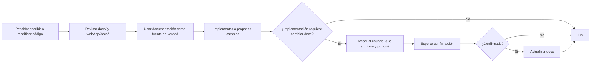
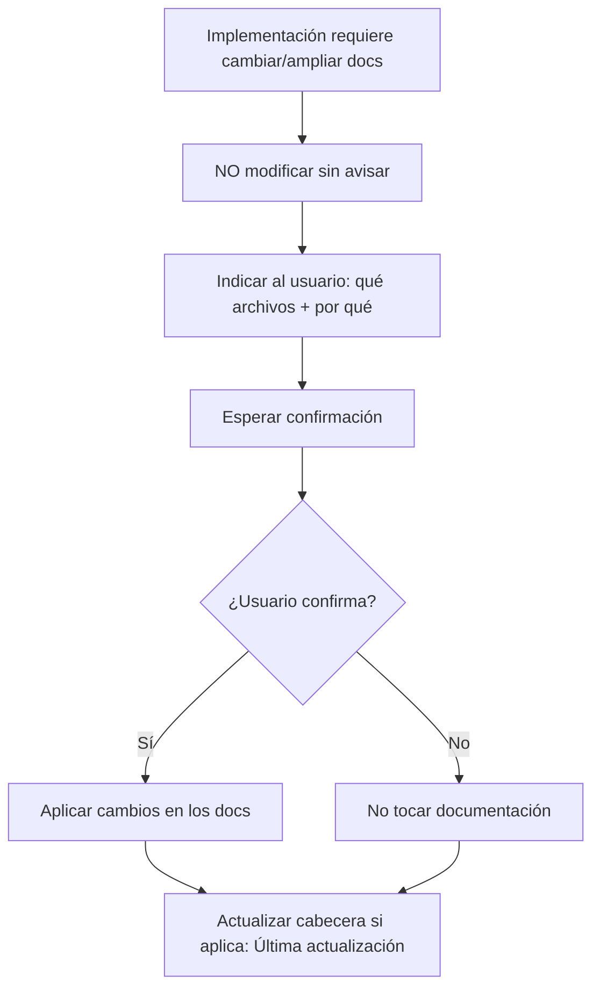

# Flujo de desarrollo con IA (Cursor)

Estado: vigente  
Última actualización: 2026-03-17  
Objetivo: que el agente (IA) consulte siempre la documentación antes de codificar y no modifique docs sin avisar.

---

## 1. Cambios realizados (registro)

| Fecha       | Cambio |
|------------|--------|
| 2026-03-04 | Creada regla de Cursor `.cursor/rules/docs-before-code.mdc` con `alwaysApply: true`. |
| 2026-03-04 | Creado este documento como fuente de verdad del flujo y referencia en `MASTER_ARCHITECTURE_GOVERNANCE.md`. |
| 2026-03-04 | Revisión y homogeneización de docs: `docs/README.md` (índice y reglas documento vivo), `docs/runbooks/README.md`, cabeceras unificadas, MASTER 6.4.1 y 6.4.4 (evitar incompatibilidades). |
| 2026-03-04 | Consolidación: eliminado `play-console-cicd.md` (contenido integrado en `RELEASE_DEPLOY_WORKFLOW.md`); eliminado `WEBAPP_SPA_DEPLOY.md` (contenido integrado en `supabase/webhook-coffees-trigger-build.md`). |
| 2026-03-17 | Añadida sección 6: qué documentación y prácticas ayudan al agente. Creados `DOCUMENTO_FUNCIONAL_CAFESITO.md`, `TESTING_PRE_POST_DESARROLLO.md` y commit-note 20260316. |

---

## 2. Regla de Cursor que lo aplica

- **Archivo:** `.cursor/rules/docs-before-code.mdc`
- **Alcance:** `alwaysApply: true` (todas las conversaciones).
- **Resumen:** Consultar `docs/` y `webApp/docs/` antes de escribir código; si hace falta tocar documentación, avisar al usuario antes y esperar confirmación.

---

## 3. Flujos de acciones (obligatorios)

### 3.1 Flujo: antes de escribir o modificar código

**Pasos (obligatorios):**

1. El agente recibe una petición que implica escribir o modificar código.
2. **OBLIGATORIO:** Revisar documentación relevante en `docs/` y, si aplica, `webApp/docs/`.
3. Usar esa documentación como fuente de verdad (arquitectura, convenciones, APIs, flujos).
4. Solo entonces proceder a implementar o proponer cambios de código.
5. Si la implementación requiere cambiar documentación: no modificar sin avisar; indicar qué archivos y por qué; esperar confirmación.

**Qué consultar según el ámbito:** Ver índice completo en `docs/README.md` (sección 5.3 y tabla por ámbito).

| Ámbito        | Documentación prioritaria |
|---------------|---------------------------|
| Arquitectura / capas / dominio | `docs/MASTER_ARCHITECTURE_GOVERNANCE.md` |
| Comportamiento funcional / criterios de aceptación | `docs/DOCUMENTO_FUNCIONAL_CAFESITO.md` |
| Testing pre y post desarrollo | `docs/TESTING_PRE_POST_DESARROLLO.md`, `docs/SMOKE_TESTS.md` |
| Android / Kotlin / Compose    | `docs/` + regla `.cursor/rules/android-kotlin-compose.mdc` |
| WebApp                        | `docs/`, `webApp/docs/` |
| Supabase / backend            | `docs/supabase/`, secciones correspondientes en MASTER |
| Runbooks / operación          | `docs/README.md` (sección 4.3), `docs/runbooks/README.md`, `docs/RELEASE_DEPLOY_WORKFLOW.md` |

---

### 3.2 Flujo: cuando la implementación requiere cambiar documentación

**Pasos (obligatorios):**

1. El agente detecta que su implementación requiere cambiar o ampliar documentación existente (p. ej. MASTER, guías en docs/, webApp/docs/).
2. **NO** modificar los archivos de documentación sin avisar.
3. **OBLIGATORIO:** Indicar al usuario, **ANTES** de tocar los docs: qué archivos actualizar y por qué (resumen breve).
4. Esperar confirmación o indicación del usuario.
5. Solo si el usuario confirma (o pide explícitamente el cambio), aplicar los cambios en los docs.

**Ejemplo de aviso al usuario:**

> Este cambio afecta al flujo de [X] descrito en `docs/[Y].md`. ¿Quieres que actualice la sección [Z] o lo dejas para revisarlo tú?

---

## 4. Resumen para no repetir errores

- **No** escribir código sin haber revisado antes la documentación relevante en `docs/` y, si aplica, `webApp/docs/`.
- **No** modificar documentación (incluido este archivo y el MASTER) sin avisar antes al usuario y esperar confirmación.
- **Sí** indicar explícitamente cuando un cambio de código implica actualizar docs y proponer el cambio solo tras confirmación.

---

## 5. Referencias

- **Índice de documentación:** `docs/README.md` (punto de entrada; documento vivo y reglas para evitar incompatibilidades).
- Regla Cursor: `.cursor/rules/docs-before-code.mdc`
- Documento maestro: `docs/MASTER_ARCHITECTURE_GOVERNANCE.md` (sección 6.4 y 6.4.4).

---

## 6. Qué ayuda al agente IA a funcionar mejor

Estas prácticas y documentos mejoran la calidad de las respuestas y reducen errores y regresiones.

### 6.1 Documento funcional y criterios de aceptación

- **`docs/DOCUMENTO_FUNCIONAL_CAFESITO.md`:** Describe los flujos principales (Despensa, Diario, Elaboración, Perfil, Auth) y los **criterios de aceptación** por flujo. El agente debe usarlo para:
  - Saber qué comportamiento se considera correcto antes de implementar.
  - No inventar flujos que contradigan lo ya acordado.
  - Proponer cambios alineados con la paridad Android/WebApp.
- **Recomendación:** Al pedir un cambio funcional, indicar el flujo afectado (ej. "añadir a despensa desde elaboración") o el criterio que debe cumplirse; el agente puede contrastar con el documento funcional.

### 6.2 Testing pre y post desarrollo

- **`docs/TESTING_PRE_POST_DESARROLLO.md`:** Define qué hacer **antes** de codear (leer docs, definir criterios, identificar flujos afectados) y **después** (build, tests, smoke, checklist manual). El agente puede:
  - Sugerir comprobaciones post-cambio según el flujo tocado.
  - Recordar ejecutar build y tests antes de dar por cerrada una tarea.
- **`docs/SMOKE_TESTS.md`:** Flujo crítico mínimo (login → Diario → detalle/añadir); útil para no romper lo básico.

### 6.3 Registro de incidencias y convenciones

- **`docs/REGISTRO_DESARROLLO_E_INCIDENCIAS.md`:** Incidencias CI/CD, TypeScript, ramas y soluciones aplicadas. Consultarlo evita repetir errores (ej. props no destructuradas, git exit 128, ref de rama).
- **Convenciones de código:** Regla `.cursor/rules/android-kotlin-compose.mdc` para Android; DESIGN_TOKENS y GUIA para UI. Respetarlas reduce retrabajo en revisión.

### 6.4 Resumen para el usuario

- **Para mejores resultados al trabajar con el agente:** (1) Indicar el flujo o pantalla afectada. (2) Mencionar si hay criterio de aceptación concreto. (3) Si el cambio es grande, dividir en pasos (el agente puede proponer un plan). (4) Después de implementar, usar el checklist de `TESTING_PRE_POST_DESARROLLO.md` para validar.
- **Documentos que el agente debe consultar con prioridad:** `docs/README.md`, `REGISTRO_DESARROLLO_E_INCIDENCIAS.md`, `DOCUMENTO_FUNCIONAL_CAFESITO.md`, y el doc específico del ámbito (MASTER, RELEASE_DEPLOY_WORKFLOW, DESIGN_TOKENS, etc.).
