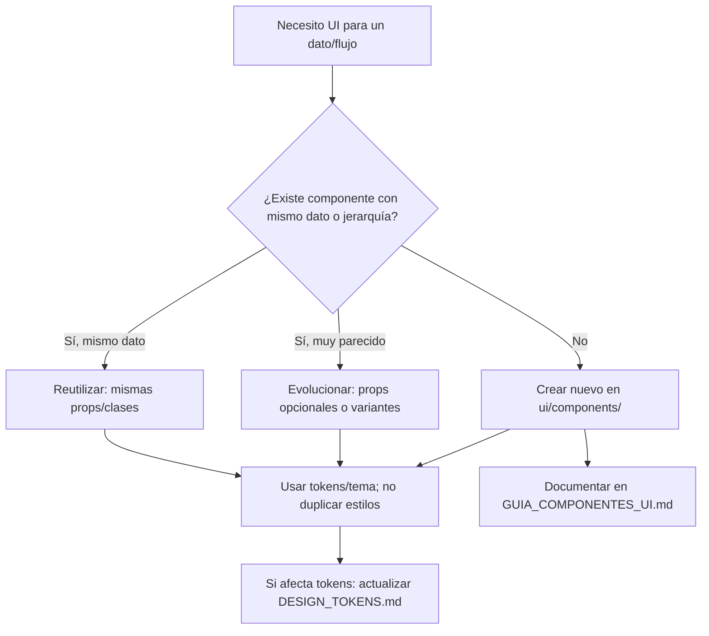

# Guía de unificación de componentes, estilos y espacios

**Propósito:** Servir de referencia para unificar estilos, espacios y funcionalidades por plataforma (WebApp y Android), y como guía a la hora de crear o evolucionar componentes para mantener consistencia y evitar duplicación.

**Última actualización:** 2026-03-13  
**Estandarización aplicada (2026-03-13):**  
- **WebApp:** buttons, cards, base, auth con tokens; tarjetas heredando .card; inputs con var(--space-*)/--radius-pill; EmptyState/ErrorState en TimelineView; layout con tokens; base.css (scrollbar/outline documentados); sliders con tokens.  
- **Android:** Color.kt (ScrimDefault, Camera, Slider, Advice, DateMetaAxis*, SwitchTrackOff*, SwitchThumbOff*); Spacing.kt, Shapes.kt; **B.5.1 colores:** BrewLabComponents, DiaryComponents, TimelineComponents, ProfileComponents, LoginScreen, AddStockScreen, EditNormalStockScreen, DetailScreen, NotificationsScreen, ProfileScreen, DiaryScreen, AddDiaryEntryScreen, BrewLabCards → PureBlack/PureWhite/tema; **B.3.3** formas botón (Shapes.pill, shapeXl) en uso. CoffeeListItem unificado; EmptyStateMessage/ErrorStateMessage en pantallas.  
- **DESIGN_TOKENS.md:** Gutter 16dp documentado.  
**Ámbito:** WebApp (`webApp/`), Android (`app/`).  
**Documentos relacionados:** `DESIGN_TOKENS.md`, `UX_EMPTY_AND_ERROR_STATES.md`, `MASTER_ARCHITECTURE_GOVERNANCE.md`.  
**Inventario detallado de componentes (estilos, funcionalidad, dónde se usan, estado):** `GUIA_COMPONENTES_UI.md`.

---

## Resumen ejecutivo

- **WebApp:** Los componentes reutilizables viven en `webApp/src/ui/components/`; los tokens en `webApp/src/styles/tokens.css`. Hay oportunidades de unificar clases de tarjetas, reemplazar valores fijos por variables `--space-*`/`--radius-*` y centralizar patrones de estado vacío/error. **Valores hardcodeados:** muchos px y colores hex/rgba en `features/auth.css`, `features.css`, `profile-adn.css` y `theme-forced.css`; ver **A.5** para estandarizar.
- **Android:** Los composables reutilizables están en `app/.../ui/components/`; el tema en `app/.../ui/theme/`. No existe un archivo de dimensiones (Dimens/Spacing); los radios están dispersos (8–32 dp). Se puede unificar la “tarjeta de café en lista” en un solo composable y alinear radios/espacios con `DESIGN_TOKENS.md`. **Valores hardcodeados:** colores `Color(0xFF…)` y `Color.Black`/`Color.White` en DetailScreen, BrewLabComponents, TimelineComponents, etc.; ver **B.5** para estandarizar.

Al crear un **nuevo** componente, comprobar primero si se puede **evolucionar** uno existente (mismo dato, misma jerarquía visual). Si no, crear uno nuevo usando siempre los tokens/tema y esta guía. Para el **inventario completo** de cada componente (estilos, funcionalidad, dónde se usa, estado y componentes no usados), ver **`GUIA_COMPONENTES_UI.md`**.

### Flujo de decisión: nuevo componente vs. reutilizar vs. evolucionar

---

# Parte A — WebApp

## A.1 Inventario de componentes reutilizables

| Componente | Ruta | Uso |
|------------|------|-----|
| Button | `ui/components/Button.tsx` | Variantes: primary, ghost, text, chip, danger, plain. Tamaños: sm, md, lg. |
| IconButton | `ui/components/IconButton.tsx` | Área de tap ≥ 44px (WCAG). Clases: `icon-button`, `topbar-icon-button`, `chip-button`. |
| Chip | `ui/components/Chip.tsx` | Chips seleccionables/filtros. |
| Input, Select, Textarea | `ui/components/` | Formularios. |
| Sheet | `ui/components/Sheet.tsx` | Modales tipo bottom sheet. |
| Tabs | `ui/components/Tabs.tsx` | Pestañas. |
| Topbar | `ui/components/Topbar.tsx` | Barra superior. |
| ComposerInputShell | `ui/components/ComposerInputShell.tsx` | Campo de texto con acciones (ej. publicar opinión). |
| MentionText | `ui/MentionText.tsx` | Texto con menciones @usuario. |

Las **vistas por feature** (pantallas o bloques grandes) viven en `webApp/src/features/` (auth, brew, coffee, diary, profile, search, timeline, etc.). No son “componentes” genéricos; si un patrón se repite en varias features, debe extraerse a `ui/components/` o a clases CSS reutilizables.

## A.2 Tokens y estilos (fuente de verdad)

| Qué | Dónde | Notas |
|-----|--------|-------|
| Colores, espaciado, radios, tipografía | `webApp/src/styles/tokens.css` | Variables `:root` y `@media (prefers-color-scheme: dark)`. |
| Tema forzado (claro/oscuro) | `webApp/src/styles/theme-forced.css` | Overrides cuando el usuario elige tema fijo. |
| Lógica de tema | `webApp/src/core/theme.ts` | ThemeMode, applyThemeToDocument. |
| Referencia compartida Web ↔ Android | `docs/DESIGN_TOKENS.md` | Colores, espacios, radios; actualizar al cambiar tokens. |

**Escala de espaciado (usar siempre que sea posible):**

- `--space-1` (4px) a `--space-8` (32px). Evitar valores literales como `10px`, `14px`, `18px` salvo casos ya documentados (ej. topbar 56px).

**Radios estándar:**

- `--radius-sm` (10px), `--radius-md` (12px), `--radius-lg` (16px), `--radius-card` (18px), `--radius-pill` (999px).
- Tarjetas de superficie: `--surface-card-radius`, `--surface-card-border`, `--surface-card-shadow`.

## A.3 Oportunidades de unificación (WebApp)

### A.3.1 Tarjetas (cards)

- **Estado actual:** `.card`, `.coffee-card`, `.config-card` comparten en `components/cards.css` base común (border-radius, border, background, padding 12px). Otras tarjetas tienen clases propias: `.profile-activity-card`, `.diary-*-card`, `.brew-tipo-card`, `.brew-tamaño-card`, `.coffee-detail-opinion-card`, etc.
- **Recomendación:**  
  - Mantener la base común (`.card`, `.coffee-card`, `.config-card`) usando **solo** variables `--surface-card-*` y `--space-*` para padding.  
  - Para tarjetas nuevas (listas, actividad, detalle): aplicar la misma base (clase `card` o `coffee-card`) y añadir una clase específica para contenido (ej. `profile-activity-card` = `card profile-activity-card`).  
  - Evitar definir de nuevo `border-radius`, `border` o `padding` en la clase específica salvo que el diseño lo exija; así se unifica el “estilo de tarjeta” en un solo lugar.

### A.3.2 Botones

- **Estado actual:** `Button.tsx` usa variantes y tamaños; `buttons.css` define `.ui-button-sm/md/lg`, `.action-button`, `.icon-button`, `.topbar-icon-button`, `.chip-button`. Algunos paddings están en px fijos (ej. `6px 10px`, `8px 10px`, `min-height: 44px`).
- **Recomendación:** Sustituir por tokens donde aplique: por ejemplo `padding: var(--space-2) var(--space-3)` en `.ui-button-md`, y mantener 44px para área de tap (documentado en accesibilidad). Revisar que `min-height`/`min-width` sigan siendo ≥ 44px donde corresponda.

### A.3.3 Inputs y campos de búsqueda

- **Estado actual:** `.search-wide` y `.search-input-standard` en `components/inputs.css`; algunos valores literales (ej. `10px 12px`).
- **Recomendación:** Usar `var(--space-*)` para padding y alinear bordes/radios con `--radius-*` o variables de borde ya definidas en `tokens.css`.

### A.3.4 Estados vacío y error

- **Estado actual:** Documento `UX_EMPTY_AND_ERROR_STATES.md` define el patrón (mensaje + CTA opcional para vacío; mensaje + “Reintentar” para error). En CSS existen clases como `.timeline-empty`, `.diary-empty-card`, `.profile-activity-empty`, `.error-state`.
- **Recomendación:** Todas las pantallas con lista o datos remotos deben usar el mismo patrón visual y las mismas clases base (o un componente React compartido “EmptyState” / “ErrorState”) y los textos indicados en `UX_EMPTY_AND_ERROR_STATES.md`.

### A.3.5 Espaciado en layout principal

- **Estado actual:** `--app-shell-gutter: 12px` en `.main-shell`; en `.main-shell-scroll` padding `10px var(--app-shell-gutter) 120px`. Algunas secciones usan `10px`, `18px`, `24px` sueltos.
- **Recomendación:** Sustituir por `var(--space-*)` (ej. `--space-3` para 12px, `--space-6` para 24px) para que un futuro cambio de escala sea centralizado.

## A.4 Guía para nuevos componentes (WebApp)

1. **¿Hace falta un componente nuevo?**  
   - Si la UI es la misma que una pantalla/componente existente (mismo dato, misma jerarquía), **evolucionar** el existente (props opcionales, variantes).  
   - Si es un patrón nuevo (ej. un tipo de tarjeta que se repetirá), crear en `ui/components/` y reutilizar en las features.

2. **Estilos:**  
   - Usar **siempre** variables de `tokens.css`: colores (`--caramel-soft`, `--surface`, `--electric-red`, etc.), espaciado (`--space-1` … `--space-8`), radios (`--radius-*`), tipografía (`--font-size-*`, `--line-height-*`).  
   - Para tarjetas, heredar de `.card` o `.coffee-card` y añadir solo la clase específica de contenido.

3. **CSS:**  
   - Estilos de componentes genéricos en `styles/components/` (o en el módulo del componente si se usa CSS modules).  
   - Estilos específicos de una feature en `styles/features.css` o en el CSS de esa feature, pero reutilizando tokens.

4. **Accesibilidad:**  
   - Botones/iconos interactivos: área de tap ≥ 44px.  
   - Ver `ACCESIBILIDAD_WEBAPP_ANDROID.md` y `AGENTS.md`.

5. **Documentar:**  
   - Si se crea un componente o clase nueva reutilizable, añadir una línea en esta guía (A.1 o A.3) y, si afecta a tokens, actualizar `DESIGN_TOKENS.md`.

## A.5 Valores hardcodeados a estandarizar (WebApp)

Inventario de valores literales que conviene sustituir por tokens o variables para alinear con el resto del sistema.

### A.5.1 CSS — Espaciado y tamaños

| Archivo | Valor hardcodeado | Estandarizar a |
|---------|-------------------|-----------------|
| `styles/base.css` | `6px`, `3px`, `2px`, `120px`, `16px`, `10px 16px` | `--space-1`/`--space-2` donde aplique; outline 2px puede quedar o documentarse. `min-height: 120px` → considerar `var(--space-*)` si es espaciado; si es altura fija, documentar. |
| `styles/base.css` | `#424242`, `#fff`, `box-shadow: 0 2px 8px rgba(0,0,0,0.2)` | Usar `--surface-elevated` o variable de fondo; `--text-main`; sombra en tokens si se repite. |
| `styles/features/auth.css` | `8px`, `10px`, `12px`, `14px`, `16px`, `18px`, `24px`, `28px`, `40px`, `56px`, `82px`, etc. | Sustituir por `var(--space-1)` … `var(--space-8)`. Ej.: `gap: 10px` → `var(--space-2)` u otra de la escala; `padding: 12px` → `var(--space-3)`. |
| `styles/features/auth.css` | `border-radius: 10px`, `16px`, `20px`, `24px`, `28px`, `2px` | Usar `--radius-sm`, `--radius-md`, `--radius-lg`, `--radius-card`; si hace falta 20px/24px/28px, añadir a tokens o documentar excepción. |
| `styles/features.css` | `10px`, `12px`, `18px`, `24px`, `56px`, `106px`, `120px`, `352px`, etc. | Mismo criterio: espaciado → `var(--space-*)`; radios → `--radius-*`. Valores de layout (860px, 106px header) pueden quedar como constantes documentadas. |
| `styles/features.css` | `padding: 24px 10px`, `gap: 18px`, `border-radius: 14px` | `24px` → `var(--space-6)`; `10px` → `var(--space-2)` o `--app-shell-gutter`; `14px` → valor no estándar: usar `--radius-md` (12px) o añadir token. |
| `styles/features/profile-adn.css` | `14px`, `10px`, `2px`, `8px`, `17px`, `30px`, `54px` | Espaciado → `var(--space-*)`; `30px` radio → considerar `--radius-*` o token específico. |
| `styles/components/buttons.css` | `6px 10px`, `8px 10px`, `min-height: 44px`, `min-width: 44px` | Padding → `var(--space-2)` `var(--space-3)`; 44px es requisito accesibilidad, puede quedar fijo pero documentado. |
| `styles/components/cards.css` | `padding: 12px` | Ya coherente; asegurar que sea `var(--space-3)`. |

### A.5.2 CSS — Colores

| Archivo | Valor hardcodeado | Estandarizar a |
|---------|-------------------|-----------------|
| `styles/base.css` | `#424242`, `#fff` | `--surface-elevated` o variable de fondo; `--text-main` / `--pure-white`. |
| `styles/features/auth.css` | `#ffffff`, `#fff`, `#f8f9fa`, `#3c4043`, `#4285f4`, `rgba(26,18,11,0.8)`, `rgba(255,255,255,0.88)` | Usar variables de `tokens.css`: `--pure-white`, `--espresso-deep`, `--text-main`, etc. Evitar hex/Google blue salvo que se defina en tokens. |
| `styles/features.css` | `#ffffff`, `rgba(26,18,11,0.92)`, `rgba(255,255,255,0.85)`, `rgba(255,255,255,0.12)` | `--pure-white`, `--modal-header-bg` o similar, `--text-main` con alpha si existe; `--surface-muted` o variable de overlay. |
| `styles/theme-forced.css` | Muchos `#000`, `#212121`, `#ffffff`, `#bdb7b2`, `#d63a3a`, etc. | Preferir variables ya definidas (`--pure-black`, `--screen-dark-background`, `--muted-cream`, `--electric-red`). Los overrides de tema pueden mantener `!important` pero usando tokens. |

### A.5.3 TSX — Estilos en línea

| Archivo / contexto | Valor hardcodeado | Estandarizar a |
|--------------------|-------------------|-----------------|
| `main.tsx` | `minHeight: "100vh"`, `paddingTop: 28` | Clase CSS con `var(--space-*)` o variable de altura; evitar números sueltos. |
| `TopBar.tsx` | `marginTop: "1rem"` | Clase con `var(--space-4)` o equivalente. |
| `iconography.tsx` | `width: 24, height: 24` | `var(--icon-size-md)` (20px) o `--icon-size-lg` (24px); o clase `.ui-icon`. |
| Sliders / barras de progreso | `style={{ "--range-progress": "…%" }}` | Correcto usar variable CSS para valor dinámico; asegurar que colores y tamaños del track vengan de tokens. |
| Transform / swipe | `transform: translateX(${offsetX}px)` | Valores dinámicos están bien; no hace falta token. |
| `DiaryLineChart.tsx` | `minHeight: CHART_MIN_HEIGHT` | Constante en módulo está bien; si se usa en más sitios, considerar variable CSS. |

**Resumen WebApp:** Priorizar reemplazo de **colores hex/rgba** y **espaciados en px** por variables de `tokens.css` en `features/auth.css`, `features.css`, `profile-adn.css` y `theme-forced.css`. En `base.css` y `buttons.css`, unificar padding/gap con `--space-*` y colores con tokens.

---

# Parte B — Android

## B.1 Inventario de composables reutilizables

| Composable | Archivo | Uso |
|------------|---------|-----|
| PremiumCard | `components/CafesitoUI.kt` | Surface con borde y forma redondeada genérica. |
| ModernAvatar | `components/CafesitoUI.kt` | Avatar con borde en gradiente. |
| UserReviewCard | `components/UserReviewCard.kt` | Reseña de usuario (valoración + texto). |
| UserSuggestionCard | `components/UserSuggestionCard.kt` | Sugerencia de usuario (seguir/dejar de seguir). |
| TagChip | `components/TagChip.kt` | Chips (ej. etiquetas). |
| DiaryComponents | `components/DiaryComponents.kt` | Entradas de diario, chips de fecha, etc. |
| TimelineComponents | `components/TimelineComponents.kt` | Posts, comentarios, empty state. |
| TimelineEmptyState | `components/TimelineEmptyState.kt` | Mensaje vacío + CTA. |
| BrewLabComponents / BrewLabCards | `components/` | Elaboración, temporizador, tarjetas de método. |
| ProfileComponents | `components/ProfileComponents.kt` | Bloques de perfil. |
| RecommendationCarousel | `components/RecommendationCarousel.kt` | Carrusel de recomendaciones. |
| SensoryRadarChart | `components/SensoryRadarChart.kt` | Gráfico radar. |
| RatingBar / SemicircleRatingBar | `components/` | Valoraciones. |
| PhotoPicker | `components/PhotoPicker.kt` | Selector de foto. |

Las **pantallas** (DetailScreen, SearchScreen, ProfileScreen, CafesProbadosScreen, etc.) viven en sus respectivos paquetes (`detail/`, `search/`, `profile/`, `diary/`, …). Si un bloque de UI se repite en varias pantallas, debe extraerse a `ui/components/`.

## B.2 Tema y tokens (fuente de verdad)

| Qué | Dónde | Notas |
|-----|--------|-------|
| Colores | `ui/theme/Color.kt` | Paleta estática (CaramelAccent, ElectricRed, etc.). |
| Tipografía | `ui/theme/Type.kt` | CafesitoTypography (headlineLarge, bodyLarge, …). |
| Tema (light/dark) | `ui/theme/Theme.kt` | CafesitoTheme, ColorSchemes, LocalCaramelAccent, LocalDateMetaColor. |
| Referencia compartida | `docs/DESIGN_TOKENS.md` | Paridad con Web; actualizar al cambiar colores/radios/espacios. |

**Espaciado:** No hay `Dimens.kt` ni `Spacing.kt`. Se usan valores inline (`8.dp`, `12.dp`, `16.dp`, …). La guía en `DESIGN_TOKENS.md` indica: 4, 8, 12, 16, 20, 24, 32 dp. Se recomienda usar de forma coherente esa escala y, si se quiere centralizar, crear un objeto `Spacing` (ej. `Spacing.space4`, `Spacing.space8`, …) en `theme/` y usarlo en componentes nuevos.

**Radios:** En el código aparecen 8, 10, 12, 14, 16, 18, 20, 24, 28, 32 dp (y 999/50 para pill). `DESIGN_TOKENS.md` fija: 10, 12, 16, 18 dp y pill. Se recomienda alinear los composables a esos valores salvo excepciones justificadas (ej. bottom sheet 32.dp).

## B.3 Oportunidades de unificación (Android)

### B.3.1 Tarjeta de café en listas

- **Estado actual:**  
  - `SearchScreen`: `CoffeePremiumListItem` (Surface 16.dp radius, 12.dp padding, imagen 60.dp, título + marca).  
  - `CafesProbadosScreen`: Surface inline muy similar (16.dp, 12.dp padding, imagen 48.dp, nombre + marca + “Primera vez”).  
  - *CoffeeCard fue eliminado (no se usaba en ninguna pantalla); listas usan CoffeeListItem.*
- **Recomendación:**  
  - Crear un único composable reutilizable, por ejemplo `CoffeeListItem` (o extender uno existente), con parámetros: `coffee`, `subtitle` (opcional, ej. “Primera vez: …”), `imageSize` (48.dp o 60.dp), `onClick`.  
  - Usar en SearchScreen y CafesProbadosScreen para mismo estilo (shape 16.dp, padding 12.dp, borde, surface). Así se unifica estilo y comportamiento en un solo sitio.

### B.3.2 Formas (RoundedCornerShape)

- **Estado actual:** Valores dispersos (8, 10, 12, 14, 16, 18, 20, 24, 28, 32 dp) en muchos archivos.
- **Recomendación:**  
  - Introducir en `theme/` un objeto `Shapes` o constantes (ej. `ShapeCard = RoundedCornerShape(16.dp)`, `ShapeCardSmall = RoundedCornerShape(12.dp)`, `ShapePill = RoundedCornerShape(percent(50))` o 24.dp) y usarlos en lugar de repetir números.  
  - Alinear con `DESIGN_TOKENS.md`: 10, 12, 16, 18 y pill.

### B.3.3 Botones primarios y secundarios

- **Estado actual:** Botones con formas y colores definidos en cada pantalla (DetailScreen “Editar” pill, LoginScreen 20.dp, etc.).
- **Recomendación:**  
  - Usar `MaterialTheme.colorScheme` y `LocalCaramelAccent` para colores.  
  - Para botones con forma pill o “acción principal”, definir una forma estándar (ej. 20.dp para altura ~40.dp) y reutilizarla. Así el aspecto de “botón primario” y “botón secundario” queda unificado.

### B.3.4 Estados vacío y error

- **Estado actual:** `TimelineEmptyState`, y en pantallas como ProfileScreen un `CircularProgressIndicator` + “Recargando…” para carga. Otros empty states están implementados in situ.
- **Recomendación:**  
  - Seguir `UX_EMPTY_AND_ERROR_STATES.md`: mismo patrón (mensaje + CTA opcional para vacío; mensaje + “Reintentar” para error).  
  - Reutilizar `TimelineEmptyState` donde encaje (mensaje + CTA) o extraer un `EmptyStateMessage(message, ctaText, onCtaClick)` y un `ErrorStateMessage(message, onRetry)` en `components/` y usarlos en todas las pantallas con listas o datos remotos.

### B.3.5 Estado de carga (loading) — estándar Android

- **Regla:** Los estados de carga en Android deben mostrarse con **shimmer** (cuadrados/placas grises en movimiento), como en las pantallas de carga completas, **no** con texto "Cargando" ni solo un `CircularProgressIndicator`.
- **Implementación:** Usar composables de shimmer existentes por contexto (`ProfileActivityCardShimmer`, `DiaryItemShimmer`, `CaffeinePremiumCardShimmer`, etc.). Si no existe uno para la lista, crear un shimmer que imite la forma de las filas/cards.
- **Dónde aplicar:** Cualquier lista o bloque que dependa de datos remotos (perfil actividad, diario, timeline, listas).

### B.3.6 Espaciado horizontal de pantalla

- **Estado actual:** Padding horizontal 16.dp en la mayoría de pantallas; algunas usan 0 en bordes (ej. mapa Cafés probados a ancho completo) y 16.dp solo en el contenido.
- **Recomendación:** Mantener 16.dp como estándar para contenido en lista/detalle; documentar aquí y en `DESIGN_TOKENS.md` que el gutter de pantalla es 16.dp. Si se introduce `Spacing`, usar `Spacing.space4` (16.dp) para ese gutter.

## B.4 Guía para nuevos componentes (Android)

1. **¿Nuevo composable o evolucionar uno existente?**  
   - Si muestra el **mismo tipo de dato** con la **misma jerarquía visual** (solo cambia texto o un detalle), **evolucionar** (parámetros opcionales, overloads).  
   - Si es un **patrón nuevo** que se repetirá (ej. tipo de tarjeta, tipo de botón), crear en `ui/components/` y reutilizar en pantallas.

2. **Tema y colores:**  
   - Usar siempre `MaterialTheme.colorScheme`, `MaterialTheme.typography`, `LocalCaramelAccent`, `LocalDateMetaColor` según corresponda.  
   - No usar colores hardcodeados salvo los definidos en `Color.kt` y usados por el tema.

3. **Formas y espaciado:**  
   - Preferir constantes de forma (ej. `ShapeCard`, `ShapePill`) si existen; si no, usar la escala de `DESIGN_TOKENS.md` (12, 16, 18 dp para cards; 4, 8, 12, 16, 24, 32 dp para espacio).  
   - Si se añade `Spacing`, usarlo en componentes nuevos.

4. **Listas de ítems:**  
   - Si es una fila de café (imagen + nombre + subtítulo), usar el composable unificado de “tarjeta de café en lista” (ver B.3.1) en lugar de duplicar Surface + Row en cada pantalla.

5. **Estados vacío y error:**  
   - Usar el mismo patrón que el resto de la app (mensaje + CTA o “Reintentar”) y, si existe, el composable `EmptyStateMessage` / `ErrorStateMessage`.

6. **Documentar:**  
   - Si se crea un composable reutilizable nuevo o se unifica uno (ej. CoffeeListItem), actualizar esta guía (B.1 o B.3) y, si cambia forma/espacio estándar, `DESIGN_TOKENS.md`.

## B.5 Valores hardcodeados a estandarizar (Android)

Inventario de colores y dimensiones literales que conviene alinear con `Color.kt`, `Theme.kt` y, si se crea, con un objeto `Spacing`/`Shapes`.

### B.5.1 Colores

| Archivo | Uso hardcodeado | Estandarizar a |
|---------|------------------|-----------------|
| `DetailScreen.kt` | `Color.Black`, `Color.White`, `Color(0xFF2D2D2D)`, `Color(0xFFE0E0E0)`, `Color(0xFF3D3D3D)`, `Color(0xFFE8E8E8)` | Scrim/gradiente: `PureBlack`/`Color.Black` con alpha o variable de overlay. Fondos de cámara/botón: añadir a `Color.kt` (ej. `CameraBgDark`, `CameraBgLight`) o usar `MaterialTheme.colorScheme.surfaceVariant`. Inactivo: `DisabledGray` o surface. |
| `BrewLabComponents.kt` | `Color.Black`, `Color.White`, `Color(0xFF424242)`, `Color(0xFF9E9E9E)`, `Color(0xFFBDBDBD)`, `Color(0xFF303030)`, `Color(0xFFEFEFEF)`, `Color(0xFFF0F0F0)`, `Color(0xFF2F2F2F)` | Sustituir por `PureBlack`/`PureWhite`, `ScreenDarkBackground`/surface, `DisabledGray`; grises de tarjeta/advice → definir en `Color.kt` (ej. `AdviceCardBgDark`) o usar `colorScheme.surfaceContainer*`. |
| `DiaryComponents.kt` | `Color.White`, `Color.Black`, `CAFFEINE_BROWN`, `WATER_BLUE`, `Color(0xFF6F6760)`, `Color(0xFFB0A8A0)` | Usar `CaramelAccent`/`WaterBlue` (ya hay constantes); grises de eje → `DateMetaLight`/`DateMetaDark` o añadir a `Color.kt`. |
| `TimelineComponents.kt` | `Color.Black`, `Color.White`, `Color(0xFF404040)`, `Color(0xFFE0E0E0)` | Slider/field: `MaterialTheme.colorScheme` o colores de tema; gris inactivo → `DisabledGray` o surface. |
| `LoginScreen.kt`, `AddPantryItemScreen.kt`, `EditNormalStockScreen.kt` | `Color.Black`, `Color.White`, fondos y scrims | Scrim: `PureBlack.copy(alpha)`; texto sobre imagen: `PureWhite`; fondos → `MaterialTheme.colorScheme.surface` o `Color.kt`. |
| `ProfileComponents.kt` | `Color(0xFFE53935)` (rojo favoritos) | Usar `ElectricRed` o color semántico de tema si existe. |
| `SensoryRadarChart.kt` | `Color(0xFF757575)` | `MaterialTheme.colorScheme.outline` o `MutedCream`/`DateMetaLight`. |
| `Theme.kt` | `Color.White` en ColorSchemes | Correcto; es la fuente de tema. |

### B.5.2 Dimensiones (dp / sp)

| Archivo | Uso hardcodeado | Estandarizar a |
|---------|------------------|-----------------|
| Varios | `8.dp`, `12.dp`, `16.dp`, `24.dp`, `32.dp` | Coinciden con escala DESIGN_TOKENS; si se introduce `Spacing`, usar `Spacing.space2`, etc. |
| Varios | `10.dp`, `14.dp`, `18.dp`, `20.dp`, `22.dp`, `28.dp`, `40.dp`, `48.dp`, `56.dp`, `58.dp`, `64.dp`, `72.dp`, `80.dp`, `86.dp`, `100.dp`, `120.dp`, `180.dp` | Valores fuera de 4–8–12–16–20–24–32: documentar o mapear a constantes (ej. `IconSizeSmall = 18.dp`, `CardImageHeight = 86.dp`). Alturas de lista (86.dp en SearchScreen) y avatares (48.dp, 100.dp) pueden vivir en `Dimens.kt` o `Spacing` si se crea. |
| `SearchScreen.kt` | `padding(horizontal = 10.dp, vertical = 6.dp)`, `20.dp`, `64.dp`, `86.dp`, `100.dp` | Unificar con escala: 10→12 si se acepta; 6→8; alturas fijas en constantes. |
| `DetailScreen.kt` | `lineHeight = 38.sp`, `fontSize = 12.sp` | Preferir `MaterialTheme.typography`; si se necesita 12.sp, usar `labelSmall` o equivalente. |
| Radios | `RoundedCornerShape(8.dp)`, `14.dp`, `20.dp`, `28.dp` | Alinear con B.3.2: usar `ShapeCard`, `ShapeCardSmall`, etc. (10, 12, 16, 18, pill). 8.dp para chips pequeños puede quedar como excepción documentada. |

### B.5.3 Resumen Android

- **Colores:** Sustituir `Color.Black`/`Color.White` en fondos y texto por `PureBlack`/`PureWhite` o por `MaterialTheme.colorScheme` cuando sea superficie/contenido. Los hex (`0xFF2D2D2D`, `0xFFE0E0E0`, etc.) moverlos a `Color.kt` con nombres semánticos y usarlos desde el tema o composables.
- **Dimensiones:** Mantener 4, 8, 12, 16, 20, 24, 32 dp para espaciado; el resto (alturas de fila, iconos, radios no estándar) centralizar en `theme/Dimens.kt` o `Spacing`/`Shapes` cuando se creen.
- **Scrims y overlays:** Unificar `Color.Black.copy(alpha = 0.5f)` (y variantes) en una constante tipo `ScrimDefault` en `Color.kt` para reutilizar en ModalBottomSheet, diálogos y pantallas de detalle.

---

# Parte C — Referencias cruzadas

- **Tokens de diseño (paridad Web ↔ Android):** `docs/DESIGN_TOKENS.md`.  
- **Estados vacío y error:** `docs/UX_EMPTY_AND_ERROR_STATES.md`.  
- **Arquitectura y principios:** `docs/MASTER_ARCHITECTURE_GOVERNANCE.md`.  
- **Registro de cambios recientes:** `docs/REGISTRO_DESARROLLO_E_INCIDENCIAS.md`.  
- **Índice de documentación:** `docs/README.md`.

### Checklist rápido: evitar hardcodeo

| Plataforma | Evitar | Usar en su lugar |
|------------|--------|-------------------|
| **WebApp** | `padding/margin/gap` en px literales (6, 10, 14, 18…) | `var(--space-1)` … `var(--space-8)` |
| **WebApp** | Colores `#hex`, `rgb()`/`rgba()` en features | Variables de `tokens.css` (`--caramel-soft`, `--surface`, `--electric-red`, etc.) |
| **WebApp** | `border-radius` en px sueltos | `var(--radius-sm)`, `var(--radius-md)`, `var(--radius-lg)`, `var(--radius-card)` |
| **Android** | `Color(0xFF…)` o `Color.Black`/`Color.White` para superficies/acentos | `MaterialTheme.colorScheme`, `Color.kt` (PureBlack, CaramelAccent, ElectricRed…), `LocalCaramelAccent` |
| **Android** | `RoundedCornerShape(X.dp)` con X disperso | Constantes de forma (ShapeCard 16.dp, ShapeCardSmall 12.dp, pill) alineadas con DESIGN_TOKENS |
| **Android** | Espaciado con dp fuera de 4–8–12–16–20–24–32 | Escala de DESIGN_TOKENS; si se crea `Spacing`, usarla |

Inventario detallado de valores a corregir: **A.5 (WebApp)** y **B.5 (Android)** en esta guía.

Al añadir o modificar un componente que afecte a estilos, espacios o comportamientos compartidos, actualizar esta guía y, si aplica, los documentos anteriores.

---

# Listado de tareas pendientes (según esta guía)

A continuación, todo lo que habría que hacer según el documento.  
**Hecho (2026-03-13):** botones/cards/base/auth WebApp; Color.kt + Spacing + Shapes Android; DetailScreen, SearchScreen, CafesProbadosScreen, scrims, SensoryRadarChart, AddDiaryEntryScreen, BrewLabComponents (slider/advice). **Segunda pasada (13 mar 2026):** A.3.1–A.3.5; A.5; B.3.1–B.3.5; B.5.1 colores. **Tercera pasada (13 mar 2026):** B.5.2 Dimens.kt, Spacing en SearchScreen y componentes; DetailScreen typography; AppNavigation Shapes.shapePremium; WebApp DiaryLineChart → `--chart-min-height`. **Eliminación (14 mar 2026):** CoffeeCard.kt (no usado; listas usan CoffeeListItem).

---

## WebApp

### Unificación de componentes y estilos (A.3)

- [x] **A.3.1 Tarjetas:** Hacer que `.profile-activity-card`, `.diary-*-card`, `.brew-tipo-card`, `.brew-tamaño-card`, `.coffee-detail-opinion-card` hereden la base `.card`/`.coffee-card` y no redefinan border-radius, border ni padding (salvo excepción de diseño). *(Aplicado: profile-activity, coffee-detail-opinion, diary-empty, diary-analytics, diary-stats.)*
- [x] **A.3.2 Botones:** Revisar que todos los paddings usen tokens; mantener min 44px para área de tap y documentar.
- [x] **A.3.3 Inputs:** En `components/inputs.css`, sustituir valores literales (ej. `10px 12px`) por `var(--space-*)` y alinear bordes/radios con `--radius-*`.
- [x] **A.3.4 Estados vacío/error:** Crear componente React compartido EmptyState / ErrorState (o clases base únicas) y usarlo en todas las pantallas con lista o datos remotos; textos según `UX_EMPTY_AND_ERROR_STATES.md`. *(EmptyState y ErrorState en ui/components; uso en TimelineView.)*
- [x] **A.3.5 Layout principal:** En `features.css`, sustituir `10px`, `18px`, `24px` sueltos por `var(--space-*)` (ej. `--space-3`, `--space-6`).

### Valores hardcodeados — CSS (A.5.1, A.5.2)

- [x] **base.css:** Scrollbar (6px, 3px) y outline 2px documentados en comentarios como decisión de diseño; `min-height: 120px` ya con comentario.
- [x] **features/auth.css:** Sustituir los px y radios que queden por `var(--space-*)` y `--radius-*`; colores por tokens (ya se hizo parte).
- [x] **features.css:** Reemplazar espaciados (24px 10px, gap 18px, etc.) y border-radius 14px por tokens; colores hex/rgba por variables. *(sidebar, main-shell, android-install-banner, timeline-empty/error, etc.)*
- [x] **features/profile-adn.css:** Espaciado y radios (14px, 10px, 30px, 54px, etc.) → `var(--space-*)` y `--radius-*`.
- [x] **theme-forced.css:** Sustituir `#000`, `#212121`, `#ffffff`, `#bdb7b2`, `#d63a3a`, etc. por variables de `tokens.css` donde sea posible.

### Valores hardcodeados — TSX (A.5.3)

- [x] **main.tsx:** `minHeight: "100vh"`, `paddingTop: 28` → clase CSS con tokens o variable. *(Clase `is-full-viewport` + tokens.)*
- [x] **TopBar.tsx:** `marginTop: "1rem"` → clase con `var(--space-4)` o equivalente. *(En .profile-options-section-title.)*
- [x] **iconography.tsx:** `width: 24, height: 24` → `var(--icon-size-lg)` o clase `.ui-icon`. *(Clase .ui-icon-size-lg para list-alt, etc.)*
- [x] Sliders/barras de progreso: colores/track en WebApp usan variables; Android usa SliderTrackInactiveDark/Light y tokens.
- [x] **DiaryLineChart.tsx:** `CHART_MIN_HEIGHT` usa variable CSS `--chart-min-height` en `tokens.css` (140px).

### Documentación

- [ ] Al crear componentes o clases reutilizables nuevos, añadir entrada en A.1 o A.3 y actualizar `DESIGN_TOKENS.md` si afecta tokens.

---

## Android

### Unificación de componentes (B.3)

- [x] **B.3.1 Tarjeta de café en listas:** Crear composable único `CoffeeListItem` (o similar) con parámetros `coffee`, `subtitle` opcional, `imageSize` (48.dp / 60.dp), `onClick`; usarlo en SearchScreen y CafesProbadosScreen. *(Composable en `ui/components/CoffeeListItem.kt`; usado en SearchScreen y CafesProbadosScreen.)*
- [x] **B.3.2 Formas:** Sustituir en el resto de pantallas los `RoundedCornerShape(X.dp)` dispersos por `Shapes.card`, `Shapes.cardSmall`, `Shapes.pill`, etc. *(Aplicado: Shapes.shapeXl, shapeCardMedium, pillFull, sheetTopPill, shapePremium añadidos; reemplazos en RecommendationCarousel, DiaryComponents, SearchUsersScreen, FollowingScreen, BrewLabComponents, CafesitoUI, LoginScreen, TimelineScreen, AddDiaryEntryScreen, TimelineComponents, NotificationsScreen, DiaryScreen, TimelineEmptyState, ProfileComponents, BrewLabCards, UserSuggestionCard, DetailScreen, AddStockScreen, TagChip.)*
- [x] **B.3.3 Botones:** Formas estándar en uso: `Shapes.pill`, `Shapes.shapeXl` para botones de acción; colores vía `MaterialTheme.colorScheme` y `LocalCaramelAccent`. Documentado en guía.
- [x] **B.3.4 Estados vacío/error:** Extraer `EmptyStateMessage(message, ctaText?, onCtaClick?)` y `ErrorStateMessage(message, onRetry)` en `components/` y usarlos en todas las pantallas con listas o datos remotos. *(Ya en DiaryComponents; usados en SearchScreen, TimelineScreen, ProfileScreen, DetailScreen, DiaryScreen.)*
- [x] **B.3.5 Gutter:** Documentar en `DESIGN_TOKENS.md` que el gutter de pantalla es 16.dp; usar `Spacing.space4` donde aplique. *(Añadido en DESIGN_TOKENS.md §2.1.)*

### Valores hardcodeados — Colores (B.5.1)

- [x] **BrewLabComponents.kt:** `Color.Black`/`Color.White` y hex (424242, 9E9E9E, BDBDBD) sustituidos por `PureBlack`/`PureWhite`, `SwitchTrackOffDark`, `SwitchThumbOffDark`, `DisabledGray`.
- [x] **DiaryComponents.kt:** Eje gráfico → `DateMetaAxisDark`/`DateMetaAxisLight`; opciones/quickAction → `PureWhite`/`PureBlack`.
- [x] **TimelineComponents.kt:** Slider → `SliderTrackInactiveDark`/`SliderTrackInactiveLight`; chips/fields → `PureBlack`/`PureWhite`.
- [x] **LoginScreen, AddStockScreen, EditNormalStockScreen, DetailScreen, NotificationsScreen, ProfileScreen, AddDiaryEntryScreen, BrewLabCards:** Fondos y texto → `PureBlack`/`PureWhite`/`ScrimDefault`/`CameraBgDark`/`CameraBgLight`.
- [x] **ProfileComponents.kt:** `Color(0xFFE53935)` → `ElectricRed`.

### Valores hardcodeados — Dimensiones (B.5.2)

- [x] **Spacing en más pantallas:** Sustituidos `8.dp`, `12.dp`, `16.dp`, `24.dp`, `32.dp` por `Spacing.space2` … `Spacing.space8` en DiaryComponents, TimelineComponents, ProfileComponents, BrewLabComponents y SearchScreen (valores compuestos como 14.dp, 18.dp, 28.dp, 48.dp se mantienen como literales).
- [x] **Dimens.kt:** Creado con `iconSizeEmpty`, `cardImageHeight`, `contentPaddingBottom`, `navBarHeight`; usados en SearchScreen y AppNavigation.
- [x] **SearchScreen.kt:** Padding 10/6 → Spacing.space3/space2; 64.dp, 100.dp → Dimens; 16.dp, 8.dp, etc. → Spacing.
- [x] **DetailScreen.kt:** Eliminados overrides `fontSize = 12.sp` y `lineHeight = 38.sp`; se usa `MaterialTheme.typography.labelLarge` y `headlineLarge` tal cual.
- [x] **Radios restantes:** AppNavigation barra inferior usa `Shapes.shapePremium` (32.dp); el resto ya estaba en Shapes.

### Documentación

- [ ] Al crear composables reutilizables (ej. CoffeeListItem, EmptyStateMessage), actualizar B.1 o B.3; si cambia forma/espacio estándar, actualizar `DESIGN_TOKENS.md`.

---

## Cross‑platform

- [x] **DESIGN_TOKENS.md:** Gutter 16.dp (Android) documentado en §2.1; paridad Web ↔ Android al añadir tokens.
- [x] **UX_EMPTY_AND_ERROR_STATES.md:** Referencia usada; EmptyState/ErrorState implementados en WebApp y Android.
