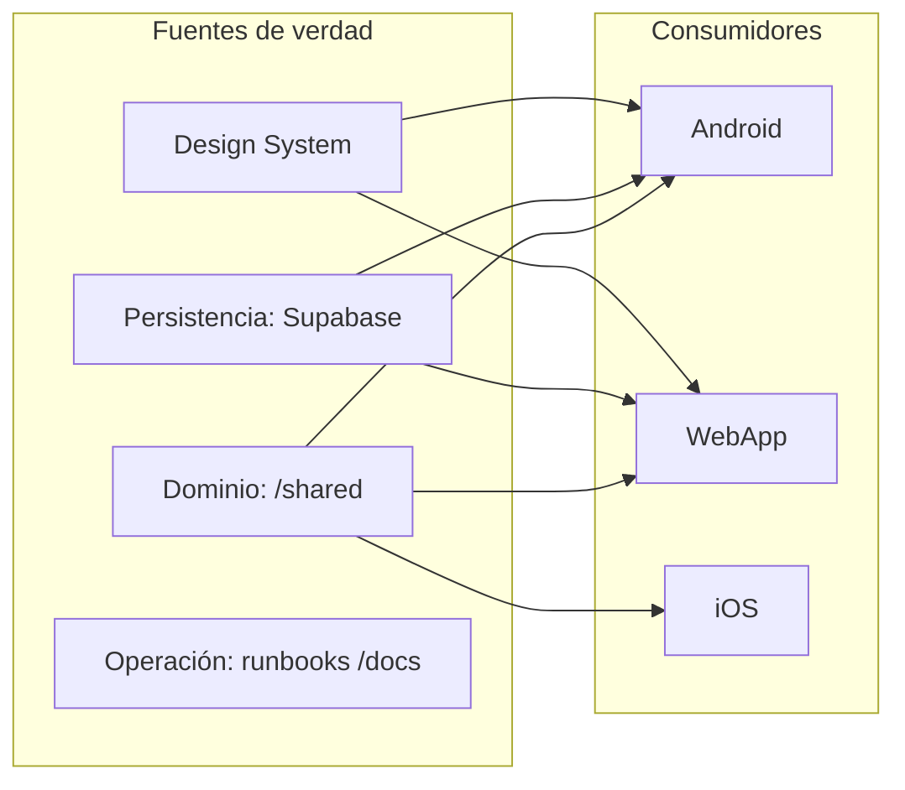
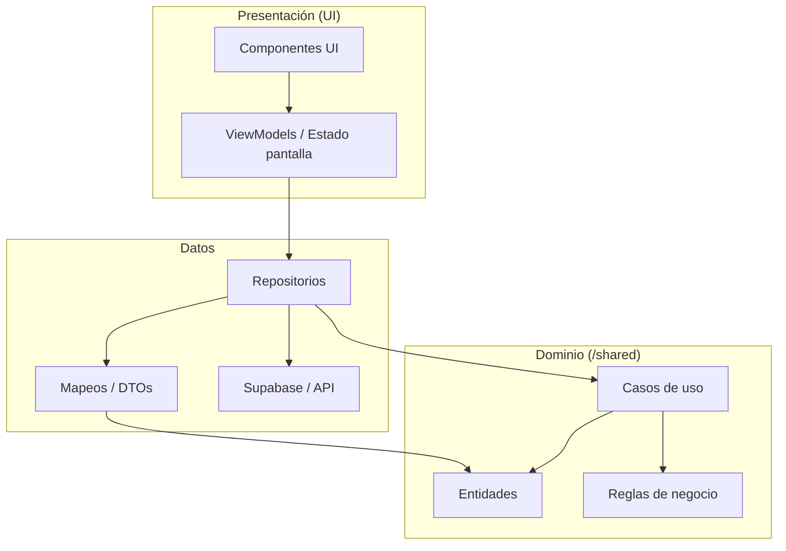
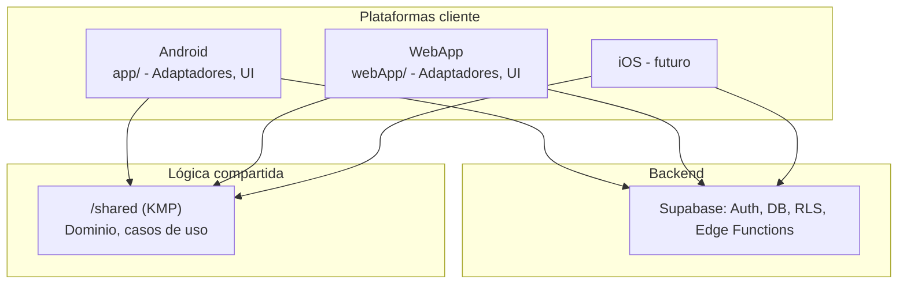

# Documento Maestro de Arquitectura y Gobernanza — Cafesito

Estado: `vivo`  
Versión: `0.1.0`  
Última actualización: `2026-03-04`  
Propietario técnico: `Arquitectura de Plataforma`  
Ámbito: `Android + iOS + WebApp + /shared + Supabase + CI/CD + Operación`

---

## Índice
1. FASE 1 — Visión global y principios arquitectónicos
1.1 Objetivo operativo del sistema  
1.2 Principios no negociables  
1.3 Single Source of Truth (SSOT)  
1.4 Modularidad y límites de responsabilidad  
1.5 Security-by-design  
1.6 Performance-first  
1.7 Accessibility-by-default (mínimo AA)  
1.8 Estrategia cross-platform y regla crítica de `/shared`  
1.9 Riesgos arquitectónicos prioritarios  
1.10 Deuda técnica aceptable vs inaceptable  
1.11 Checklists de cumplimiento de Fase 1  
1.12 Plantillas operativas de Fase 1  

2. FASE 2 — Estructura global del monorepo  
3. FASE 3 — Arquitectura por plataforma  
4. FASE 4 — Design System y UX Governance  
5. FASE 5 — Infraestructura y Seguridad  
6. FASE 6 — Testing, Operación y Documentación Viva *(pendiente)*  

---

# 1) FASE 1 — Visión global y principios arquitectónicos

## 1.1 Objetivo operativo del sistema
Construir y operar un producto multiplataforma de café con:
- Paridad funcional entre Android, iOS y WebApp.
- Lógica de dominio centralizada y reutilizable.
- Seguridad y privacidad por defecto.
- Rendimiento predecible en dispositivos de gama media.
- Accesibilidad mínima WCAG 2.2 AA.
- Capacidad de evolución durante 5+ años sin reescrituras masivas.

Resultado esperado de esta fase:
- Toda decisión futura debe poder trazarse a estos principios.
- Cualquier PR que viole estos principios se bloquea en revisión.

---

## 1.2 Principios no negociables

### P1. Dominio único
La lógica de negocio se modela una vez y se reutiliza.

Enforcement técnico:
- Dominio en `/shared` (Kotlin Multiplatform).
- WebApp solo puede implementar:
  - adaptación de transporte/API,
  - estado de UI,
  - presentación.
- No se permite lógica de reglas de negocio en `webApp/src/features/**` ni `webApp/src/app/**`.

Enforcement organizativo:
- PR checklist obligatorio con sección “duplicación de dominio”.
- Review dual: 1 reviewer de plataforma + 1 reviewer de producto.

Anti-patrón prohibido:
- Reescribir en TypeScript reglas ya existentes en `/shared` (scoring, recomendaciones, validaciones de dominio, decisiones de flujo de negocio).

---

### P2. Arquitectura por contratos
Todo límite entre capas/plataformas se gobierna por contrato explícito (tipos, DTOs, invariantes, errores).

Enforcement técnico:
- Tipos de dominio y mapeos en capa dedicada.
- Fallo de contrato debe ser “fail fast” (sin silencios).

Anti-patrón prohibido:
- Acceder JSON crudo de Supabase directamente desde componentes de UI.

---

### P3. Seguridad por defecto
No hay feature sin threat model básico y sin controles mínimos.

Enforcement técnico:
- RLS obligatorio en tablas de usuario.
- No `service_role` en cliente.
- Secrets solo en entorno servidor/CI seguro.

Anti-patrón prohibido:
- Solucionar permisos en frontend “ocultando botones” sin policy de backend.

---

### P4. Rendimiento como requisito funcional
Cada feature define presupuesto de rendimiento antes de implementar.

Enforcement técnico:
- Presupuestos por plataforma (arranque, interacción, memoria).
- Revisión de bundle y render en PR.

Anti-patrón prohibido:
- Aceptar degradaciones “temporales” sin ticket de remediación fechado.

---

### P5. Accesibilidad por defecto
La accesibilidad no es “fase final”.

Enforcement técnico:
- Componentes base con semántica y foco correctos.
- Tests automáticos de smoke a11y en CI.

Anti-patrón prohibido:
- Modales sin manejo de foco ni cierre por teclado.

---

### P6. Evolución controlada
El sistema evoluciona con ADRs, runbooks y versionado de contratos.

Enforcement organizativo:
- Cambios de arquitectura sin ADR: bloqueados.
- Incidentes sin actualización documental: incompletos.

---

## 1.3 Single Source of Truth (SSOT)

SSOT oficial del proyecto:
- Dominio: `/shared`
- Persistencia y seguridad de datos: `Supabase (schema + RLS + migrations + Edge Functions)`
- Diseño visual/tokens: `Design System`
- Navegación y flujos: contratos de routing/plataforma
- Operación: runbooks y playbooks en `/docs`

Reglas operativas:
1. Si existe implementación de regla en `/shared`, cualquier equivalente en Web/Android/iOS debe eliminarse.
2. Si se modifica un caso de negocio en `/shared`, el PR debe incluir:
   - impacto en Android,
   - impacto en Web,
   - plan de verificación de paridad.
3. Si un requisito no cabe en `/shared`, debe justificarse en ADR con razón técnica (no de conveniencia).

Métrica de control:
- `Shared logic drift`: número de reglas de dominio detectadas fuera de `/shared`.
- Objetivo permanente: `0`.

**Esquema SSOT y flujo de verdad:**



---

## 1.4 Modularidad y límites de responsabilidad

Definición de módulos (alto nivel):
- `Dominio`: reglas, entidades, casos de uso (`/shared`).
- `Datos`: mapeo, repositorios, fuentes remotas/locales.
- `Presentación`: estado de pantalla y componentes de UI.

Regla de dependencia:
- `Presentación -> Datos -> Dominio`
- `Dominio` no depende de UI ni de infraestructura concreta.

**Esquema de dependencias entre capas:**



**Esquema alto nivel por plataforma:**



Criterios de módulo correcto:
- API pública mínima.
- Invariantes documentadas.
- Sin dependencias cíclicas.
- Testable en aislamiento.

Anti-patrones prohibidos:
- “God files” (componentes/controladores con orquestación, dominio y render mezclados).
- Estados globales opacos sin ownership explícito.

---

## 1.5 Security-by-design

Controles mínimos obligatorios por feature:
1. Clasificación de datos: público / interno / sensible.
2. Matriz de acceso: quién lee, quién escribe, quién administra.
3. Validación de entrada: cliente y servidor.
4. Política de autorización real (RLS / Edge).
5. Trazabilidad de acción crítica (auditoría).

Controles de implementación:
- Sanitización de inputs antes de persistir.
- Políticas RLS por tabla sensible.
- Reglas de rate limit en edge functions críticas.
- Revocación y rotación de credenciales documentada.

Checklist “ASUNCIÓN / Verificar / Corregir”:
- ASUNCIÓN: “esta operación solo la hace el dueño”.
  - Verificar: policy RLS con tests de rol.
  - Corregir: crear policy explícita y test negativo.
- ASUNCIÓN: “el frontend nunca enviará payload inválido”.
  - Verificar: validación server-side.
  - Corregir: schema validation + errores tipados.

---

## 1.6 Performance-first

Presupuestos iniciales (base, revisables por ADR):
- Web:
  - LCP p75 móvil: `< 2.5s`
  - INP p75: `< 200ms`
  - CLS p75: `< 0.1`
  - JS inicial gzip: `< 250KB` objetivo, `< 350KB` límite duro temporal
- Android:
  - arranque frío p75 `< 2.2s`
  - frame drops en timeline `< 3%`
- iOS:
  - arranque frío p75 `< 2.2s`
  - interacción crítica `< 100ms` perceptual

Reglas de ingeniería:
- Virtualización en listas largas.
- Carga diferida de secciones no críticas.
- Evitar recomputaciones con memoización y caching con invalidación explícita.
- Preservar estabilidad de layout (evitar saltos).

Anti-patrones prohibidos:
- Filtros pesados en render sin memo/control.
- Backdrop blur intensivo en scroll continuo sin fallback.
- Imágenes sin estrategia de tamaños/resolución.

---

## 1.7 Accessibility-by-default (mínimo AA)

Requisitos base:
- Contraste AA en todos los estados (normal, hover, disabled, focus).
- Navegación completa por teclado en Web.
- Semántica/roles correctos en elementos interactivos.
- Gestión de foco en modales/sheets.
- Labels accesibles en icon-only buttons.
- Soporte de Dynamic Type / Text scaling en nativas.

Reglas de aceptación:
- Ningún PR de UI se aprueba sin:
  - evidencia de navegación teclado,
  - evidencia de lector de pantalla en flujos críticos,
  - captura de contraste en componentes nuevos/ajustados.

Anti-patrones prohibidos:
- Clickable `div` sin rol/teclado.
- Estados solo por color.
- Placeholders como única etiqueta.

---

## 1.8 Estrategia cross-platform y regla crítica de `/shared`

### Regla crítica oficial
La lógica de dominio en `/shared` **no puede duplicarse** en WebApp.
Cualquier cambio en `/shared` impacta obligatoriamente Android y Web.

### Garantía técnica (obligatoria)
1. Estructura de casos de uso en `/shared` con API estable.
2. Adaptadores plataforma:
   - Android/iOS/Web adaptan IO, no reglas.
3. Tests de contrato:
   - fixture común de escenarios de negocio.
   - ejecución por plataforma para verificar mismo resultado esperado.
4. CI con gates:
   - si cambia `/shared`, deben ejecutarse suites Android + Web afectadas.
   - bloqueo si no hay evidencia de paridad.

### Garantía organizativa (obligatoria)
1. Plantilla PR con sección:
   - “¿Cambio en `/shared`? Sí/No”
   - “Impacto Android”
   - “Impacto Web”
   - “Validación de paridad adjunta”
2. Reviewer de “Cross-platform parity” obligatorio para PRs que tocan `/shared`.
3. Incidente de divergencia = severidad alta y corrección prioritaria.

### Señales de ruptura de regla (detección temprana)
- Condicionales de negocio complejos apareciendo en `webApp/src/features/**`.
- Mismos cálculos de recomendación/rating en TS y KMP.
- Bugs “solo en Web” de reglas que deberían ser universales.

### Respuesta estándar si se rompe
1. Congelar feature afectada.
2. Mover regla al dominio compartido.
3. Reemplazar implementación duplicada por adaptación.
4. Añadir test de contrato para evitar regresión.

---

## 1.9 Riesgos arquitectónicos prioritarios

R1. Deriva de lógica entre plataformas  
Impacto: inconsistencia funcional crítica.  
Mitigación:
- contrato de dominio único,
- tests de paridad,
- gate de CI por cambios en `/shared`.

R2. Acoplamiento UI-datos en Web  
Impacto: fragilidad y regresiones rápidas.  
Mitigación:
- capa de mappers y hooks de dominio separados,
- prohibición de acceso crudo a Supabase desde componentes.

R3. Degradación de rendimiento por crecimiento de features  
Impacto: mala experiencia y churn.  
Mitigación:
- budgets obligatorios,
- profiling por release,
- alertas de regresión.

R4. Seguridad delegada solo al cliente  
Impacto: fuga/modificación de datos.  
Mitigación:
- RLS + edge validation + auditoría de policies.

R5. Deuda documental  
Impacto: decisiones inconsistentes y onboarding lento.  
Mitigación:
- documentación viva obligatoria por PR estructural.

---

## 1.10 Deuda técnica aceptable vs inaceptable

### Aceptable (temporal y con fecha)
- Workaround de presentación que no afecte seguridad ni dominio.
- Duplicación mínima de UI mientras se migra componente común.
- Budget de bundle sobre objetivo pero bajo límite duro y con plan de reducción.

Condiciones para aceptar:
- ticket creado,
- owner asignado,
- fecha de vencimiento,
- criterio de cierre medible.

### Inaceptable (bloquea release)
- Duplicación de lógica de dominio fuera de `/shared`.
- Bypass de autorización real en backend.
- Regresión de accesibilidad crítica en flujo principal.
- Secretos expuestos en cliente o repo.
- Cambios estructurales sin actualización de documento maestro/ADR.

---

## 1.11 Checklists de cumplimiento de Fase 1

### Checklist de PR técnico
- [ ] ¿Se respetó dominio único en `/shared`?
- [ ] ¿Hay contratos/mappers claros entre capas?
- [ ] ¿Se validó seguridad (RLS/edge/input)?
- [ ] ¿No hay regresión de rendimiento conocida?
- [ ] ¿Cumple accesibilidad AA en cambios de UI?
- [ ] ¿Se actualizaron documentos vivos necesarios?

### Checklist de cambios en `/shared`
- [ ] Android validado con escenarios impactados.
- [ ] Web validada con escenarios impactados.
- [ ] Tests de paridad actualizados o añadidos.
- [ ] PR incluye evidencia de misma salida funcional en ambas plataformas.

### Checklist de release
- [ ] Sin deuda inaceptable abierta.
- [ ] KPIs de performance en rango.
- [ ] Incidentes de seguridad en cero críticos.
- [ ] Smoke tests de a11y y auth en verde.

---

## 1.12 Plantillas operativas de Fase 1

### Plantilla — Decisión arquitectónica rápida
```
Contexto:
Decisión:
Opciones descartadas:
Riesgos:
Impacto en /shared:
Impacto Android:
Impacto iOS:
Impacto Web:
Estrategia de rollback:
Métricas de validación:
```

### Plantilla — Excepción técnica temporal
```
Tipo de excepción:
Motivo:
Riesgo explícito:
Alcance:
Fecha límite:
Owner:
Plan de remediación:
Test que valida remediación:
```

### Plantilla — Verificación ASUNCIÓN / Verificar / Corregir
```
ASUNCIÓN:
Cómo verificar:
Resultado observado:
Cómo corregir:
Fecha objetivo de corrección:
Responsable:
```

---

## Criterio de salida de Fase 1
Esta fase se considera cerrada cuando:
1. El equipo acepta estos principios como reglas de aprobación.
2. Los checklists se incorporan en PR template/CI.
3. El owner de arquitectura queda definido.

---

**Fin Fase 1.**

---

# 2) FASE 2 — Estructura global del monorepo

## 2.1 Árbol global del repositorio (estructura objetivo vigente)

```text
cafesito-app-android/
├─ app/                              # Android nativo (Kotlin + Compose)
│  ├─ src/main/java/com/cafesito/app/
│  │  ├─ analytics/
│  │  ├─ camera/
│  │  ├─ data/
│  │  ├─ di/
│  │  ├─ fcm/
│  │  ├─ navigation/
│  │  ├─ notifications/
│  │  ├─ platform/
│  │  ├─ security/
│  │  ├─ startup/
│  │  └─ ui/
│  │     ├─ access/ brewlab/ components/ detail/ diary/ profile/ search/ theme/ timeline/ utils/
│  ├─ src/main/res/                  # drawables, raw, values, xml
│  ├─ src/test/                      # unit tests android
│  └─ src/androidTest/               # instrumentation tests
├─ iosApp/                           # iOS nativo (SwiftUI + integración KMP)
│  └─ CafesitoIOS/
├─ shared/                           # Kotlin Multiplatform (núcleo compartido)
│  └─ src/
│     ├─ commonMain/kotlin/com/cafesito/shared/
│     │  ├─ core/
│     │  ├─ data/
│     │  │  ├─ local/ model/ remote/ repository/
│     │  ├─ domain/
│     │  │  ├─ repository/ search/ usecase/ validation/
│     │  ├─ platform/
│     │  └─ presentation/
│     ├─ commonMain/sqldelight/com/cafesito/shared/data/local/
│     ├─ commonTest/
│     ├─ androidMain/
│     ├─ androidUnitTest/
│     └─ iosMain/
├─ webApp/                           # React + Vite + PWA + Playwright
│  ├─ src/
│  │  ├─ app/
│  │  ├─ config/
│  │  ├─ core/
│  │  ├─ data/
│  │  ├─ features/
│  │  ├─ hooks/
│  │  │  └─ domains/
│  │  ├─ mappers/
│  │  ├─ styles/
│  │  │  ├─ components/
│  │  │  └─ features/
│  │  └─ ui/
│  │     └─ components/
│  ├─ e2e/
│  ├─ public/
│  └─ scripts/
├─ docs/                             # documentación viva y operativa
│  ├─ supabase/edge-functions/
│  └─ commit-notes/
├─ infra/                            # scripts/infra auxiliar
│  └─ scripts/
├─ scripts/                          # utilidades globales repo
├─ .github/                          # CI/CD workflows
├─ gradle/                           # wrapper/config gradle
├─ build.gradle.kts                  # raíz
└─ settings.gradle.kts               # módulos del monorepo
```

---

## 2.2 Responsabilidad de cada módulo

### `shared/` (núcleo de negocio multiplataforma)
Responsabilidad:
- Entidades de dominio.
- Casos de uso.
- Validaciones de negocio.
- Contratos de repositorio.
- Modelos comunes y transformaciones de dominio.

Permitido:
- Kotlin multiplatform puro.
- Reglas deterministas de negocio.
- Abstracciones de data source.

Prohibido:
- Código específico de UI de Android/iOS/Web.
- Dependencias directas a frameworks de presentación.
- Lógica temporal “solo web”.

---

### `app/` (Android)
Responsabilidad:
- Render Compose.
- Navegación Android.
- Integraciones Android (camera, FCM, permisos, lifecycle, keystore).
- Adaptadores hacia `/shared`.

Permitido:
- Estado de pantalla.
- Mapeo UI ↔ dominio.
- Instrumentación Android.

Prohibido:
- Reglas de negocio que ya existen en `/shared`.
- SQL o requests de negocio “saltándose” contratos de data/domain.

---

### `iosApp/` (iOS)
Responsabilidad:
- Render SwiftUI.
- Navegación iOS.
- Integraciones iOS (Keychain, notificaciones, permisos).
- Adaptadores hacia `/shared`.

Permitido:
- Estado y binding de UI.
- Interop con framework generado por KMP.

Prohibido:
- Reescritura de reglas de dominio presentes en `/shared`.

---

### `webApp/`
Responsabilidad:
- Presentación Web (React).
- Routing y layouts Web.
- Gestión de estado de UI.
- Adaptación de transporte/API para usar contratos de dominio.

Permitido:
- Componentes UI.
- Hooks de pantalla.
- Mappers de entrada/salida API.

Prohibido:
- Duplicar lógica de negocio de `/shared`.
- Crear reglas de dominio en `features/` o `app/`.
- Añadir estilos/componentes paralelos al design system existente sin justificación ADR.

---

### `docs/`
Responsabilidad:
- Fuente de verdad documental.
- Runbooks, ADRs, contratos, guía de operación.

Prohibido:
- Documentación huérfana sin owner/fecha.
- Decisiones arquitectónicas sin ADR cuando alteran límites de capa.

---

### `infra/` y `scripts/`
Responsabilidad:
- Automatización operativa (build, deploy, verificación, utilidades de mantenimiento).

Prohibido:
- Scripts destructivos sin confirmación explícita.
- Script no idempotente usado en CI.

---

## 2.3 Qué está prohibido por capa (domain / data / presentation)

## Domain
Prohibido:
- Dependencias a SDKs de UI, HTTP concreto o DB concreta.
- Efectos secundarios no deterministas no encapsulados.

Debe contener:
- Entidades, reglas, invariantes, casos de uso.

## Data
Prohibido:
- Renderización.
- Reglas de negocio finales embebidas en repositorios.

Debe contener:
- DTOs, mappers, fuentes remotas/locales, implementación de repositorios.

## Presentation
Prohibido:
- Cálculo de negocio complejo.
- Persistencia directa sin pasar por contratos de data/domain.

Debe contener:
- Estado de interacción, render, navegación, accesibilidad de UI.

---

## 2.4 Convenciones de naming (obligatorias)

### Kotlin (shared/app)
- Paquetes por dominio funcional: `com.cafesito.shared.domain.usecase`
- Use cases: `VerbNounUseCase` (`GetTimelineUseCase`, `SaveReviewUseCase`)
- Repositorios: `XRepository` (interfaz en domain, impl en data)
- Mappers: `XMapper` o `toDomain()/toDto()`
- DTO: `XDto`

### Swift/iOS
- Vistas: `XView`
- ViewModels: `XViewModel`
- Bridges KMP: `XSharedAdapter`

### TypeScript/Web
- Features: carpeta por bounded context (`timeline`, `search`, `coffee`, `profile`, `diary`, `brew`, `auth`)
- Hooks de dominio: `use<Feature><Concern>Domain` o `use<Feature><Concern>Actions`
- Tipos: `*Row`, `*Bundle`, `*ViewModel` solo cuando aplique
- Componentes base UI: `PascalCase.tsx` en `ui/components/`
- CSS:
  - tokens/base/components/features separados
  - nombres de clase estables por feature (evitar utilitarios improvisados globales)

### Convención de tests
- Unit: `*.test.ts`, `*.test.tsx`, `*Test.kt`
- E2E: specs por feature y por tipo de guard/flujo (`auth-and-routing.spec.ts`, `guest-guards.spec.ts`)

---

## 2.5 Gestión de dependencias (regla de gobierno)

## Regla D1 — Entrada de dependencia
Toda dependencia nueva debe pasar checklist:
- ¿Resuelve problema no cubierto por stack actual?
- ¿Tiene mantenimiento activo?
- ¿Impacto bundle/binario?
- ¿Riesgo de lock-in?

Si falla uno de estos puntos: no se aprueba.

## Regla D2 — Alcance mínimo
- Dependencias de UI sólo en capa presentación.
- Dependencias de data sólo en data.
- En `/shared/commonMain` evitar libs no multiplataforma.

## Regla D3 — Versionado coordinado
- Android/Gradle: actualizaciones controladas por ventana de mantenimiento.
- Web/npm: actualizar con changelog y test matrix.
- iOS: actualización de paquetes con validación en dispositivo real.

## Regla D4 — Detección de dependencias muertas
- Revisión mensual:
  - imports sin uso,
  - paquetes no referenciados,
  - archivos duplicados JS/TS.
- Acción: eliminar en la misma iteración de hallazgo.

---

## 2.6 Versionado interno del monorepo

Modelo:
- SemVer por release de producto.
- Cambios de contratos internos (domain/data API) requieren:
  - nota de cambio en `docs/`,
  - plan de migración.

Etiqueta recomendada de commits:
- `arch:`
- `domain:`
- `android:`
- `ios:`
- `web:`
- `infra:`
- `docs:`
- `test:`

Regla:
- PR multi-módulo debe declarar impacto por módulo en descripción.

---

## 2.7 Estrategia de refactors (sin degradar entrega)

Patrón obligatorio:
1. Introducir estructura nueva.
2. Migrar feature por feature.
3. Añadir tests de regresión.
4. Eliminar código legado al final (sin convivencia indefinida).

Límites:
- No dejar dualidad de rutas de ejecución > 2 sprints.
- Refactor sin métricas de “done” no se cierra.

Métricas de “refactor completado”:
- Sin imports al módulo legado.
- Cobertura de tests estable o mejor.
- Sin deuda crítica abierta del refactor.

---

## 2.8 Control de duplicación de lógica (sección crítica)

## 2.8.1 Definición operativa
Lógica de dominio:
- Cualquier regla que transforma decisiones de negocio:
  - validaciones funcionales,
  - scoring/recomendación,
  - cálculo de estados de negocio,
  - permisos de negocio,
  - composición de casos de uso.

Lógica de presentación:
- Render, layout, animaciones, microinteracciones.
- Estado efímero de UI (open/close, selected tab, drag state).
- Formateo visual no crítico al negocio.

Regla:
- Dominio: `/shared`.
- Presentación: plataforma correspondiente.

---

## 2.8.2 Cómo se evita duplicación en Web
1. Crear/usar caso de uso en `/shared` para toda regla de negocio nueva.
2. En Web, consumir salida de ese caso de uso o contrato equivalente, nunca recrear regla.
3. Si Web necesita adaptación, se limita a `mappers/` y `data/`.
4. Cualquier función en Web con patrón de negocio debe pasar revisión “possible-domain-duplication”.

Patrones sospechosos en Web (a bloquear):
- `calculate*Score`, `recommend*`, `validate*Business*`, `resolve*Rule`.
- Switch/if extensos con condiciones funcionales de negocio.

---

## 2.8.3 Checks de CI obligatorios

Check C1 — Cambio en `/shared` requiere matrix Android+Web
- Trigger: diff toca `shared/**`.
- Acción CI:
  - `:shared:test`
  - `:app:testDebugUnitTest` mínimo
  - `webApp npm run test`
  - `webApp npm run test:e2e` smoke
- Si cualquier job falla: PR bloqueada.

Check C2 — Detector de duplicación de dominio en Web
- Script CI (regla semántica + regex inicial):
  - inspeccionar `webApp/src/features/**` y `webApp/src/app/**`
  - detectar funciones candidatas de negocio.
- Salida:
  - warning en primer mes de adopción,
  - error bloqueante al consolidar baseline.

Check C3 — Imports prohibidos por capa
- ESLint + reglas de límites:
  - `features/` no importa `data/supabaseApi` directamente salvo vía hooks de dominio autorizados.
  - `ui/components` sin acceso a `data/`.

Check C4 — Contrato de paridad
- Suite de escenarios de negocio compartidos con expected outputs.
- Runner por plataforma (Android/Web) con comparación de snapshots de dominio.

---

## 2.8.4 Qué ocurre si se rompe la regla
Severidad: `Alta` (arquitectura).

Protocolo:
1. Marcar incidente de arquitectura.
2. Bloquear merge de nuevos cambios sobre esa ruta.
3. Crear ticket de remediación con owner y fecha.
4. Migrar lógica duplicada a `/shared`.
5. Añadir test que prevenga recurrencia.
6. Cerrar incidente sólo con evidencia de paridad restablecida.

---

## 2.9 Inventario de prohibiciones por módulo (resumen ejecutable)

- `shared/domain/**`: prohibido importar data source concreto.
- `app/ui/**`: prohibido contener validación de negocio final.
- `iosApp/**`: prohibido duplicar casos de uso de `/shared`.
- `webApp/features/**`: prohibido cálculo de negocio replicado.
- `webApp/ui/**`: prohibido acceso a red/DB.
- `docs/**`: prohibido documento sin owner, versión y fecha.

---

## 2.10 Checklist de aceptación de Fase 2

- [ ] Árbol de monorepo alineado con secciones anteriores.
- [ ] Cada módulo tiene responsabilidad y prohibiciones explícitas.
- [ ] Capas domain/data/presentation definidas y aplicadas.
- [ ] Naming conventions adoptadas en plantillas y revisión.
- [ ] Checks CI de no-duplicación definidos técnicamente.
- [ ] Protocolo de ruptura de regla `/shared` aprobado.

---

## 2.11 Plantilla de PR para control de duplicación (obligatoria)

```md
## Impacto por módulo
- [ ] shared
- [ ] app (Android)
- [ ] iosApp
- [ ] webApp
- [ ] infra
- [ ] docs

## Dominio compartido
- ¿Se añadió/modificó regla de negocio? (Sí/No)
- Si Sí, ¿vive en /shared? (Sí/No)
- Evidencia de paridad Android/Web:
  - enlace test Android:
  - enlace test Web:

## Riesgo de duplicación
- ¿Se creó lógica funcional en Web `features/app`? (Sí/No)
- Justificación:

## Actualización documental
- Documento actualizado:
- Sección:
```

---

**Fin Fase 2.**  
Esperando confirmación para continuar con **FASE 3 — Arquitectura por plataforma**.

---

# 3) FASE 3 — Arquitectura por plataforma

## 3.1 Android (Kotlin + Jetpack Compose)

## 3.1.1 Arquitectura objetivo Android
Estructura vigente observada:
- `app/src/main/java/com/cafesito/app/`
  - `ui/*` (Compose screens + componentes)
  - `navigation/` (rutas y back stack)
  - `di/` (inyección)
  - `data/` (adaptadores Android)
  - `analytics/`, `fcm/`, `camera/`, `security/`, `startup/`
- `implementation(project(":shared"))` obligatorio en `app/build.gradle.kts`.

Modelo:
- UI (Compose) consume estado y eventos.
- Estado/orquestación de feature en capa de presentación Android.
- Reglas de negocio y casos de uso en `/shared`.
- Data Android solo adapta platform concerns y transporte.

Flujo estándar:
1. UI emite intención.
2. Presentación invoca caso de uso de `/shared`.
3. Caso de uso devuelve resultado tipado.
4. UI renderiza estado + feedback.

Prohibido:
- Implementar reglas funcionales de negocio en `app/ui/**`.
- Saltar `/shared` para resolver decisiones de dominio.

---

## 3.1.2 Estado (state management)
Regla:
- Estado inmutable por pantalla.
- Eventos de UI explícitos.
- Efectos de una sola vez (toast, navegación, diálogo) separados del estado persistente.

Enforcement:
- Cada pantalla debe tener:
  - `UiState`
  - `Intent/Action`
  - `Effect` (si aplica)
- Tests unitarios de reducer/orquestación.

Anti-patrón:
- Estados mutables dispersos en múltiples composables sin owner central.

---

## 3.1.3 Navegación
Reglas:
- Navegación declarada en módulo `navigation/`.
- Rutas con argumentos tipados.
- Deep links definidos por contrato de producto.

Checklist:
- [ ] Cada destino tiene contrato de entrada.
- [ ] Back navigation determinista.
- [ ] Restauración de estado al volver.

---

## 3.1.4 Offline y persistencia
Base técnica:
- Room en `app` + SQLDelight en `shared` (según caso de uso y estrategia vigente).
- Estrategia recomendada: `cache-first` para lectura crítica, `network-first` para eventos que requieren frescura.

Reglas:
- Definir por feature:
  - comportamiento sin red,
  - política de reintento,
  - criterio de invalidación.

Prohibido:
- Pantalla crítica sin comportamiento definido offline.

---

## 3.1.5 Seguridad Android
Controles mínimos:
- Keystore para secretos locales.
- `usesCleartextTraffic=false` en release (ya configurado).
- Proguard/R8 activo en release (ya configurado).
- Tokens no persistidos en texto plano.

Checklist release:
- [ ] build release ofuscada.
- [ ] sin logs sensibles.
- [ ] validación de permisos runtime.
- [ ] endpoints bajo TLS.

---

## 3.1.6 Testing Android
Mínimos obligatorios:
- Unit tests en `app/src/test`.
- Instrumentation tests en `app/src/androidTest`.
- Tests de integración con `/shared` para casos críticos.

Cobertura mínima recomendada:
- Dominio consumido por Android: 80%+ rutas críticas.
- UI smoke por pantalla principal.

---

## 3.1.7 Performance budgets Android
Budgets operativos:
- Arranque frío p75: `< 2.2s`
- Frame drops timeline p95: `< 3%`
- Tiempo de primera interacción utilizable: `< 1.2s` tras abrir pantalla principal.
- Memoria en sesión estándar: sin crecimiento no acotado.

Validación:
- Baseline profile + macrobenchmark en pipeline de release.
- Comparación contra baseline previa.

Bloqueo:
- Si un PR degrada >10% una métrica crítica sin ADR, no se mergea.

---

## 3.2 iOS (SwiftUI + integración `/shared`)

## 3.2.1 Arquitectura objetivo iOS
Estado observado:
- `iosApp/CafesitoIOS/` con app SwiftUI y wrapper de ViewModel de `Shared`.

Modelo:
- SwiftUI para presentación.
- Wrappers de ViewModel para observar `StateFlow` y `Effects`.
- Lógica funcional en `/shared`.

Reglas:
- Cualquier ViewModel con negocio debe originarse en `/shared`.
- Wrappers iOS solo adaptan lifecycle, threading y binding SwiftUI.

Prohibido:
- Duplicar use cases en Swift.
- Mantener reglas de negocio divergentes “temporalmente”.

---

## 3.2.2 Integración con `/shared`
Patrón obligatorio:
1. `Factory` en `/shared`.
2. Wrapper Swift (`ObservableObject`) para:
   - suscripción a state flow,
   - suscripción a effects,
   - cierre de recursos.

Checklist:
- [ ] Wrapper cierra observadores (`close`) en deinit.
- [ ] Errores de dominio se presentan sin pérdida de contexto.
- [ ] Intentos de UI mapean 1:1 con intents de `/shared`.

---

## 3.2.3 Seguridad iOS
Controles:
- Keychain para tokens/credenciales.
- ATS (App Transport Security) estricto.
- Sin secretos embebidos en binario cliente.

Prohibido:
- Persistencia de token en `UserDefaults` sin cifrado.
- Bypass de autorización backend por “feature flag” local.

---

## 3.2.4 Testing iOS
Mínimos:
- Unit tests de wrappers y mapeos.
- UI tests de flujos críticos (auth, navegación principal, acción protegida).
- Tests de paridad de resultados de negocio contra `/shared`.

---

## 3.2.5 Paridad funcional con Android/Web
Regla:
- Si cambia `/shared`, iOS debe validar escenarios impactados antes de merge.

Evidencia obligatoria en PR:
- Escenarios afectados.
- Resultado esperado.
- Captura/log de validación.

Incumplimiento:
- Etiqueta `parity-blocker`.
- Bloqueo de release.

---

## 3.3 Web (React + Vite + PWA)

## 3.3.1 Arquitectura objetivo Web
Estructura vigente:
- `webApp/src/app` orquestación.
- `webApp/src/features/*` por dominio funcional.
- `webApp/src/hooks/domains/*` estado/side-effects por dominio.
- `webApp/src/ui/components/*` design primitives.
- `webApp/src/core/*` routing/layout/guards utilitarios.
- `webApp/src/data + mappers` acceso y normalización.

Regla:
- `features/` no contiene lógica de negocio de dominio.
- Orquestación en hooks de dominio + contratos de datos.

---

## 3.3.2 Routing
Reglas:
- Rutas canónicas en `core/routing`.
- Sync de ruta y guards en hooks dedicados (`useRouteSync`).
- Rutas públicas y protegidas explícitas.

Contratos mínimos:
- Público: detalle de café.
- Protegido: timeline/search/brewlab/diary/profile.

Checklist:
- [ ] ruta inválida se normaliza.
- [ ] guard redirige sin loop.
- [ ] URL refleja estado de pantalla compartible.

---

## 3.3.3 State management
Modelo actual:
- Hook por dominio (`useXDomain`, `useXActions`).
- Estado global acotado en `AppContainer`.

Regla de evolución:
- Reducir orquestación monolítica.
- Extraer estado complejo a hooks/modular slices.

Prohibido:
- Side effects en render.
- Estado duplicado entre feature y app sin fuente única.

---

## 3.3.4 PWA
Base:
- `vite-plugin-pwa` activo.
- Service worker en producción.

Reglas:
- Caching de recursos estáticos + estrategia controlada para API.
- Invalidación versionada por release.
- No cachear respuestas sensibles de usuario sin estrategia explícita.

Checklist:
- [ ] instalación funciona.
- [ ] SW se actualiza sin quedar en estado zombie.
- [ ] fallback offline definido para rutas públicas.

---

## 3.3.5 Layout móvil vs desktop
Reglas:
- Mobile-first para flujo principal.
- Desktop con rails/paneles solo cuando aporte contexto sin romper flujo móvil.
- Misma semántica funcional, distinto layout permitido.

Prohibido:
- Cambiar comportamiento de negocio por breakpoint.

---

## 3.3.6 Modo iOS-like (glass topbar/tabbar)
Regla funcional:
- Efecto “glass” (topbar/tabbar translúcido) solo en contexto iOS-like.
- Detección combinada:
  - user agent iOS + viewport táctil.

Fallback:
- Si `backdrop-filter` no está soportado o degrada rendimiento, usar fondo sólido semitransparente sin blur.

Prohibido:
- Forzar glass en desktop no iOS.

---

## 3.3.7 Safe areas
Requisitos:
- Uso de `env(safe-area-inset-*)` en top/bottom bars.
- Evitar solapamiento de CTA y navegación en notch/home indicator.

Checklist:
- [ ] iPhone con notch sin clipping.
- [ ] teclado virtual no tapa acciones críticas.

---

## 3.3.8 Performance de `backdrop-filter`
Política:
- Máximo blur por capa y por cantidad de capas simultáneas.
- No animar propiedades costosas en scroll continuo.
- Medir INP/FPS en dispositivos iOS de referencia.

Budget operativo:
- No más de 2 superficies con blur activo simultáneo en pantalla.
- Si INP empeora >15% frente a baseline, activar fallback sin blur.

---

## 3.3.9 Accesibilidad de teclado (Web)
Obligatorio:
- Todos los controles interactivos alcanzables por Tab.
- Modales/sheets con trap de foco y Escape.
- Focus visible consistente.

Checklist de regresión:
- [ ] abrir/cerrar modal por teclado.
- [ ] navegación de topbar/bottom-nav sin mouse.
- [ ] acciones icon-only con `aria-label`.

---

## 3.3.10 SEO técnico (público y cerrado)

Superficie pública indexable:
- Detalle de café con URL canónica.
- Meta title/description dinámicos.
- Canonical y OpenGraph.
- Prerender de páginas públicas clave.

Superficie cerrada:
- No indexable (meta robots noindex, rutas protegidas sin contenido indexable).

Reglas:
- Público: contenido semántico SSR/prerender cuando aplique.
- Privado: no exponer datos de usuario en HTML público.

Checklist:
- [ ] canonical correcto.
- [ ] robots/noindex en rutas privadas.
- [ ] sitemap sólo con rutas públicas.

---

## 3.4 Matriz de paridad entre plataformas (operativa)

Cada feature nueva debe rellenar:
- Caso de uso en `/shared`: Sí/No + justificación.
- Android: estado implementación.
- iOS: estado implementación.
- Web: estado implementación.
- Pruebas de paridad adjuntas.

Estados permitidos:
- `parity-complete`
- `parity-in-progress` (máximo 1 sprint)
- `parity-blocked` (requiere plan y owner)

---

## 3.5 Anti-patrones prohibidos en Fase 3

- Reglas de negocio replicadas en TS/Swift/Kotlin app en vez de `/shared`.
- Navegación con side effects implícitos y no trazables.
- UI que depende directamente de SQL/HTTP sin capa data/mappers.
- Soluciones visuales iOS-like aplicadas globalmente sin detección de contexto.
- Accesibilidad “manual” por pantalla en lugar de primitives accesibles.

---

## 3.6 Checklist de aceptación de Fase 3

- [ ] Android: arquitectura, seguridad, testing y budgets definidos.
- [ ] iOS: integración con shared y reglas de paridad definidas.
- [ ] Web: routing/state/PWA/SEO/a11y definidos con enforcement.
- [ ] Reglas iOS-like + safe area + blur performance establecidas.
- [ ] Matriz de paridad formal incluida.

---

**Fin Fase 3.**  
Esperando confirmación para continuar con **FASE 4 — Design System y UX Governance**.

---

# 4) FASE 4 — Design System y UX Governance

## 4.1 Objetivo de gobernanza visual
Garantizar consistencia total de UX/UI entre Android, iOS y Web, evitando deriva visual y funcional.

Regla principal:
- **No crear nuevos colores, componentes o variantes si ya existe equivalente aprobado.**

Si se requiere algo nuevo:
1. justificar brecha funcional real,
2. documentar impacto cross-platform,
3. aprobar por ADR de diseño,
4. implementar en las 3 plataformas o dejar plan explícito de paridad.

---

## 4.2 Inventario oficial de tokens (fuente actual)

## 4.2.1 Web tokens base (vigente)
Archivo: `webApp/src/styles/tokens.css`

Familia tipográfica:
- `--font-family-base: "Segoe UI", sans-serif`
- `--font-sans`

Escala tipográfica:
- `--font-size-2xs` `--font-size-xs` `--font-size-sm` `--font-size-md` `--font-size-lg` `--font-size-xl` `--font-size-2xl`

Espaciados:
- `--space-1` a `--space-8`

Motion:
- `--duration-fast`
- `--duration-normal`
- `--duration-slow`
- `--ease-standard`

Paleta:
- `--espresso-deep`
- `--espresso-medium`
- `--caramel-accent`
- `--caramel-soft`
- `--screen-light-background`
- `--screen-dark-background`
- `--pure-white`
- `--pure-black`
- `--border-light`
- `--border-default`
- `--border-strong`
- `--text-main`
- `--text-subtle`
- `--text-muted`
- `--danger`
- `--focus-ring`

Iconografía/tamaño:
- `--icon-size-sm`
- `--icon-size-md`
- `--icon-size-lg`

Radios:
- `--radius-pill`
- `--radius-sm`
- `--radius-md`
- `--radius-lg`
- `--radius-card`

Layout:
- `--topbar-height`

---

## 4.2.2 Android tokens base (vigente)
Archivos:
- `app/src/main/java/com/cafesito/app/ui/theme/Color.kt`
- `app/src/main/java/com/cafesito/app/ui/theme/Type.kt`
- `app/src/main/java/com/cafesito/app/ui/theme/Theme.kt`

Colores oficiales:
- `EspressoDeep`
- `EspressoMedium`
- `CaramelAccent`
- `CaramelSoft`
- `ScreenLightBackground`
- `ScreenDarkBackground`
- `PureWhite`
- `PureBlack`
- `BorderLight`
- `MutedCream`
- `DarkBorder`
- `DarkOutline`
- `SuccessGreen`
- `ElectricRed`
- `ErrorRed`
- `OrangeYellow`

Tipografía oficial:
- `CafesitoTypography` con jerarquías:
  - `headlineLarge`
  - `headlineMedium`
  - `titleLarge`
  - `bodyLarge`
  - `bodyMedium`
  - `labelLarge`

Tema:
- `CafesitoTheme(darkTheme: Boolean)` con esquemas Light/Dark.

---

## 4.2.3 iOS tokens base (estado actual)
Estado observado:
- No existe aún un módulo explícito de tokens iOS (p. ej. `DesignTokens.swift`).
- Uso actual de estilos SwiftUI base (`.roundedBorder`, `.borderedProminent`, `.secondary`, etc.).

Regla inmediata:
- iOS debe converger a un archivo de tokens propio alineado 1:1 con la semántica de Android/Web.

Acción obligatoria:
- Crear `iosApp/CafesitoIOS/DesignSystem/` con:
  - `ColorTokens.swift`
  - `TypographyTokens.swift`
  - `SpacingTokens.swift`
  - `RadiusTokens.swift`
  - `ComponentStyles.swift`

---

## 4.3 Catálogo oficial de componentes base

## 4.3.1 Web UI primitives oficiales
Fuente: `webApp/src/ui/components/index.ts`

Componentes permitidos:
- `Button`
- `Chip`
- `IconButton`
- `Input`
- `Select`
- `SheetOverlay`
- `SheetCard`
- `SheetHandle`
- `SheetHeader`
- `Switch`
- `Tabs`
- `TabButton`
- `Textarea`
- `Topbar`

Regla:
- En features, usar primitives oficiales; no crear clones locales de botones/inputs/tabs/sheets.

---

## 4.3.2 Android UI base
Ubicación principal:
- `app/src/main/java/com/cafesito/app/ui/components/`

Regla:
- Cualquier componente reutilizable nuevo debe vivir aquí.
- Pantallas de feature sólo componen componentes base + layout de pantalla.

---

## 4.3.3 iOS UI base
Estado actual:
- No existe aún catálogo explícito de componentes base.

Acción obligatoria:
- Crear `iosApp/CafesitoIOS/UIComponents/` con equivalentes:
  - `PrimaryButton`
  - `IconButton`
  - `TopBar`
  - `BottomTabs`
  - `ModalSheet`
  - `InputField`
  - `FilterChip`

---

## 4.4 Regla estricta: no crear nuevos componentes/colores si ya existe equivalente

## 4.4.1 Criterio de reutilización
Antes de crear algo nuevo, responder:
1. ¿Existe un componente semánticamente equivalente?
2. ¿Se puede extender por variante (`size`, `tone`, `state`) sin romper API?
3. ¿El caso es realmente nuevo o sólo styling puntual?

Si cualquiera es “sí”: reutilizar/variabilizar, no crear.

## 4.4.2 Excepciones permitidas
Solo con ADR cuando:
- hay nueva interacción no modelable por variantes existentes,
- hay requerimiento de accesibilidad no cubierto,
- hay requerimiento de plataforma nativa sin equivalente razonable.

---

## 4.5 Anti-patrones de UI/UX prohibidos

- Colores hardcoded en feature cuando existe token.
- Tipografías ad-hoc por pantalla.
- Radios/sombras arbitrarios sin token.
- Componente duplicado con nombre distinto y comportamiento igual.
- Uso de `div` clickable sin semántica/teclado (Web).
- Variantes visuales no documentadas en design system.
- Estados activos/inactivos inconsistentes entre plataformas.

---

## 4.6 Reglas responsive y diferencias permitidas por plataforma

## 4.6.1 Reglas comunes
- Móvil es baseline funcional.
- Desktop amplía contexto, no cambia reglas de negocio.
- Safe areas respetadas en móviles con notch.

## 4.6.2 Diferencias permitidas
- Patrón de navegación nativo (Compose nav, SwiftUI nav, router web).
- Tratamiento visual contextual (glass en iOS-like web).
- Microinteracciones específicas de plataforma.

## 4.6.3 Diferencias no permitidas
- Cambiar semántica de acciones (ej. favorito/guardar/comentar) por plataforma.
- Cambiar orden de flujo funcional sin justificación de UX aprobada.

---

## 4.7 Gobernanza de evolución del design system

## 4.7.1 Flujo de cambio obligatorio
1. Solicitud de cambio (issue diseño).
2. Evaluación de impacto (Android+iOS+Web).
3. Decisión:
   - `reusar`
   - `extender variante`
   - `nuevo componente` (con ADR)
4. Implementación con checklist cross-platform.
5. Actualización de documentación viva.

## 4.7.2 Checklist de aceptación de cambio DS
- [ ] Token nuevo justificado.
- [ ] Componente o variante añadida en catálogo.
- [ ] Estados de interacción definidos.
- [ ] Contraste AA validado.
- [ ] Comportamiento teclado/lector definido (Web).
- [ ] Paridad Android/Web/iOS planificada o ejecutada.

---

## 4.8 Matriz de equivalencia visual entre plataformas (mínima obligatoria)

| Semántica | Android token/componente | Web token/componente | iOS equivalente requerido |
|---|---|---|---|
| Fondo pantalla claro | `ScreenLightBackground` | `--screen-light-background` | `ColorTokens.screenLightBackground` |
| Fondo pantalla oscuro | `ScreenDarkBackground` | `--screen-dark-background` | `ColorTokens.screenDarkBackground` |
| Color primario espresso | `EspressoDeep` | `--espresso-deep` | `ColorTokens.espressoDeep` |
| Accent caramelo | `CaramelAccent` | `--caramel-accent` | `ColorTokens.caramelAccent` |
| Botón principal | UI components Android | `Button` variant oficial | `PrimaryButton` |
| Input estándar | UI components Android | `Input` | `InputField` |
| Sheet/modal | UI components Android | `SheetOverlay/SheetCard` | `ModalSheet` |
| Tabs navegación | UI components Android | `Tabs/TabButton` | `TopTabs/SegmentControl` homologado |

Regla:
- Si una fila no tiene equivalente en iOS, no se considera cierre de paridad visual.

---

## 4.9 Enforcement técnico (CI + revisión)

## 4.9.1 Lint de tokens Web
Check CI:
- bloquear colores hardcoded en `webApp/src/features/**` salvo excepciones permitidas.

Regla ejemplo:
- prohibir `#` literals fuera de `tokens.css` y temas documentados.

## 4.9.2 Revisión de componentes duplicados
Check CI:
- detectar componentes con firma/markup altamente similar en rutas distintas.
- abrir warning obligatorio de consolidación.

## 4.9.3 PR template UX governance
Obligatorio en cambios de UI:
- “¿Reutiliza componente existente?”
- “¿Añade token nuevo?”
- “¿Impacta paridad cross-platform?”
- “¿A11y AA verificada?”

---

## 4.10 Métricas de salud del design system

KPIs obligatorios:
- `% pantallas que usan primitives oficiales`
- `nº colores hardcoded fuera de tokens`
- `nº componentes duplicados`
- `nº excepciones activas de diseño`
- `tiempo medio de convergencia de paridad visual`

Objetivos:
- Hardcoded colors fuera de tokens: `0`
- Duplicados de componente base: `0`
- Excepciones abiertas > 1 sprint: `0`

---

## 4.11 Plan de convergencia iOS (gap actual)

Gaps actuales detectados:
- iOS sin design system explícito.
- textos con problemas de encoding en flujos antiguos.

Plan mínimo obligatorio:
1. Crear módulo `DesignSystem` en iOS.
2. Migrar `SearchView` y componentes base a tokens iOS.
3. Añadir snapshot tests visuales por tema light/dark.
4. Verificación de contraste AA en componentes clave.

Criterio de cierre:
- iOS usa tokens y componentes base equivalentes en flujos core.

---

## 4.12 Checklist de aceptación de Fase 4

- [ ] Tokens oficiales definidos y mapeados por plataforma.
- [ ] Catálogo de componentes base definido por plataforma.
- [ ] Regla “no crear si existe” con excepciones formales.
- [ ] Anti-patrones prohibidos documentados.
- [ ] Reglas responsive y diferencias permitidas definidas.
- [ ] Enforcement técnico (lint/CI/revisión) documentado.
- [ ] Plan de convergencia iOS explícito.

---

**Fin Fase 4.**  
Esperando confirmación para continuar con **FASE 5 — Infraestructura y Seguridad**.

---

# 5) FASE 5 — Infraestructura y Seguridad

## 5.1 Objetivo operativo de infraestructura
Operar Cafesito con una base segura, auditada y recuperable:
- autorización real en backend (`RLS`),
- secretos fuera de cliente,
- CI/CD reproducible y con rollback definido,
- trazabilidad de cambios de datos y despliegues.

Resultado exigido:
- ningún flujo crítico depende de “seguridad por UI”,
- toda incidencia severa tiene playbook de contención en menos de 30 minutos.

---

## 5.2 Supabase: estándar obligatorio

## 5.2.1 Estructura y fuente de verdad
Estado actual del repo:
- SQL operativo en `docs/supabase/*.sql`
- funciones edge en `docs/supabase/edge-functions/*`

Regla obligatoria a partir de esta fase:
- el estado de producción debe gestionarse en un proyecto Supabase con migraciones versionadas y auditables.

Estructura objetivo:
- `supabase/config.toml`
- `supabase/migrations/<timestamp>_<name>.sql`
- `supabase/functions/<function-name>/index.ts`
- `supabase/seed.sql` (si aplica)

Prohibido:
- cambios directos en dashboard de Supabase sin reflejo en migración.
- SQL “manual” en producción sin PR.

---

## 5.2.2 RLS obligatorio por tabla de negocio
Tablas mínimas sujetas a RLS:
- `users`
- `posts`
- `comments`
- `notifications_db`
- `diary_entries`
- tablas de favoritos/seguimiento/despensa

Contrato:
1. `RLS ON` en todas las tablas de negocio.
2. políticas `SELECT/INSERT/UPDATE/DELETE` explícitas por rol.
3. tests negativos: acceso denegado a usuario no dueño.

Checklist de policy por tabla:
- [ ] `ALTER TABLE ... ENABLE ROW LEVEL SECURITY`
- [ ] policy de lectura de propios datos
- [ ] policy de escritura solo propietario
- [ ] policy de admin/service limitada
- [ ] test de usuario anónimo y usuario autenticado ajeno

---

## 5.2.3 Edge Functions (incluye push)
Referencia actual:
- `docs/supabase/edge-functions/send-notification.ts`

Reglas:
- cada función con contrato de entrada/salida documentado.
- validación de payload al inicio.
- idempotencia en operaciones reintentables.
- timeout y manejo de errores estandarizado.

Variables permitidas en edge:
- `SUPABASE_URL`
- `SUPABASE_SERVICE_ROLE_KEY`
- `FCM_SERVER_KEY` o proveedor equivalente

Prohibido:
- exponer `SUPABASE_SERVICE_ROLE_KEY` al cliente.
- reusar secrets de producción en entornos de dev.

---

## 5.2.4 Migrations, cron y jobs programados
Regla:
- cualquier cambio de schema se aplica vía migración.
- jobs recurrentes (limpieza, recomputación, envío diferido) deben declararse y versionarse.

Plantilla mínima de cambio de datos:
1. migración SQL,
2. rollback SQL viable,
3. validación en staging,
4. despliegue controlado,
5. verificación post-deploy.

---

## 5.2.5 Backups y recuperación
Política mínima:
- backup diario automático de base de datos.
- retención mínima 30 días.
- restore drill mensual en entorno aislado.

SLO de recuperación:
- RPO objetivo: 24h (máximo temporal hasta mejorar a 4h).
- RTO objetivo: 2h en incidente crítico.

Evidencias obligatorias:
- fecha de último backup válido,
- evidencia de último restore drill,
- incidencia abierta si restore drill falla.

---

## 5.3 Seguridad de aplicación (cliente + backend)

## 5.3.1 Gestión de tokens y sesiones
Web:
- usar sesión de Supabase con almacenamiento controlado.
- limpiar sesión al logout y en revocación remota.

Android:
- secretos en Android Keystore.
- no persistir tokens sensibles en texto plano.

iOS:
- secretos en Keychain.
- no exponer token en logs.

Prohibido:
- imprimir tokens en consola/logcat.
- persistir refresh token sin cifrado del sistema.

---

## 5.3.2 CSP, CORS y aislamiento web
WebApp (Vite + React) debe publicar con política CSP mínima:
- `default-src 'self'`
- `script-src 'self'`
- `style-src 'self' 'unsafe-inline'` (temporal, reducir progresivamente)
- `img-src 'self' data: https:`
- `connect-src 'self' https://*.supabase.co`
- `font-src 'self' data:`
- `frame-ancestors 'none'`

CORS:
- permitir solo dominios de frontends oficiales por entorno.
- bloquear comodines en producción.

Enforcement:
- test smoke de headers de seguridad en pipeline web.

---

## 5.3.3 XSS, CSRF y validación de entradas
XSS:
- no usar `dangerouslySetInnerHTML` salvo sanitización robusta.
- sanitizar contenido generado por usuario antes de render persistente.

CSRF:
- para endpoints stateful externos a Supabase, usar token CSRF o protección de mismo sitio.

Validación:
- backend valida siempre, aunque frontend valide.
- contratos estrictos en edge functions.

---

## 5.3.4 Prohibición de `service_role` en cliente
Regla crítica:
- en Web/Android/iOS solo `anon key` (y sesiones de usuario).
- `service_role` únicamente en backend controlado (edge/server/CI).

Check automático:
- escaneo en CI para detectar `service_role` en código cliente.

Si se detecta:
1. bloquear merge,
2. rotar secret comprometido,
3. abrir incidente de seguridad,
4. auditar accesos.

---

## 5.4 Threat model mínimo (obligatorio por feature crítica)

Plantilla STRIDE simplificada:
- Activo protegido
- Actor malicioso probable
- Vector de ataque
- Impacto
- Mitigación
- Evidencia de test

Escenarios mínimos de Cafesito:
1. Exfiltración de datos de usuario por policy RLS incompleta.
2. Abuse de notificaciones push por endpoint no autenticado.
3. Escalada de permisos por validación insuficiente en edge.
4. Secuestro de sesión en cliente compartido.
5. Inyección de contenido malicioso en comentarios/reseñas.

Ninguna feature crítica pasa a producción sin threat model firmado.

---

## 5.5 Rotación de claves y secretos

Frecuencia mínima:
- trimestral para claves de integración no humanas.
- inmediata tras incidente o sospecha de fuga.

Procedimiento:
1. generar clave nueva,
2. desplegar en entorno no productivo,
3. desplegar en producción con ventana controlada,
4. invalidar clave anterior,
5. verificar telemetría de errores,
6. registrar operación en `docs/security/key-rotation-log.md`.

Tiempo máximo entre detección de fuga y revocación:
- 60 minutos.

---

## 5.6 CI/CD por plataforma (estado y estándar)

## 5.6.1 Android
Workflows actuales:
- `.github/workflows/android-quality.yml`
- `.github/workflows/release-android.yml`

Controles mínimos:
- tests `shared` y `app`,
- `assembleDebug`,
- release firmado con secretos de GitHub Actions,
- publicación Play por rama (`Interna/Alpha/Beta/main`).

Mejora obligatoria:
- agregar job de verificación de políticas de seguridad (secrets leakage + lint reglas críticas).

---

## 5.6.2 Web
Workflow actual:
- `.github/workflows/multiplatform-ci.yml` (job `web`)

Controles actuales:
- `npm ci`
- `npm test`
- `npm run build`

Controles obligatorios adicionales:
- test de headers de seguridad (CSP/CORS en entorno deploy),
- scan de dependencias vulnerables (alto/crítico bloquea),
- smoke e2e de autenticación + rutas públicas de detalle café.

---

## 5.6.3 iOS
Estado actual:
- smoke de `shared` para XCFramework en `.github/workflows/multiplatform-ci.yml`.

Gap:
- no hay pipeline completo de build/test de app iOS nativa.

Acción obligatoria:
- crear workflow iOS dedicado con:
  - build,
  - tests unitarios,
  - validación de firma/config de release (cuando aplique).

---

## 5.6.4 Entornos y variables
Entornos obligatorios:
- `dev`
- `staging`
- `production`

Variables por entorno:
- Supabase URL
- Supabase anon key
- secretos de push
- credenciales de release móvil

Reglas:
- `.env.example` sin secretos reales.
- no commitear `.env` con credenciales productivas.
- rotación y ownership de secretos documentado.

---

## 5.6.5 Plan de rollback (obligatorio)
Tipos de rollback:
1. `app rollback` (Android/iOS): revertir release al canal previo estable.
2. `web rollback`: redeploy de artefacto anterior.
3. `db rollback`: migración reversa o restauración puntual.
4. `edge rollback`: redeploy versión previa de función.

Playbook de decisión:
- severidad `S1`: rollback inmediato sin esperar fix.
- severidad `S2`: rollback si no hay fix validado en < 2h.
- severidad `S3`: hotfix preferente sin rollback global.

Registro obligatorio:
- incidente,
- versión afectada,
- timestamp de rollback,
- validación post-rollback.

---

## 5.7 ASUNCIÓN / Cómo verificar / Cómo corregir

### Caso A — “RLS está bien configurado”
- Verificar:
  - intentar leer/escribir datos de otro usuario con sesión autenticada distinta.
  - test automatizado negativo por tabla.
- Corregir:
  - crear/ajustar policy por operación,
  - añadir test de regresión.

### Caso B — “No hay secretos en cliente”
- Verificar:
  - escaneo CI de patrones `service_role`, `private_key`, `BEGIN PRIVATE KEY`.
- Corregir:
  - revocar y regenerar secret,
  - mover uso a edge/backend.

### Caso C — “Push es seguro”
- Verificar:
  - endpoint autenticado/autorizado,
  - rate limit y validación payload.
- Corregir:
  - cerrar acceso público,
  - añadir límites y auditoría de eventos.

---

## 5.8 Checklist de aceptación de Fase 5

- [ ] Supabase operado con migraciones versionadas.
- [ ] RLS habilitado y testeado en tablas de negocio.
- [ ] Edge functions con validación, errores tipados e idempotencia básica.
- [ ] Política de backups y restore drill activa.
- [ ] Gestión de tokens/secrets por plataforma definida y aplicada.
- [ ] Prohibición de `service_role` en cliente con check CI.
- [ ] Threat model mínimo aplicado en features críticas.
- [ ] Rotación de claves documentada y operativa.
- [ ] CI/CD de Android/Web/iOS definido con controles de seguridad.
- [ ] Plan de rollback probado y documentado.

---

# 6) FASE 6 — Testing, Operación y Documentación Viva

## 6.1 Estrategia de Testing Multiplataforma

### 6.1.1 Pirámide de Tests y Responsabilidades
El objetivo no es el 100% de cobertura teórica, sino la **validación de invariantes de negocio y paridad funcional**.

1.  **Unit Tests (80% lógica de dominio):**
    *   **Ubicación:** `shared/commonTest`, `app/src/test`, `webApp/src/**/*.test.ts`.
    *   **Foco:** Reglas de cálculo, validaciones de entrada, conversores/mappers.
    *   **Enforcement:** Fallo en unit test bloquea el avance del pipeline.

2.  **Integration Tests (Mallas de contrato):**
    *   **Ubicación:** `shared/commonTest` (con suites específicas por plataforma si el interop es complejo).
    *   **Foco:** Persistencia (SQLDelight/Room), integración con Supabase (via mocks realistas o contenedores), flujos de Use Case completos.
    *   **Regla Crítica:** Todo Use Case en `/shared` debe tener al menos un test de integración que simule éxito y error.

3.  **UI & Snapshot Tests:**
    *   **Android:** Compose Preview tests + Screenshot testing (Paparazzi o similar).
    *   **iOS:** SnapshotTesting (Point-Free).
    *   **Web:** Storybook interactions + Chromatic (opcional).
    *   **Foco:** Regresiones visuales, estados de carga y error, accesibilidad básica.

4.  **E2E (End-to-End):**
    *   **Android/iOS:** Maestro o Appium para flujos críticos (Auth -> Post -> Feed).
    *   **Web:** Playwright en `webApp/e2e`.
    *   **Foco:** Smoke tests de usuario real.

---

### 6.1.2 Tests de Paridad (Detección de Drift)
Para garantizar que la WebApp y Android se comportan igual ante cambios en `/shared`:
*   **Contrato de Datos Común:** Uso de fixtures JSON compartidos en `shared/commonTest/resources`.
*   **Runner Dual:** Un job de CI que ejecuta el mismo set de inputs contra la implementación Kotlin (Android) y la adaptación TypeScript (Web) y compara el output.
*   **Trigger:** Cambio en `shared/domain` o `shared/data`.

---

### 6.1.3 Performance Budgets (Revisiones Técnicas)
*   **Web:** Lighthouse CI integrado. Límite: Performance < 90 en mobile = Warning.
*   **Android:** Macrobenchmark para scroll de timeline. Límite: Jank > 5% = Bloqueo.
*   **Backend:** Latencia de Edge Functions < 300ms (p75).

---

## 6.2 Operación: Runbook de Diagnóstico y Respuesta

### 6.2.1 Diagnóstico de Autenticación
*   **Síntoma:** Usuario no puede entrar o pierde sesión.
*   **Checklist:**
    1.  Verificar estado de Supabase Auth (Dashboard).
    2.  Check de expiración de token en cliente (Console/Logcat).
    3.  Validar si hay bloqueo por IP o Rate Limit en Supabase.
    4.  Verificar si ha habido cambio de secretos en CI que haya roto la `anon_key`.

### 6.2.2 Diagnóstico de RLS (Permisos)
*   **Síntoma:** Error 401/403 o lista vacía inesperada.
*   **Checklist:**
    1.  Ejecutar query manual en Supabase SQL Editor con el `user_id` afectado: `SET request.jwt.claims = '{"sub": "UUID"}'; SELECT * FROM table;`.
    2.  Verificar si la columna `user_id` o `owner_id` está poblada correctamente.
    3.  Validar si la tabla tiene `RLS ENABLED`.

### 6.2.3 Diagnóstico de Builds y Despliegue
*   **Síntoma:** El pipeline falla en `shared` o `web`.
*   **Checklist:**
    1.  Check de compatibilidad de versiones de Kotlin/Compose (si hubo actualización de Gradle).
    2.  Validar caché de dependencias (limpiar `.gradle` o `node_modules`).
    3.  Verificar cuotas de GitHub Actions o proveedores de hosting.

---

## 6.3 Analíticas y Estrategia de Marketing Técnico

### 6.3.1 Medición de Componentes (Data-Driven)
**Regla:** Ningún componente interactivo nuevo va a producción sin eventos de analítica.
*   **Nivel 1 (Básico):** Impresión de componente (View).
*   **Nivel 2 (Interacción):** Click, Swipe, Errores de validación.
*   **Nivel 3 (Negocio):** Conversión (ej. tiempo desde "ver detalle café" hasta "añadir a favoritos").

**Framework de Analíticas:**
*   Se abstrae en `/shared` con una interfaz `AnalyticsProvider`.
*   Implementación en plataformas (Firebase Analytics para Android/iOS, Plausible/Mixpanel para Web).

### 6.3.2 Marketing Técnico y SEO de Crecimiento
*   **Público:** SEO dinámico en detalle de café (`webApp`). Uso de JSON-LD para datos estructurados de productos (cafés, cafeterías).
*   **Retención:** Estrategia de Push Notifications segmentada desde Supabase Edge Functions (triggers por inactividad calculados en `/shared`).
*   **Referidos:** Deep links universales que funcionen igual en web y abran la app nativa si está instalada (Android App Links / iOS Universal Links).

---

## 6.4 Documentación Viva: Fuente de la Verdad

### 6.4.1 Estructura de `/docs`
**Índice y gobernanza:** `/docs/README.md` — índice de toda la documentación, principio de documento vivo, reglas para evitar incompatibilidades y reducir tasa de errores.

**Estructura actual:**
*   `/docs/` (raíz): Documento Maestro (este archivo), flujos de release/deploy, planes, guías (DEVELOPMENT_WORKFLOW_AI_CURSOR, CRASH_FIX_WEEKLY, STEPs, ANALITICAS, ACCESIBILIDAD_WEBAPP_ANDROID, etc.).
*   `/docs/gtm/`: Configuración GTM (Web/Android): guías paso a paso, referencia de contenedores; fuente de verdad de analíticas: `docs/ANALITICAS.md`.
*   `/docs/commit-notes/`: Notas de commit por despliegue (trazabilidad).
*   `/docs/supabase/`: SQL (RLS, triggers, migrations), Edge Functions, runbooks de Supabase, webhooks.
*   `/docs/runbooks/`: Índice de runbooks; ver `runbooks/README.md`. Runbooks concretos en raíz (ej. CRASH_FIX_WEEKLY) o en `supabase/` según ámbito.
*   `/docs/adr/`, `/docs/api/`, `/docs/ux/`: Previstos para ADRs, contratos de API y tokens/UX; crear cuando se añadan documentos de ese tipo.
*   `/docs/DEVELOPMENT_WORKFLOW_AI_CURSOR.md`: Flujo de desarrollo con IA (Cursor): consultar docs antes de código y avisar antes de modificar documentación. Ver 6.4.3.

**WebApp:** `/webApp/docs/` — documentación específica de la web (ej. auditoría de accesibilidad).

### 6.4.2 Mantenimiento de este Documento
Este documento **NO es estático**. Debe actualizarse cuando:
1.  Se cambie una tecnología core (ej. cambio de base de datos o framework de UI).
2.  Se detecte una desviación sistemática (drift) de la arquitectura.
3.  Se añada un nuevo proceso de gobernanza o CI/CD.
4.  Se resuelva un incidente grave cuya causa raíz fue una falta de definición aquí.

**Versionado:**
`MAJOR.MINOR.PATCH`
*   `MAJOR`: Cambio estructural de arquitectura.
*   `MINOR`: Nueva sección o actualización de fase.
*   `PATCH`: Corrección de erratas o aclaraciones.

### 6.4.3 Desarrollo asistido (Cursor / IA)
Cuando se usa Cursor (u otro agente de IA) para escribir o modificar código:
*   **Consultar docs antes de código:** El agente debe revisar `docs/` y `webApp/docs/` según el ámbito del cambio y usar esa documentación como fuente de verdad antes de implementar.
*   **No modificar docs sin avisar:** Si la implementación requiere cambiar o ampliar documentación (este documento, guías en `docs/`, `webApp/docs/`), el agente debe indicar al usuario qué archivos habría que actualizar y por qué, y esperar confirmación antes de aplicar cambios en los docs.

Regla de Cursor que aplica este flujo: `.cursor/rules/docs-before-code.mdc` (`alwaysApply: true`). Detalle de flujos de acciones: **`docs/DEVELOPMENT_WORKFLOW_AI_CURSOR.md`**.

### 6.4.4 Documento vivo: evitar incompatibilidades y reducir errores
*   **Una sola fuente de verdad por tema:** no duplicar contenido; enlazar al doc canónico (ej. flujo de release: `RELEASE_DEPLOY_WORKFLOW.md`). Si otro doc contradice, actualizar o marcar como obsoleto con enlace al vigente.
*   **Cabecera en documentos:** incluir al menos Estado y Última actualización para saber si el doc está vigente.
*   **Runbooks:** tras resolver un incidente con cambios permanentes, crear o actualizar runbook (causas raíz, cambios aplicados) y registrarlo en `docs/runbooks/README.md`.
*   **Índice:** usar `docs/README.md` como punto de entrada; mantener el índice al añadir o mover documentos.

---

## 6.5 Checklist Final de Pre-Release (Gatekeeper)

Antes de mover cualquier tag a `main` o `Prod`:
*   [ ] **Tests:** Unitarios, integración y E2E playbooks en verde.
*   [ ] **Paridad:** Confirmado que `/shared` no tiene duplicados en Web.
*   [ ] **Seguridad:** RLS verificado y secrets rotados si aplica.
*   [ ] **A11y:** Checklist AA cumplido en nuevas pantallas.
*   [ ] **Performance:** Budgets dentro de rango.
*   [ ] **Docs:** Versión de este documento actualizada en la cabecera.

---

# 7) APÉNDICE — Evolución, Calidad y Escalabilidad Progresiva

## 7.1 Internacionalización (i18n) Centralizada
Para garantizar que Cafesito hable el mismo idioma en todas las plataformas:
*   **Fuente Única:** Los recursos de texto (`strings`) deben residir en `/shared` (ej. usando `moko-resources` o similar).
*   **Consumo:** Android, iOS y Web consumen la misma clave de traducción.
*   **Regla:** No se permiten textos "hardcoded" en las vistas de plataforma. Todo texto debe pasar por el sistema de i18n centralizado.

## 7.2 Feature Flagging y Remote Config
Para desacoplar el despliegue de código de la activación de funcionalidades:
*   **Capa Shared:** Interfaz `FeatureManager` definida en `/shared`.
*   **Backend:** Configuración gestionada en Supabase (tabla `remote_config` o similar).
*   **Caso de Uso:** Desactivar el "Timeline" globalmente si se detecta un fallo crítico sin requerir una nueva versión en las stores.

## 7.3 Observabilidad Técnica (Error Reporting)
Más allá de las analíticas de negocio, necesitamos el pulso técnico:
*   **Crash Reporting:** Integración de **Sentry** o **Firebase Crashlytics**.
*   **Shared Errors:** Los errores capturados en el código compartido (`/shared`) deben reportarse con paridad de contexto entre plataformas.
*   **Enforcement:** Cada release debe tener una tasa de sesiones libres de errores > 99.9%.

## 7.4 Protocolo de "Boy Scout Rule" (Manejo de Deuda)
El proyecto ha evolucionado y existe código "legado" que no cumple este documento maestro:
*   **Regla del 20%:** Al tocar cualquier fichero para una nueva funcionalidad, el 20% del esfuerzo debe dedicarse a refactorizarlo para alinearlo con este Documento Maestro.
*   **Legacy Warnings:** Si un componente antiguo viola una regla de seguridad o paridad, debe marcarse con `@Deprecated` o equivalente y crear un ticket de remediación vinculado.

---

**Fin del Documento Maestro de Arquitectura y Gobernanza.**
*Este documento es la fuente de la verdad para Cafesito. Su cumplimiento garantiza la escalabilidad a 5+ años y la excelencia técnica multiplataforma.*
