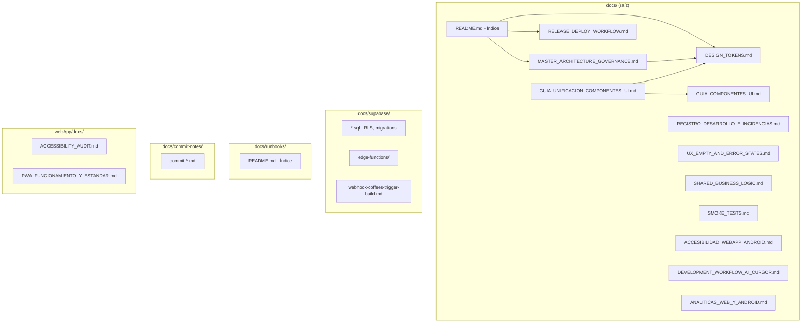
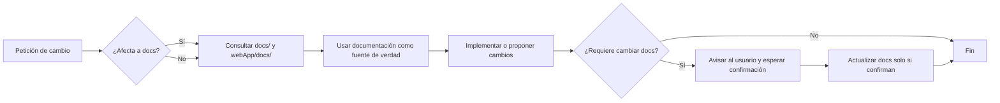
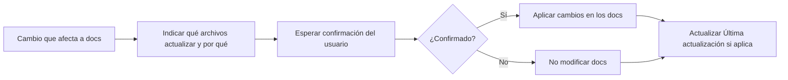
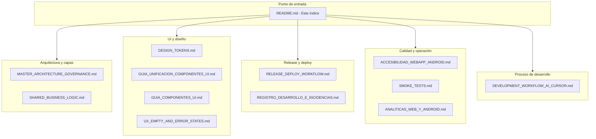
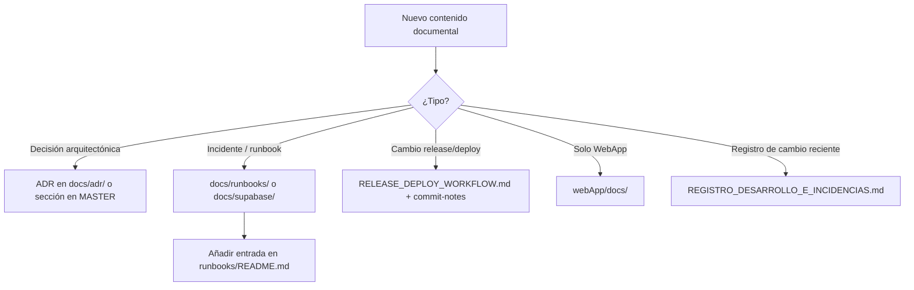

# Documentación Cafesito — Índice y gobernanza

**Estado:** vivo  
**Última actualización:** 2026-03-17 (registro §17 despensa, diario, deploy, CI)  
**Objetivo:** documentación como fuente de verdad, sin incompatibilidades y con menor tasa de errores.

---

## 1. Principio: documento vivo

- La documentación **no es estática**. Se actualiza cuando cambia la arquitectura, los flujos o los procesos.
- **Una sola fuente de verdad por tema:** evita duplicar el mismo contenido en varios sitios; enlaza al doc canónico.
- **Antes de cambiar código:** consulta los docs relevantes (`docs/`, `webApp/docs/`) y alinea la implementación.
- **Antes de cambiar documentación:** si trabajas con IA/agente, indica qué archivos tocarías y espera confirmación. Ver `DEVELOPMENT_WORKFLOW_AI_CURSOR.md`.

---

## 2. Evitar incompatibilidades y reducir errores

- **No contradigas** el Documento Maestro (`MASTER_ARCHITECTURE_GOVERNANCE.md`). Si algo queda obsoleto, actualiza el doc o añade una nota de deprecación con enlace al doc vigente.
- **Flujo de release:** la fuente de verdad para ramas y despliegue es `RELEASE_DEPLOY_WORKFLOW.md` (incluye configuración Play Console y secretos Android/Web).
- **Runbooks:** si resuelves un incidente y aplicas cambios permanentes, actualiza el runbook correspondiente o crea uno nuevo con fecha y causas raíz.
- **Cabecera en documentos nuevos:** incluye al menos `Estado`, `Última actualización` y, si aplica, `Ámbito` o `Propietario`, para saber si el doc está vigente.

---

## 3. Estructura actual de `/docs`

| Ruta | Contenido |
|------|------------|
| **Raíz** | Documento Maestro, flujos de release/deploy, planes y guías de desarrollo. |
| `docs/commit-notes/` | Notas de commit por despliegue (trazabilidad). |
| `docs/supabase/` | SQL (RLS, triggers, migrations), Edge Functions, runbooks de Supabase, webhooks. |
| `docs/runbooks/` | Índice de runbooks; los runbooks concretos pueden estar aquí o en `supabase/` (p. ej. notificaciones). |

**WebApp:** `webApp/docs/` — documentación específica de la web (p. ej. auditoría de accesibilidad).

### 3.1 Esquema de la estructura de documentación

---

## 4. Índice de documentos (por uso)

### 4.1 Arquitectura y gobernanza

| Documento | Descripción |
|-----------|-------------|
| `MASTER_ARCHITECTURE_GOVERNANCE.md` | Fuente de verdad: principios, estructura del monorepo, capas, diseño, seguridad, testing, documentación. |
| `DESIGN_TOKENS.md` | **Tokens de diseño:** colores (marrón día/noche, rojo eliminar, azul agua, fondos), espaciados/gaps, radios. Referencia única para WebApp y Android. |
| `GUIA_UNIFICACION_COMPONENTES_UI.md` | **Unificación UI:** estilos, espacios y funcionalidades por plataforma; cuándo crear o evolucionar componentes; checklist de estandarización. |
| `GUIA_COMPONENTES_UI.md` | **Inventario de componentes UI:** cada componente (WebApp y Android) definido por estilos, funcionalidad, dónde se usa y estado; reutilizar o evolucionar en nuevas pantallas; eliminar los no usados. |
| `UX_EMPTY_AND_ERROR_STATES.md` | Patrón unificado para estados vacío (mensaje + CTA) y error de red (mensaje + Reintentar) en Web y Android. |
| `SHARED_BUSINESS_LOGIC.md` | Qué lógica de negocio es compartida (diario, brew, reseñas, recomendaciones) y dónde vive (shared/, webApp/core/). |
| `DOCUMENTO_FUNCIONAL_CAFESITO.md` | **Especificación funcional:** flujos principales (Despensa, Diario, Elaboración, Perfil, Auth) y criterios de aceptación por flujo. Consultar antes de cambiar comportamiento de usuario. |
| `SMOKE_TESTS.md` | Flujo de humo crítico (login → diario → detalle/añadir) y dónde añadir tests en Web y Android. |
| `TESTING_PRE_POST_DESARROLLO.md` | **Testing pre y post:** qué validar antes de codear (docs, criterios, flujos) y después (build, tests, smoke, checklist manual). |
| `ACCESIBILIDAD_WEBAPP_ANDROID.md` | **Accesibilidad (fuente única):** criterios mínimos (aria-label/contentDescription, 44px/48dp, contraste WCAG), revisión WebApp y Android, huecos, checklist al eliminar/modificar/añadir UI. |
| `DEVELOPMENT_WORKFLOW_AI_CURSOR.md` | Flujo para desarrollo con IA: consultar docs antes de código; avisar antes de modificar docs. |
| `ANALITICAS_WEB_Y_ANDROID.md` | **Analíticas:** qué se recoge en WebApp (GA4) y Android (Firebase), archivos implicados y checklist al eliminar/modificar/añadir funcionalidades. Consultar siempre antes de tocar rutas o pantallas. |
| `MULTIPLATFORM_EXECUTION_PLAN.md` | Plan de ejecución multiplataforma (Android, iOS, Web); decisión web y auditoría. |
| `PLAN_OFFLINE_FIRST_Y_FOTOS_CAMARA.md` | Plan offline-first por pantalla, galería/cámara y permisos (Android). |

### 4.2 Release, deploy y CI/CD

| Documento | Descripción |
|-----------|-------------|
| `RELEASE_DEPLOY_WORKFLOW.md` | **Fuente de verdad:** cuándo se ejecuta el workflow, ramas (Interna/Alpha/Beta/Producción), jobs, secretos (Android/Play + Web Ionos), configuración Play Console, revisión de crashes. |
| `REGISTRO_DESARROLLO_E_INCIDENCIAS.md` | **Registro reciente:** cambios de desarrollo, incidencias resueltas (p. ej. deploy-web/TypeScript), política de ramas (main, beta, alpha, Interna) y flujo main → beta. Consultar en próximos desarrollos o incidencias. |
| `REGISTRO_CAMBIOS_PARIDAD_Y_MEJORAS_2026-03.md` | **Paridad Web/Android (mar 2026):** inventario de cambios y eliminaciones (actividad perfil, ADN, despensa, listas, diario, elaboración, auth, Supabase) para futuras modificaciones y mejoras. |
| `supabase/webhook-coffees-trigger-build.md` | Deploy web: prerender de cafés, SEO, requisitos servidor (SPA fallback), webhook Supabase → build (actualizar web sin Git). |

### 4.3 Runbooks y operación

| Documento | Descripción |
|-----------|-------------|
| `CRASH_FIX_WEEKLY.md` | Revisión y resolución de crashes (manual, desde Cursor); flujo y rutas. |
| `runbooks/README.md` | Índice de runbooks (crash, notificaciones, etc.). |
| `supabase/NOTIFICATIONS_RUNBOOK_2026-03-04.md` | Runbook notificaciones/push; causas raíz y cambios aplicados. |

### 4.4 Pasos y calidad (iOS / multiplataforma)

| Documento | Descripción |
|-----------|-------------|
| `STEP6_SWIFTUI.md` | Paso 6 — SwiftUI bridge de ejemplo (Search). |
| `STEP7_IOS_SETUP.md` | Paso 7 — Proyecto iOS + Shared vía SPM. |
| `STEP8_QUALITY.md` | Paso 8 — Batería de calidad (tests, criterios, riesgos). |

### 4.5 Android y WebApp: servicios, llamadas y optimización

| Documento | Descripción |
|-----------|-------------|
| `ANDROID_Y_WEBAPP_SERVICIOS_CONECTADOS_LLAMADAS_Y_OPTIMIZACION.md` | **Servicios Android y WebApp:** a qué está conectada cada app (Supabase, Firebase/GA4, FCM solo Android), detalle de llamadas por tabla/RPC, SyncManager (Android) y carga inicial/usuario (WebApp), Realtime, y propuestas de optimización para ambas plataformas. |

### 4.6 Supabase (SQL, Edge Functions, webhooks)

| Documento / carpeta | Descripción |
|---------------------|-------------|
| `supabase/*.sql` | Scripts RLS, triggers, migrations (notifications, push, coffees, diary, users, etc.). |
| `supabase/CONEXION_SUPABASE_ANDROID.md` | **Conexión Android:** posibles problemas (red, 500, auth, timeouts) y qué comprobar; enlace al fix de `get_my_internal_id` y a user_lists_500_troubleshooting. |
| `supabase/user_lists_500_troubleshooting.md` | 500 en user_lists / user_list_members: pasos para aplicar el fix y comprobar columna en users_db. |
| `supabase/edge-functions/` | Edge Functions (trigger-coffees-build, process-pending-account-deletions, send-notification). |
| `supabase/webhook-coffees-trigger-build.md` | Deploy web: prerender, SEO, SPA fallback, webhook cafés → build (ver también 4.2). |

### 4.7 Trazabilidad de despliegues

| Ubicación | Descripción |
|-----------|-------------|
| `commit-notes/commit-*.md` | Notas por despliegue; enlazadas desde la tabla en `RELEASE_DEPLOY_WORKFLOW.md`. |

### 4.8 WebApp y port Android

| Documento | Descripción |
|-----------|-------------|
| `ACCESIBILIDAD_WEBAPP_ANDROID.md` | Accesibilidad unificada Web/Android (ver 4.1). |
| `webApp/docs/ACCESSIBILITY_AUDIT.md` | Auditoría de accesibilidad (scope, validaciones, riesgos, regresión). |
| `webApp/docs/PWA_FUNCIONAMIENTO_Y_ESTANDAR.md` | **PWA:** cómo debe funcionar la WebApp instalable (manifest, SW, offline, standalone), archivos implicados y checklist de cumplimiento/pendientes. |
| `CHANGELOG_WEB_UI_AND_ANDROID_PORT.md` | Changelog de cambios en la WebApp y guía de traslado nativo a Android (paridad funcional). |
| `OPCIONES_DE_LISTA_WEB_Y_ANDROID.md` | **Opciones de lista:** backend (Supabase), flujo WebApp (página opciones) y paridad Android (pantalla Opciones de lista, privacidad, miembros, invitaciones, copiar enlace, editar/eliminar/abandonar). |

---

## 5. Workflows obligatorios

### 5.1 Antes de escribir o modificar código

**Regla:** Siempre consultar `docs/README.md` (este índice) para saber **qué documento** abrir según el ámbito (arquitectura, Android, WebApp, release, accesibilidad, analíticas, etc.). Ver también `DEVELOPMENT_WORKFLOW_AI_CURSOR.md`.

### 5.2 Antes de modificar documentación

### 5.3 Qué documento consultar según ámbito

| Ámbito | Documento(s) prioritario(s) |
|--------|-----------------------------|
| Principios, capas, dominio, shared | `MASTER_ARCHITECTURE_GOVERNANCE.md`, `SHARED_BUSINESS_LOGIC.md` |
| Comportamiento funcional, criterios de aceptación | `DOCUMENTO_FUNCIONAL_CAFESITO.md` |
| Testing pre y post desarrollo | `TESTING_PRE_POST_DESARROLLO.md`, `SMOKE_TESTS.md` |
| Colores, espaciado, radios | `DESIGN_TOKENS.md` |
| Componentes, reutilización, inventario | `GUIA_UNIFICACION_COMPONENTES_UI.md`, `GUIA_COMPONENTES_UI.md` |
| Estados vacío/error | `UX_EMPTY_AND_ERROR_STATES.md` |
| Ramas, Play, Ionos, secretos | `RELEASE_DEPLOY_WORKFLOW.md` |
| Incidencias, ramas main/beta | `REGISTRO_DESARROLLO_E_INCIDENCIAS.md` |
| Accesibilidad (a11y) | `ACCESIBILIDAD_WEBAPP_ANDROID.md` |
| Tests de humo | `SMOKE_TESTS.md` |
| Analíticas (GA4, Firebase) | `ANALITICAS_WEB_Y_ANDROID.md` |
| Flujo con IA / Cursor | `DEVELOPMENT_WORKFLOW_AI_CURSOR.md` |

---

## 6. Dónde poner cosas nuevas

- **Decisión arquitectónica relevante:** ADR en `docs/adr/` (crear carpeta si no existe) o sección en MASTER si es principio transversal.
- **Comportamiento funcional nuevo o cambio de flujo:** actualizar `DOCUMENTO_FUNCIONAL_CAFESITO.md` (flujos y criterios de aceptación).
- **Runbook de incidente:** `docs/runbooks/` o `docs/supabase/` si es solo backend/Supabase; añadir entrada en `runbooks/README.md`.
- **Cambio de flujo de release/deploy:** actualizar `RELEASE_DEPLOY_WORKFLOW.md` y, si aplica, la tabla de registro de despliegues y commit-notes.
- **Documentación solo WebApp:** `webApp/docs/`.

---

## 7. Referencias rápidas

- **Arquitectura y reglas:** `MASTER_ARCHITECTURE_GOVERNANCE.md`
- **Release y ramas:** `RELEASE_DEPLOY_WORKFLOW.md`
- **Desarrollo con IA:** `DEVELOPMENT_WORKFLOW_AI_CURSOR.md`
- **Accesibilidad:** `ACCESIBILIDAD_WEBAPP_ANDROID.md` (antes `ACCESSIBILITY_MINIMA.md` unificado aquí).
- **Este índice:** `docs/README.md`
