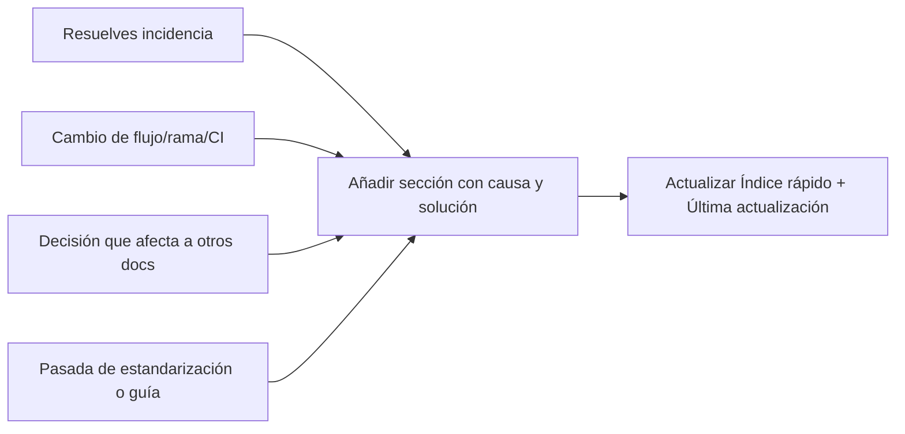

# Registro de desarrollo e incidencias

**Propósito:** Documentar cambios, correcciones y decisiones recientes para tenerlos en cuenta en próximos desarrollos o incidencias.  
**Última actualización:** 2026-03-17

---

## Cuándo actualizar este registro



Consultar este documento antes de tocar ramas, deploy, TypeScript/CI o flujos ya documentados aquí.

---

## Índice rápido

1. [Elaboración (Brew), UI, colores, Italiana](#1-elaboración-brew-ui-colores-italiana)
2. [Incidencias CI/CD y TypeScript (deploy-web)](#2-incidencias-cicd-y-typescript-deploy-web)
3. [Ramas y entornos](#3-ramas-y-entornos)
4. [Reglas Cursor por plataforma](#4-reglas-cursor-por-plataforma)
5. [Webapp — Diario: rejilla de meta y máscara de scroll](#5-webapp--diario-rejilla-de-meta-y-máscara-de-scroll)
6. [Referencias a otros documentos](#6-referencias-a-otros-documentos)
7. [Resumen de cambios — accesibilidad, diario, documentación (03–04 mar 2026)](#7-resumen-de-cambios--accesibilidad-diario-documentación-0304-mar-2026)
8. [Release notes Android desde última publicación (git)](#8-release-notes-android-desde-última-publicación-git)
9. [Resumen de cambios — historial, detalle café (04 mar 2026)](#9-resumen-de-cambios--historial-detalle-café-04-mar-2026)
10. [Resumen de cambios — calendario, layout, merge (mar 2026)](#10-resumen-de-cambios--calendario-layout-merge-mar-2026)
11. [Registro completo: paridad Web/Android y mejoras (mar 2026)](#11-registro-completo-paridad-webandroid-y-mejoras-mar-2026)
12. [Resumen de cambios — Cafés probados, perfil, detalle café, WebApp (12–13 mar 2026)](#12-resumen-de-cambios--cafés-probados-perfil-detalle-café-webapp-1213-mar-2026)
13. [Estandarización completa según GUIA (13 mar 2026)](#13-estandarización-completa-según-guia-13-mar-2026)
14. [Segunda pasada GUIA — Colores Android y documentación (13 mar 2026)](#14-segunda-pasada-guia--colores-android-y-documentación-13-mar-2026)
15. [Tercera pasada GUIA — Dimensiones, Spacing, Dimens, WebApp chart (13 mar 2026)](#15-tercera-pasada-guia--dimensiones-spacing-dimens-webapp-chart-13-mar-2026)
16. [Elaboración Android y WebApp — chips, carruseles, márgenes, Selecciona café como página (13–14 mar 2026)](#16-elaboración-android-y-webapp--chips-carruseles-márgenes-selecciona-café-como-página-1314-mar-2026)
17. [Resumen de cambios — despensa, diario, deploy, CI (15–16 mar 2026)](#17-resumen-de-cambios--despensa-diario-deploy-ci-1516-mar-2026)

---

## 1. Elaboración (Brew), UI, colores, Italiana

Detalle completo en: **`docs/commit-notes/commit-20260304-05-elaboracion-brew-ui-colores-italiana.md`**.

Resumen para futuras modificaciones:

- **Crear mi café:** Botón “Crear mi café” en “Elige tu café” va al formulario de crear café (`addPantryItem?onlyActivity=true&origin=brewlab`). Formulario incluye “Cantidad del café (g)” (slider 0–2000 g) y título “CREAR MI CAFÉ”.
- **Tiempo de extracción (espresso):** Debe aplicarse al temporizador en “Proceso en curso”. En Android, `phasesTimeline` debe incluir `_brewTimeSeconds` en el `combine`.
- **Sin pantalla Resultado:** Todo queda en “Proceso en curso”: al terminar el timer se muestra la tarjeta “¿QUÉ SABOR HAS OBTENIDO?” y el “Guardar” en la topbar (solo texto). No hay botón Reiniciar al terminar; para repetir se vuelve atrás a Configuración.
- **Colores:**
  - **Tiempo (número y slider):** Modo día negro, modo noche blanco (no marrón). Incluye temporizador grande, tiempo transcurrido y barra de fases (`BrewTimeline`).
  - **Café (número en Ajustes técnicos):** Siempre marrón (`LocalCaramelAccent` / `--caramel-soft` / `--caramel-accent`).
  - **Sliders:** Agua = azul; ratio/café = marrón; tiempo = negro/blanco según tema; barra inactiva gris.
- **Modo Italiana (y Turco):** Mostrar slider “CANTIDAD DE CAFÉ (g)” cuando `isWaterEditable && !isRatioEditable`. Rango derivado de `waterMinMl/ratioMax` a `waterMaxMl/ratioMin`.

---

## 2. Incidencias CI/CD y TypeScript (deploy-web)

### 2.1 Error: `BrewBaristaTip[]` vs `{ label, value, icon: string }[]`

**Síntoma:** El job `deploy-web` fallaba con:

```text
Argument of type '{ label: string; value: string; icon: string; }[]' is not assignable to parameter of type 'BrewBaristaTip[]'.
Type '{ label: string; value: string; icon: string; }' is not assignable to type 'BrewBaristaTip'.
  Types of property 'icon' are incompatible.
  Type 'string' is not assignable to type '"coffee" | "grind" | "thermostat" | "water" | "clock"'.
```

**Causa:** En `webApp/src/core/brew.ts`, la variable `baseTips` se infiere por la cadena de ternarios y TypeScript acaba infiriendo `icon` como `string`.

**Solución:** Declarar explícitamente el tipo de `baseTips`:

```ts
const baseTips: BrewBaristaTip[] = !key ? defaults : key.includes("espresso") ? [ ... ] : ...
```

**Archivo:** `webApp/src/core/brew.ts` (función `getBrewBaristaTipsForMethod`).

---

### 2.2 Error: comparación `"coffee"` con tipo sin overlap

**Síntoma:** El job `deploy-web` fallaba con:

```text
This comparison appears to be unintentional because the types '"search" | "timeline" | "brewlab" | "diary" | "profile"' and '"coffee"' have no overlap.
```

**Causa:** En `AppContainer.tsx`, el `TopBar` se renderiza dentro de `{guardedActiveTab !== "coffee" ? ( <TopBar ... /> ) : ...}`. En ese bloque TypeScript restringe `guardedActiveTab` a los otros tabs, por lo que comparar de nuevo con `"coffee"` genera el error.

**Soluciones aplicadas:**

1. **Props del TopBar en la rama no-coffee:** En esa rama nunca estamos en `"coffee"`, así que se pasan valores fijos en lugar de depender de `guardedActiveTab === "coffee"`:
   - `coffeeTopbarFavoriteActive={false}`
   - `coffeeTopbarStockActive={false}`

2. **Clase `is-coffee` en el main shell:** Donde se usaba `guardedActiveTab === "coffee"` para la clase `main-shell-scroll is-coffee`, se cambió a `activeTab === "coffee"` (sin restricción de tipo).

**Archivos:** `webApp/src/app/AppContainer.tsx` (aprox. líneas 1760–1768).

---

### 2.3 Error: `The process '/usr/bin/git' failed with exit code 128` en deploy-web

**Síntoma:** El job `deploy-web` fallaba con exit code 128 en un paso que usa git (p. ej. checkout).

**Causa probable:** El checkout usaba `ref: refs/heads/${{ env.TARGET_BRANCH }}`. En eventos **push**, `TARGET_BRANCH` viene de `github.ref_name`, que puede tener distinta capitalización que la rama real (p. ej. "Beta" vs "beta"). En sistemas con sensibilidad a mayúsculas, `refs/heads/Beta` no existe si la rama es `beta`, y git devuelve 128.

**Solución:** En el job `deploy-web`, en eventos **push** usar la ref que disparó el workflow (`github.ref`) para el checkout; en manual/schedule seguir usando `refs/heads/${{ env.TARGET_BRANCH }}`.

**Archivo:** `.github/workflows/release-deploy.yml` (step checkout del job `deploy-web`).

**Si git 128 sigue apareciendo en `changes` o `deploy-web`:** (1) En **push**: comprobar que la rama a la que se hace push existe y el nombre coincide exactamente (mayúsculas/minúsculas, p. ej. `beta` no `Beta`). (2) En **workflow_dispatch**: comprobar que la rama elegida existe en el repo (p. ej. crear/actualizar con `git push origin main:beta`) y que en Settings → Actions → General → Workflow permissions está "Read and write". (3) En el job `changes` se añadió `ref: ${{ github.ref }}` explícito en el checkout (push) para alinearlo con deploy-web y release-android.

---

### 2.4 release-android: git exit 128 y deprecación Node.js 20

**Síntomas:**
- El job `release-android` fallaba con `The process '/usr/bin/git' failed with exit code 128`.
- Aviso: acciones (github-script, setup-java, setup-gradle, upload-google-play) en Node.js 20 están deprecadas; en junio 2026 se usará Node 24 por defecto.

**Soluciones aplicadas:**
1. **Checkout:** Igual que en deploy-web, en evento **push** usar `github.ref` en lugar de `refs/heads/${{ env.TARGET_BRANCH }}` para evitar ref no encontrada (p. ej. Beta vs beta).
2. **Commit version bump / Save last deployed version:** Usar la rama actual de git (`CURRENT_BRANCH=$(git rev-parse --abbrev-ref HEAD)`) para `git fetch`, `git rebase` y `git push`, en lugar de `TARGET_BRANCH`, para que fetch/push usen la misma ref que el checkout.
3. **Node 24:** Añadido `FORCE_JAVASCRIPT_ACTIONS_TO_NODE24: true` en `env` del workflow para optar por Node 24 en las acciones y eliminar el aviso de deprecación.

**Archivo:** `.github/workflows/release-deploy.yml`.

---

### 2.5 Error: `Cannot find name 'diarySelectedPantryItemIdDraft'` en deploy-web

**Síntoma:** El job `deploy-web` fallaba con errores TypeScript:

```text
Cannot find name 'diarySelectedPantryItemIdDraft'.
Cannot find name 'setDiarySelectedPantryItemIdDraft'.
```

**Causa:** En `DiarySheets.tsx`, las props `diarySelectedPantryItemIdDraft` y `setDiarySelectedPantryItemIdDraft` estaban declaradas en el **tipo** del componente pero **no** en la destructuración del parámetro. El cuerpo del componente las usaba, por lo que TypeScript las consideraba no definidas.

**Solución:** Añadir ambas a la destructuración de props de `DiarySheets`, junto a `diaryCoffeeIdDraft` / `setDiaryCoffeeIdDraft`.

**Archivo:** `webApp/src/features/diary/DiarySheets.tsx`.

---

### 2.6 Notas de la versión Android (What's new): solo Android, desde producción, tono divertido

**Requisitos:** Las notas de la versión que sube el workflow a Google Play deben (1) incluir **solo cambios que tocan Android** (app/, shared/, gradle/, etc.), no commits solo de webApp; (2) tomar **siempre como referencia producción** (tag `deploy/android/production/*`) cuando exista, de modo que lo desplegado a beta/alpha recoga el gap con producción y cuando llegue a producción el usuario final sepa todas las mejoras; (3) estar **todas en español**, con tono divertido y no técnico, entendible por todo el mundo.

**Solución:** En el job `release-android`, paso "Generate release notes": se usa `git log refSince..HEAD -- <paths>` con las rutas Android para filtrar commits; la referencia `refSince` es el último tag de **producción** (si existe y es ancestro de HEAD), y si no hay producción se usa el de la pista actual (beta/alpha). Los mensajes de commit se transforman con una función `toFriendly()` que elimina prefijos técnicos y convierte a frases tipo "Mejoras en tu despensa de café", "Retoques en tu diario", "Corregimos detalles para que todo vaya mejor", etc. Título de la sección: "¿Qué hay de nuevo?".

**Archivos:** `.github/workflows/release-deploy.yml`; `docs/RELEASE_DEPLOY_WORKFLOW.md` (descripción de las notas).

---

## 3. Ramas y entornos

### 3.1 Ramas que se mantienen

Solo se usan estas ramas para entornos y despliegue:

| Rama     | Uso / entorno |
|----------|----------------|
| **main** | Desarrollo principal; no dispara el workflow de deploy. |
| **beta** | Pruebas abiertas (Play Console, web). |
| **alpha** | Pruebas cerradas. |
| **Interna** | Pruebas internas (solo Android en el workflow). |

Cualquier otra rama (codex/*, fix/*, webapp, webap, Alpha/Beta con mayúscula, etc.) se considera prescindible y puede eliminarse para no acumular ramas activas.

### 3.2 Acciones realizadas (limpieza de ramas)

- **Remoto (origin):** Se eliminaron las ramas `Alpha`, `Beta`, `webap`, `webapp`, `fix/alpha-consolidacion-webapp-webap-20260225`, `fix/widgets-diary-and-deprecations` y un gran número de ramas `codex/*`. Se mantienen solo `main`, `beta`, `alpha`, `Interna`. (Nota: la eliminación masiva de `codex/*` se lanzó en segundo plano; si alguna sigue existiendo en origin, se puede borrar con `git push origin --delete <nombre>`.)
- **Local:** Se eliminaron las ramas locales `Alpha`, `webap`, `beta` (luego se recreó `beta` desde `main`), `alpha-merge`, `beta-play-fix`, `webapp`. Se mantienen `main` y `beta` (y opcionalmente `alpha` si se trabaja con esa pestaña).

### 3.3 Flujo habitual: subir main y actualizar beta

1. Subir cambios a `main`:  
   `git push origin main`
2. Dejar `beta` igual que `main`:  
   `git push origin main:beta`

Si en remoto ya no existe `beta`, `main:beta` la crea. Si existe, la actualiza (puede requerir `--force` si la historia diverge y se quiere que beta sea exactamente main).

---

## 4. Reglas Cursor por plataforma

En `.cursor/rules/` hay reglas específicas que se aplican al editar código de cada plataforma:

| Plataforma | Archivo | Cuándo se aplica |
|------------|---------|-------------------|
| **WebApp** | `webapp-react-typescript.mdc` | Al editar `webApp/**/*.ts`, `*.tsx`, `*.css`, `*.mjs` |
| **Android (app)** | `android-kotlin-compose.mdc` (siempre) + `android-app-especifico.mdc` | General siempre; contexto de `app/` al editar `app/**/*.kt`, `*.xml` |
| **iOS** | `ios-swiftui.mdc` | Al editar `iosApp/**/*.swift`, `Package.swift` |

Además: `docs-before-code.mdc` (siempre) — consultar docs antes de actuar.

---

## 5. Webapp — Diario: rejilla de meta y máscara de scroll

**Fecha:** 2026-03-04. **Ámbito:** solo webapp (`webApp/`).

### 5.1 Rejilla de meta (`.diary-entry-meta-grid`)

- **Base (todas las anchuras):** `gap: 8px 30px` (antes `24px`). Archivo: `webApp/src/styles/features.css`.
- **En `@media (max-width: 899px)`:** En los dos bloques que afectan a `.diary-entry-meta-grid`, el `gap` se unificó a `8px 25px` (uno tenía `20px`, otro `8px 10px`). Así en móvil/tablet la rejilla usa 8px entre filas y 25px entre columnas.

### 5.2 Máscara de scroll (`.diary-entry-meta-scroll`)

- **Comportamiento:** Por defecto no se muestra máscara (`mask-image: none`). La máscara izquierda solo se muestra cuando hay scroll horizontal y hay contenido que ha “desaparecido” a la izquierda (`scrollLeft > 0`). La máscara derecha solo cuando hay más contenido a la derecha (`scrollLeft + clientWidth < scrollWidth`).
- **Implementación:**
  - **CSS:** Clases `.has-scroll-left` y `.has-scroll-right` aplican los gradientes correspondientes; si ambas están presentes se usa un único gradiente que difumina ambos lados. Archivo: `webApp/src/styles/features.css`.
  - **Lógica:** En `DiaryView.tsx` se añadieron estado `metaScrollLeft` y `metaScrollRight`, callback `updateMetaScrollEdges()` (actualiza esos estados según `scrollLeft` y dimensiones del nodo), y suscripción a `scroll` y `ResizeObserver` en el contenedor `.diary-entry-meta-scroll`. Las clases `has-scroll-left` / `has-scroll-right` se aplican al mismo div según ese estado.

---

## 6. Referencias a otros documentos

| Tema | Documento |
|------|-----------|
| Tokens de diseño (colores, espaciados, radios) Web + Android | `docs/DESIGN_TOKENS.md` |
| Estados vacío y error (patrón unificado) | `docs/UX_EMPTY_AND_ERROR_STATES.md` |
| Lógica de negocio compartida (diario, brew, recomendaciones) | `docs/SHARED_BUSINESS_LOGIC.md` |
| Tests de humo (flujo crítico) | `docs/SMOKE_TESTS.md` |
| Accesibilidad (aria, 44px/48dp, WCAG) | `docs/ACCESIBILIDAD_WEBAPP_ANDROID.md` |
| Analíticas (GA4, GTM, eventos, pantallas; guías en `docs/gtm/`) | `docs/ANALITICAS.md` |
| Workflow release y deploy (triggers, ramas, jobs) | `docs/RELEASE_DEPLOY_WORKFLOW.md` |
| Changelog detallado Brew/UI/colores/Italiana (04–05 mar) | `docs/commit-notes/commit-20260304-05-elaboracion-brew-ui-colores-italiana.md` |
| Compliance Play Console, orientación, edge-to-edge | `docs/ANDROID_PLAY_CONSOLE_COMPLIANCE.md` |
| ASO y App Links (assetlinks.json) | `docs/ASO_PLAY_STORE.md` |
| Revisión manual de crashes (sin automatización en CI) | `docs/CRASH_FIX_WEEKLY.md` |

---

## 7. Resumen de cambios — accesibilidad, diario, documentación (03–04 mar 2026)

Recopilación de lo modificado en las sesiones recientes (diario webapp, accesibilidad Android y webapp, documentación de diseño y pruebas).

### 7.1 Webapp

| Ámbito | Archivo(s) | Cambio |
|--------|------------|--------|
| **Diario — rejilla de meta** | `webApp/src/styles/features.css` | `.diary-entry-meta-grid`: `gap: 8px 30px` (base); en `@media (max-width: 899px)` → `gap: 8px 25px`. |
| **Diario — máscara de scroll** | `webApp/src/styles/features.css` | `.diary-entry-meta-scroll`: por defecto `mask-image: none`; clases `.has-scroll-left` y `.has-scroll-right` aplican gradientes solo cuando hay contenido oculto a ese lado. |
| **Diario — lógica máscara** | `webApp/src/features/diary/DiaryView.tsx` | Estado `metaScrollLeft` / `metaScrollRight`, callback `updateMetaScrollEdges()`, suscripción a `scroll` y `ResizeObserver` en el contenedor de meta; clases dinámicas en el div. |
| **Diario — alt en imágenes** | `webApp/src/features/diary/DiarySheets.tsx` | Imágenes de café en despensa y sugerencias: `alt={row.coffee.nombre}` y `alt={coffee.nombre}`; imagen placeholder taza con `alt=""` y `aria-hidden="true"`. |
| **Tests** | `webApp/src/App.test.tsx` | Test de humo: navegar a Diario y comprobar que se muestra contenido del diario (texto "mi diario" o "sin café o agua registrada"). |

### 7.2 Android — accesibilidad

Se sustituyeron **todos** los `contentDescription = null` e `Icon(..., null)` por descripciones útiles para TalkBack y se aseguró área táctil mínima en un botón crítico.

| Ámbito | Archivo(s) | Cambio |
|--------|------------|--------|
| **Diario** | `EditNormalStockScreen.kt`, `AddDiaryEntryScreen.kt`, `DiaryComponents.kt`, `AddPantryItemScreen.kt`, `AddStockScreen.kt` | Imágenes de café → nombre del café; iconos WaterDrop, LocalCafe, Search, AddCircle, CoffeeMaker → "Añadir agua", "Añadir café", "Buscar", "Crear café", "Método de elaboración"; portafiltro → "Gramos"; MoreHoriz → "Opciones"; chips → `label`; ChevronRight → "Abrir". |
| **BrewLab** | `BrewLabCards.kt`, `BrewLabComponents.kt` | Imágenes de café → nombre; Add → "Añadir café a la despensa"; AddCircle, Search, Play/Pause → "Crear mi café", "Buscar café", "Iniciar"/"Pausar"; CoffeeMaker, AutoAwesome, ChevronRight → descripciones acordes; tips → `tip.label`. |
| **Valoraciones** | `RatingBar.kt`, `SemicircleRatingBar.kt`, `UserReviewCard.kt` | Estrellas → "Estrella i de n" / "Valoración i de 5"; imagen reseña y café → "Imagen de la reseña" / nombre; estrella → "Valoración". |
| **Búsqueda / perfil** | `SearchScreen.kt`, `SearchUsersScreen.kt`, `CompleteProfileScreen.kt`, `UserSuggestionCard.kt`, `ProfileComponents.kt`, `FollowingScreen.kt`, `FollowersScreen.kt` | Imágenes de café y favoritos → nombre / "Quitar de favoritos" | "Añadir a favoritos"; Search → "Buscar" o "Buscar usuarios"; foto perfil → "Foto de perfil" / "Añadir foto de perfil"; avatar sugerencias → "Avatar de {username}"; IconButton favoritos en SearchScreen → `minimumInteractiveComponentSize()` (área táctil ≥ 48 dp). |
| **Timeline / publicaciones** | `TimelineComponents.kt`, `PostCard.kt`, `AddPostScreen.kt` | Imágenes de post y café → "Imagen del post" / nombre; iconos PhotoCamera, Close, Schedule, CoffeeMaker → "Cámara", "Cerrar", "Hora", `option.label`; DetailPremiumBlock → `label`; Coffee, ArrowForwardIos, AddPhotoAlternate → "Añadir café", "Seleccionar café", "Añadir foto". |
| **Detalle / acceso** | `DetailScreen.kt`, `LoginScreen.kt`, `RecommendationCarousel.kt` | Editar/Añadir reseña → "Editar reseña" / "Añadir reseña"; icono opción login → `title`; imagen recomendación → nombre del café. |
| **Diario — máscara de scroll** | `TimelineComponents.kt` (`DiaryEntryItem`) | Máscara condicional en la fila de meta (LazyRow): gradientes izquierda/derecha según `hasScrollLeft` / `hasScrollRight` derivados del estado de scroll, alineado con el comportamiento de la webapp. |

### 7.3 Documentación creada o actualizada

| Documento | Descripción |
|-----------|-------------|
| **`docs/DESIGN_TOKENS.md`** | Tokens de diseño (colores día/noche, espaciados, radios) para Web y Android; variables CSS y uso en Compose. |
| **`docs/UX_EMPTY_AND_ERROR_STATES.md`** | Patrón unificado para listas vacías (mensaje, icono, CTA) y errores de red (mensaje + "Reintentar"). |
| **`docs/SHARED_BUSINESS_LOGIC.md`** | Qué lógica es compartida (Kotlin shared), replicada (Web TS) o por plataforma; diario, brew, recomendaciones, fechas. |
| **`docs/SMOKE_TESTS.md`** | Flujo crítico (login → diario → detalle/añadir) y dónde implementar tests de humo en Web (Vitest/RTL) y Android (instrumented/Compose). |
| **`docs/ACCESIBILIDAD_WEBAPP_ANDROID.md`** | Fuente única a11y: criterios mínimos, revisión WebApp/Android, checklist al cambiar UI. |
| **`docs/README.md`** | Enlaces a los cinco documentos anteriores en la sección "Arquitectura y gobernanza". |
| **`docs/REGISTRO_DESARROLLO_E_INCIDENCIAS.md`** | Sección 5 (diario webapp), sección 6 (referencias), esta sección 7 (resumen). |

### 7.4 Resumen por tipo de cambio

- **UI/UX:** Rejilla y máscara de scroll en diario (webapp y Android); área táctil mínima en botón favoritos (Android).
- **Accesibilidad:** contentDescription/aria-label y alt en iconos, imágenes y controles; documento de criterios mínimos.
- **Calidad:** Test de humo web (navegación a Diario); documentos de smoke tests, estados vacío/error y lógica compartida.
- **Mantenibilidad:** DESIGN_TOKENS, README y registro actualizados para no desalinear Web y Android.

---

## 8. Release notes Android desde última publicación (git)

**Fecha:** 2026-03-05. **Ámbito:** workflow Release & Deploy (Android).

### Objetivo

Que las notas “Qué hay de nuevo” en Play Store reflejen **todos los cambios desde la última versión que el usuario tenía instalada**, usando el historial de git en lugar de textos genéricos.

### Cambios en `.github/workflows/release-deploy.yml`

1. **Checkout:** Se añade `fetch-tags: true` para que el job tenga los tags `deploy/android/<pista>/*` creados en despliegues anteriores.
2. **Generar release notes:**
   - Se busca el último tag `deploy/android/<track>/<versionCode>` que sea ancestro de HEAD (por pista: internal, alpha, beta, production).
   - Se ejecuta `git log TAG..HEAD --no-merges --pretty=format:%s` y se formatea como lista de viñetas.
   - Se filtran mensajes `chore(release):` y `[skip ci]`; se eliminan duplicados; se limita a 500 caracteres (límite de Play).
   - Si no hay tag previo (primera publicación), se usa el texto genérico: "Mejoras y correcciones. ¡Gracias por usar Cafesito!".
3. **Tag tras subida a Play:** Después de “Upload to Google Play” y antes de “Save last deployed version”, se crea el tag anotado `deploy/android/<track>/<versionCode>` en el commit actual (el del bump) y se hace push. Así la próxima ejecución puede tomar ese tag como “última versión desplegada”.

### Documentación

- **`docs/RELEASE_DEPLOY_WORKFLOW.md`:** Actualizada la descripción del job `release-android` (notas desde git, tag de deploy).

### Primera ejecución

En la primera vez que corra el workflow **no** existirán tags `deploy/android/*`; las release notes serán el texto genérico. A partir del primer despliegue exitoso se creará el tag y las siguientes releases mostrarán los commits desde esa versión.

---

## 9. Resumen de cambios — historial, detalle café (04 mar 2026)

Cambios de UI/UX en webapp: página historial (sin scroll innecesario en desktop) y botones del detalle de café (favorito, despensa, compartir) con fondo y borde siempre blancos.

### 9.1 Webapp — Historial (desktop): sin scroll innecesario

- **Problema:** En versión desktop, la página de historial mostraba barra de scroll aunque no hubiera suficientes ítems para justificarla.
- **Causa:** `.content.content-profile` y `.historial-view` tenían `min-height: 100%` y `min-height: 100dvh`, forzando una altura mínima de viewport y provocando overflow.
- **Solución:** Se eliminaron esas propiedades de `min-height` en ambos bloques. La altura del contenido depende solo de los ítems; el fondo de la zona vacía lo aporta `.main-shell-scroll` (tokens).
- **Archivos:** `webApp/src/styles/features.css` (`.content.content-profile`, `.historial-view`).

### 9.2 Webapp — Detalle café: botones favorito, despensa y compartir

- **Objetivo:** Los botones del hero del detalle de café (favorito, despensa, compartir) deben tener **siempre** fondo blanco y borde blanco/claro (día y noche), estén activos o no. Solo el **icono** puede cambiar de color (p. ej. rojo cuando favorito está activo).
- **Cambios:**
  - Se forzó `background: var(--pure-white) !important` y `border: 1px solid rgba(0, 0, 0, 0.12) !important` para `.coffee-detail-topbar-icon` y `.coffee-detail-topbar-icon.is-active`, de modo que las reglas genéricas de `topbar-icon-button` (p. ej. `background: transparent` en modo oscuro) no los sobrescriban.
  - El estado activo solo modifica el color del icono: `color: var(--electric-red)` en `.is-active` y en `.is-active .ui-icon`.
  - Misma lógica aplicada en `@media (prefers-color-scheme: dark)`, en bloques desktop y en `theme-forced.css` para `html.theme-dark` y `html.theme-light`.
- **Terminología:** En comentarios del CSS se sustituyó "me gusta" por "favorito" en los bloques del detalle de café.
- **Archivos:** `webApp/src/styles/features.css`, `webApp/src/styles/theme-forced.css`.

### 9.3 Resumen por archivo

| Archivo | Cambio |
|---------|--------|
| `webApp/src/styles/features.css` | `.content.content-profile` y `.historial-view` sin `min-height`; `.coffee-detail-topbar-icon` / `.is-active` con bg y borde blancos `!important`; comentarios "favorito" en lugar de "me gusta". |
| `webApp/src/styles/theme-forced.css` | `html.theme-dark` y `html.theme-light`: mismo bg y borde blancos para los iconos del detalle café; solo color del icono en rojo cuando `.is-active`. |

---

## 10. Resumen de cambios — calendario, layout, merge (mar 2026)

Cambios en webapp: scroll del calendario en desktop, layout móvil al 100 %, resolución de conflictos de merge y actualización del remote de Git.

### 10.1 Calendario del diario — scroll en desktop

- **Problema:** En versión desktop, el calendario (modal al pulsar la fecha en Mi diario) no hacía scroll entre meses.
- **Causa:** El contenedor del contenido del sheet (`.sheet-card-content`) no era flex; `.diary-calendar-scroll` con `flex: 1` y `min-height: 0` no tenía altura acotada.
- **Solución:** En `.diary-calendar-sheet .sheet-card-content` se añadió `display: flex`, `flex-direction: column`, `min-height: 0`, `flex: 1`, `overflow: hidden`. Handle y header con `flex-shrink: 0`. Así `.diary-calendar-scroll` queda con altura fija y `overflow-y: auto` hace scroll.
- **Archivos:** `webApp/src/styles/features.css`.

### 10.2 Layout móvil — altura 100 %

- **Cambio:** En `@media (max-width: 899px)`, `.layout` pasó de `min-height: 100dvh` / `height: 100dvh` (y fallbacks `-webkit-fill-available`) a `min-height: 100%` y `height: 100%`.
- **Archivos:** `webApp/src/styles/features.css`.

### 10.3 Conflictos de merge en features.css

- **Problema:** El build fallaba con `[postcss] Unknown word ours` en la línea 32: quedaban marcadores de merge (`<<<<<<< ours`, `=======`, `>>>>>>> theirs`).
- **Solución:** Se eliminaron los marcadores y se dejó una única versión del bloque `.layout` (la que usa 100 % según el punto anterior).
- **Archivos:** `webApp/src/styles/features.css`.

### 10.4 Remote de Git

- **Cambio:** El repositorio se movió a `https://github.com/rmoya87/cafesito-app.git`. Se actualizó el remote con `git remote set-url origin https://github.com/rmoya87/cafesito-app.git` para que push/pull usen la nueva URL.

---

---

## 11. Registro completo: paridad Web/Android y mejoras (mar 2026)

**Documento de referencia:** [`REGISTRO_CAMBIOS_PARIDAD_Y_MEJORAS_2026-03.md`](REGISTRO_CAMBIOS_PARIDAD_Y_MEJORAS_2026-03.md).

Resumen de lo documentado allí (para futuras modificaciones y mejoras):

| Área | Cambios principales |
|------|---------------------|
| **Actividad de perfil** | Homogeneización Web/Android: resolución de nombres de café (`getCoffeeById`/`resolveCoffeeName`), inclusión de perfiles sensoriales en ADN, tiempo relativo (MIN/H/D), cards (opinión, primera vez, lista) con mismo texto y estilo, actividad de seguidos en mi perfil. Combine de 6 flujos en ViewModel con `ProfileCombineState`. |
| **ADN / radar** | Perfiles sensoriales del usuario en el cálculo; filtrado de muestras con todos los valores en 0; puntos visibles en vértices; fórmulas y escala 0–10 alineadas con web; modo noche. |
| **Despensa** | Múltiples registros por café (UUID `id` en `pantry_items`); independencia respecto a borrado de diario/listas; stub de café si falta en caché; modal "Crea tu café" sin icono rayo; Android y WebApp por `pantryItemId`. |
| **Listas** | Iconos list_alt, list_alt_add, list_alt_check; color activo verde eléctrico (#00E676). |
| **Mi Diario** | Gráfica más alta y margen inferior para no cortar curva; eje X con día actual en negro/blanco; "primera vez" solo con 1 entrada por café. |
| **Elaboración WebApp** | Café no obligatorio para continuar; resultado opcional al guardar; modo noche; dosis no automática por tamaño. |
| **Auth / rendimiento** | Manejo de sesión sin refresh token (sin forzar re-login); Timeline refresh en `Dispatchers.IO`. |
| **Supabase** | `pantry_items.sql` (id UUID), documentos RLS y troubleshooting cafés, nota de independencia pantry. |

En el documento enlazado se detallan archivos tocados, nombres de funciones y referencias a SQL/docs.

---

## 12. Resumen de cambios — Cafés probados, perfil, detalle café, WebApp (12–13 mar 2026)

Recopilación de cambios en la pantalla **Cafés probados** (Android y WebApp), **detalle de café** (opiniones y botón Editar), **perfil > Actividad** (estado de carga) y estilos WebApp (rating chip modo noche, controles del mapa).

### 12.1 Android — Cafés probados (Mi diario)

| Ámbito | Archivo(s) | Cambio |
|--------|------------|--------|
| **Página completa** | `app/.../diary/CafesProbadosScreen.kt` | Pantalla dedicada (no sheet): mapa arriba, listado debajo. Navegación desde "Mi diario" → "Cafés probados". |
| **Mapa** | Id. | OpenStreetMap vía OSMDroid; MapTiler OMT (si hay API key). Altura fija 1/3 de pantalla. Sin controles de zoom (+/-). Marcadores con emoji de bandera del país (TextView → Bitmap). |
| **Zoom** | Id. | Zoom inicial: ajuste a todos los pins (`zoomToBoundingBox` o `setCenter`+zoom 4 si uno solo). Margen en píxeles (`zoomToBoundingBox(box, false, borderPx)`) para que los pins no queden en el borde. Al pulsar un pin: centrar y zoom 6; al pulsar X (Limpiar): volver al zoom que muestra todos los pins. |
| **Layout** | Id. | Un solo `LazyColumn`: primer ítem = mapa (altura fija), resto = cabeceras por país y tarjetas de café. Mapa a ancho total (sin `contentPadding` horizontal en el ítem del mapa). Lista con `padding(horizontal = 16.dp)` en cabeceras y tarjetas. |
| **Botones** | Id. | Volver y Limpiar (X) con márgenes laterales 16.dp (igual que otras pantallas): `padding(top = 16.dp, start = 16.dp, end = 16.dp)`. |
| **Listado** | Id. | Cafés agrupados por país; tarjetas con estilo tipo buscador (surface, bordes redondeados 16.dp, borde outline). Coordenadas por país en `CountryCoords.kt`; banderas en `CountryFlags.kt`. |
| **Datos** | `CafesProbadosViewModel.kt` | Incluir todos los cafés probados (eliminado filtro que solo mostraba cafés con una única entrada). `SharingStarted.Eagerly` para retener estado al volver de detalle. |

### 12.2 Android — Detalle de café (opiniones y edición)

| Ámbito | Archivo(s) | Cambio |
|--------|------------|--------|
| **Card de opinión** | `app/.../detail/DetailScreen.kt` | Fondo surface, bordes redondeados 16.dp; nota en píldora (fondo amarillo-anaranjado, estrella y texto "X/5" sin decimales). Botón **Editar**: rectangular con bordes 100 % (pill, `RoundedCornerShape(20.dp)`), texto "Editar"; color de fondo según tema: **modo noche** = marrón claro (`LocalCaramelAccent` → CaramelSoft), **modo día** = marrón (CaramelAccent). Texto del botón negro (noche) / blanco (día). |
| **ReviewBottomSheet** | Id. | Campo de texto con fondo surface; icono cámara en círculo (fondo gris oscuro/claro según tema); botón "Eliminar" (rojo eléctrico) en lugar de Cancelar cuando hay reseña; "Publicar" inactivo = gris, activo = marrón (CaramelAccent). |

### 12.3 Android — Perfil > Actividad

| Ámbito | Archivo(s) | Cambio |
|--------|------------|--------|
| **Estado de carga** | `ProfileViewModel.kt` | Nuevo `profileActivityLoading: StateFlow<Boolean>`. Al iniciar `refreshProfileActivity` se pone a `true`; al terminar (en `finally`) a `false`. |
| **UI** | `ProfileScreen.kt` | En pestaña Actividad: si `profileActivityLoading` es true se muestra indicador centrado (**CircularProgressIndicator** + texto "Recargando…") en lugar del mensaje "Tu actividad está vacía". Cuando termina la carga, si la lista está vacía se muestra el mensaje de vacío; si no, el listado. |

### 12.4 WebApp — Cafés probados y mapa

| Ámbito | Archivo(s) | Cambio |
|--------|------------|--------|
| **Mapa** | `webApp/.../diary/CafesProbadosView.tsx`, `features.css` | OpenStreetMap (Leaflet); MapTiler OMT. Marcadores con banderas vía Twemoji (`getCountryFlagImageUrl` en `countryFlags.ts`). Mapa 1/3 de alto; al hacer scroll en la lista pasa a 1/4. Controles de zoom abajo a la izquierda. |
| **Controles zoom modo oscuro** | `webApp/src/styles/features.css` | `.leaflet-bar a`: `background-color: #212121`; `border-bottom: none`. En `html.theme-dark` el contenedor de zoom con fondo blanco y símbolos en negro (`filter: invert(1)` donde aplique). |
| **Navegación** | `useCoffeeDetailNavigation.ts`, `AppContainer` | Al abrir detalle desde Cafés probados, al volver se navega a `/diary/cafes-probados` (no a home). `returnDiarySubViewRef` para recordar subvista. |
| **Scroll** | `CafesProbadosView.tsx` | `handleListScroll` con `useCallback` para detectar scroll y colapsar altura del mapa; referencia correcta para evitar `ReferenceError`. TopBar oculta en subvista Cafés probados; contenido sin padding superior. |

### 12.5 WebApp — Detalle de café y perfil (rating chip modo noche)

| Ámbito | Archivo(s) | Cambio |
|--------|------------|--------|
| **Píldora de nota (opinión)** | `webApp/src/styles/features.css`, `theme-forced.css` | En **modo noche** el texto y la estrella de la píldora de nota (detalle café y actividad de perfil) deben ser **negros**. Reglas con `html.theme-dark` y `@media (prefers-color-scheme: dark)` para `.coffee-detail-opinion-rating-chip`, `.profile-activity-coffee-card-review-block .coffee-detail-opinion-rating-chip`, incl. `.ui-icon`, `svg`, `path` (`color` y `fill: #000000 !important`). |
| **Modo claro (perfil actividad)** | `webApp/src/styles/features.css` | `:root:not(.theme-dark) .profile-activity-coffee-card-review-block .coffee-detail-opinion-rating-chip { color: black !important; }` para que en modo día la píldora de nota en actividad sea negra. |
| **Detalle café / perfil** | `CoffeeDetailView.tsx`, `ProfileView.tsx` | Nota sin decimales (`Math.round(...)`); icono estrella rellena (`star-filled`) en la píldora de valoración. |

### 12.6 Incidencias resueltas (WebApp)

| Síntoma | Causa | Solución / archivo |
|---------|--------|---------------------|
| `setDiarySubView is not defined` | Parámetro no declarado en el hook. | Añadir `setDiarySubView` a la destructuración y al tipo en `useAppNavigationDomain.ts`. |
| Orden de Hooks cambiado / "Rendered more hooks" en `AppContainer` | `useMemo` de `diaryCoffeesWithFirstTried` estaba después de `return` condicionales. | Mover el `useMemo` a una posición incondicional (antes de los early return). `AppContainer.tsx`. |
| `handleListScroll is not defined` en CafesProbadosView | Callback referenciado en JSX pero no definido. | Definir `handleListScroll` con `useCallback` en `CafesProbadosView.tsx`. |
| Listado no mostraba cafés de distintos países | Filtro que solo dejaba cafés con una única entrada en diario. | Quitar condición `countByCoffeeId === 1` en `AppContainer.tsx` (diaryCoffeesWithFirstTried), `DiaryView.tsx` (baristaStats) y en Android `CafesProbadosViewModel.kt`. |
| Errores de red (Google Fonts, GSI, GA4) con red caída | Scripts externos se cargaban sin comprobar conectividad. | Quitar `<link>` de Material Symbols en `index.html`; en `ga4.ts` y `AuthPromptOverlay.tsx` comprobar `navigator.onLine` antes de cargar script / One Tap. |

### 12.7 Resumen por tipo

- **UX:** Cafés probados con mapa estable, zoom coherente (inicial / pin / limpiar), márgenes unificados; perfil Actividad con estado "Recargando…" mientras cargan datos; botón Editar con colores por tema.
- **Estilos:** Rating chip negro en modo noche (WebApp); píldora nota en actividad en negro también en modo claro; controles Leaflet (`.leaflet-bar a`) con fondo y sin borde inferior.
- **Correcciones:** Hooks, navegación desde detalle a Cafés probados, listado con todos los cafés probados (varios países), scripts externos solo con red.

---

## 13. Estandarización completa según GUIA (13 mar 2026)

Se ejecutaron todas las tareas factibles del listado en **`docs/GUIA_UNIFICACION_COMPONENTES_UI.md`** sin romper funcionalidades ni estilos.

### WebApp

- **Tarjetas (A.3.1):** `.profile-activity-card`, `.coffee-detail-opinion-card`, `.diary-empty-card`, `.diary-analytics-card`, `.diary-stats-card` heredan base `.card` o `.coffee-card`; clases añadidas en JSX donde correspondía.
- **Inputs (A.3.3):** `components/inputs.css` — padding y border-radius con `var(--space-*)` y `var(--radius-pill)`.
- **Estados vacío/error (A.3.4):** Componentes `EmptyState` y `ErrorState` en `ui/components/`; uso en `TimelineView` (vacío y error).
- **Layout (A.3.5):** `features.css` — main-shell, sidebar, android-install-banner, session-logout, topbar padding, timeline-empty con tokens.
- **Hardcodeados CSS (A.5):** `features.css` (sidebar, layout, timeline), `profile-adn.css` (espaciados, radios, icon-size), `theme-forced.css` (#000, #212121, #ffffff, #bdb7b2, #d63a3a → variables).
- **TSX (A.5.3):** `main.tsx` — clase `is-full-viewport` para min-height/padding; `TopBar` — margin-top en `.profile-options-section-title`; `iconography.tsx` — clase `.ui-icon-size-lg` para iconos 24px; `tokens.css` — `--radius-xl: 28px` y `.ui-icon-size-lg`.

### Android

- **CoffeeListItem (B.3.1):** Composable unificado en `ui/components/CoffeeListItem.kt` (coffee, subtitle, secondLine, imageSize, showChevron, onClick); usado en `SearchScreen` y `CafesProbadosScreen`. Eliminado `CoffeePremiumListItem` de SearchScreen.
- **CafesProbadosScreen:** Uso de `CoffeeListItem`; padding con `Spacing.space4`/`space3`/`space1`; eliminados `RoundedCornerShape` locales.
- **Empty/Error (B.3.4):** Ya existían `EmptyStateMessage` y `ErrorStateMessage` en `DiaryComponents.kt` y se usan en SearchScreen, TimelineScreen, ProfileScreen, DetailScreen, DiaryScreen.
- **DESIGN_TOKENS (B.3.5):** Gutter 16dp documentado en §2.1; referencia a `Spacing.space4` y `Spacing.kt`.

### Documentación

- **DESIGN_TOKENS.md:** Gutter de pantalla Android 16dp y uso de `Spacing.spaceN`.
- **GUIA_UNIFICACION_COMPONENTES_UI.md:** Actualizado “Estandarización aplicada” y listado de tareas (marcadas [x] las completadas).

### Pendiente (sin cerrar en esta pasada)

- B.5.2: Spacing en más pantallas (SearchScreen 10/6 dp → Spacing opcional); DetailScreen typography; Dimens.kt opcional.
- DiaryLineChart.tsx: variable CSS para CHART_MIN_HEIGHT si se reutiliza (opcional).

---

## 14. Segunda pasada GUIA — Colores Android y documentación (13 mar 2026)

Se completaron los ítems pendientes de **`docs/GUIA_UNIFICACION_COMPONENTES_UI.md`** (colores B.5.1, base.css, B.3.3, cross-platform).

### WebApp

- **base.css:** Comentarios que documentan scrollbar (6px/3px) y outline 2px como decisión de diseño; min-height 120px ya documentado.
- **Sliders:** Confirmado uso de tokens en WebApp y Android (SliderTrackInactiveDark/Light, etc.).

### Android — Colores (B.5.1)

- **Color.kt:** Añadidos `DateMetaAxisDark`, `DateMetaAxisLight`, `SwitchTrackOffDark`, `SwitchThumbOffDark` para gráficos y switch del temporizador.
- **BrewLabComponents.kt:** `Color.Black`/`Color.White` y hex (424242, 9E9E9E, BDBDBD) sustituidos por `PureBlack`/`PureWhite`, `SwitchTrackOffDark`, `SwitchThumbOffDark`, `DisabledGray`; idem en MethodCard, chips, timer card, PreparationStep, TasteChip, PreparationTasteCard.
- **DiaryComponents.kt:** Opciones icon/bg → `PureWhite`/`PureBlack`; eje gráfico → `DateMetaAxisDark`/`DateMetaAxisLight`; quickAction → `PureWhite`/`PureBlack`.
- **TimelineComponents.kt:** Slider inactivo → `SliderTrackInactiveDark`/`SliderTrackInactiveLight`; campos, chips, gradientes → `PureBlack`/`PureWhite`.
- **ProfileComponents.kt:** Favoritos → `ElectricRed`; contenedores, campos, bordes → `PureBlack`/`PureWhite`.
- **LoginScreen, AddStockScreen, EditNormalStockScreen, DetailScreen, NotificationsScreen, ProfileScreen, AddDiaryEntryScreen, BrewLabCards:** Fondos, texto sobre imagen y contenedores → `PureBlack`/`PureWhite`/`ScrimDefault`/`CameraBgDark`/`CameraBgLight`; imports de tema añadidos donde faltaban.
- **DiaryScreen:** Chips de fecha → `PureWhite`/`PureBlack`.

### Botones (B.3.3)

- Formas estándar ya en uso: `Shapes.pill`, `Shapes.shapeXl` para botones de acción; documentado en guía.

### Documentación

- **GUIA_UNIFICACION_COMPONENTES_UI.md:** Marcados [x] base.css, sliders, B.3.3, B.5.1 (todos los archivos), cross-platform; resumen de estandarización actualizado.
- **REGISTRO:** Esta sección 14 y actualización de pendientes en §13.

### Verificación

- `./gradlew compileDebugKotlin` ejecutado con éxito tras los cambios.

---

## 15. Tercera pasada GUIA — Dimensiones, Spacing, Dimens, WebApp chart (13 mar 2026)

Se aplicó todo lo que quedaba en **`docs/GUIA_UNIFICACION_COMPONENTES_UI.md`**: B.5.2 dimensiones Android, Dimens.kt, Spacing en pantallas, DetailScreen typography, radios (AppNavigation), WebApp DiaryLineChart.

### Android — Dimensiones (B.5.2)

- **Dimens.kt:** Nuevo archivo en `ui/theme/` con `iconSizeEmpty` (64.dp), `cardImageHeight` (86.dp), `contentPaddingBottom` (100.dp), `navBarHeight` (64.dp). Usado en SearchScreen y AppNavigation.
- **SearchScreen.kt:** Padding 10/6.dp → Spacing.space3/space2; 64.dp y 100.dp → Dimens; 16.dp, 8.dp, 12.dp, 24.dp, 32.dp, 4.dp → Spacing.space4/space2/space3/space6/space8/space1 en filtros, listas, EmptySearchResults y opciones.
- **Spacing en componentes:** DiaryComponents, TimelineComponents, ProfileComponents, BrewLabComponents: 8.dp, 12.dp, 16.dp, 24.dp, 32.dp y 4.dp sustituidos por Spacing.space2 … space8 y space1. Se mantienen literales para valores compuestos (14.dp, 18.dp, 28.dp, 48.dp, 35.dp, 54.dp) para no alterar tamaños de iconos y gráficos.
- **DetailScreen.kt:** Eliminados overrides `fontSize = 12.sp` y `lineHeight = 38.sp` en título/marca del hero; se usa solo `MaterialTheme.typography.labelLarge` y `headlineLarge`.
- **AppNavigation.kt:** Barra inferior usa `Shapes.shapePremium` (32.dp) en lugar de `RoundedCornerShape(32.dp)`; altura 64.dp → `Dimens.navBarHeight`. Imports de `Shapes` y `Dimens` añadidos.

### WebApp

- **DiaryLineChart.tsx:** `CHART_MIN_HEIGHT` pasa a usar la variable CSS `var(--chart-min-height)`; en `tokens.css` se añadió `--chart-min-height: 140px`.

### Documentación

- **GUIA_UNIFICACION_COMPONENTES_UI.md:** Marcados [x] todos los ítems de B.5.2 y DiaryLineChart; resumen "Tercera pasada" en el listado de tareas.
- **REGISTRO:** Esta sección 15.

### Verificación

- `./gradlew compileDebugKotlin` ejecutado con éxito.

---

## 16. Elaboración Android y WebApp — chips, carruseles, márgenes, Selecciona café como página (13–14 mar 2026)

Ajustes de UI en elaboración (BrewLab) en Android y conversión de "Selecciona café" de modal a página en ambas plataformas. Detalle en **`docs/commit-notes/commit-20260313-elaboracion-android-webapp-ajustes.md`**.

### Android

- **Chips no activos:** Modo día = fondo gris claro (`AdviceCardBgLight`); modo noche = fondo de página. Método, tipo y tamaño unificados; método con `Shapes.card` (igual que tipo).
- **Carruseles:** Derecha al borde de la card; izquierda con padding inicial 16 dp; scroll permite llegar al borde izquierdo.
- **Márgenes:** Config, barista y temporizador con mismo margen horizontal que "Selecciona café" (`Spacing.space4`). Más margen bajo "Tipo" (divisor con padding vertical); menos bajo temporizador.
- **Consejo del barista:** Card con fondo gris día/noche y esquinas redondeadas.
- **Selecciona café (fila):** Flecha a la derecha; imagen del café cuadrada con bordes redondeados.
- **Selecciona café (flujo):** Modal sustituido por pantalla completa (`brewlab_select_coffee`); TopBar "Selecciona café" y atrás; despensa ordenada por último uso.

### WebApp

- **Selecciona café:** Modal sustituido por página completa (`BrewSelectCoffeePage`); TopBar "Selecciona café" y flecha atrás; misma lógica y UI que "Tu despensa" de Home; sugerencias sin cafés ya en despensa; despensa por último uso.

---

## 17. Resumen de cambios — despensa, diario, deploy, CI (15–16 mar 2026)

Cambios en flujos de despensa (guardar/añadir desde elaboración y Home), stock restante en UI, método espresso, error 400 al insertar en despensa, modal "Café terminado" en Android, y correcciones de CI/deploy-web (TypeScript y git exit 128).

### 17.1 Guardar en despensa desde "Selecciona café"

| Plataforma | Archivo(s) | Cambio |
|------------|------------|--------|
| **WebApp** | `useDiarySheetActions.ts`, `AppContainer` (o equivalente donde se maneja brew) | `savePantry` devuelve el ítem creado; en `handleSavePantry` se llama a `setBrewPantryItemId(newRow.id)` además de `setBrewCoffeeId` cuando se abre desde elaboración. |
| **Android** | `AppNavigation.kt` | Callback `onCoffeeCreatedForBrewLab` guarda el id del ítem en `getBackStackEntry("brewlab")?.savedStateHandle` (no en `previousBackStackEntry`). |

### 17.2 Stock restante en "Tu despensa" (1000/1000 vs real)

En WebApp se mostraba "restante tras esta elaboración" en lugar del stock real. Se pasó a mostrar siempre el stock real (`row.remaining` / `row.total`) en **BrewSelectCoffeePage** y **BrewViews**. Android ya mostraba el stock real.

### 17.3 Método espresso: títulos en la misma línea y "Café (g)"

**WebApp:** En `BrewViews.tsx` se añadió la fila `brew-tech-coffee-espresso-titles` con "Café (g)" y "RATIO 1:2.0 - CONCENTRADO" en la misma línea; estilos en `features.css`. La etiqueta "Café (g)" se reutiliza en otros métodos donde aplique.

### 17.4 Añadir a despensa no funcionaba (Home y Selecciona café)

| Plataforma | Cambio |
|------------|--------|
| **WebApp** | En `useDiarySheetActions.ts` se usa `customCoffees` y `getLastSelectedPantryCoffee` para resolver el café en `savePantry`. En `AppContainer.tsx`: `lastSelectedPantryCoffeeRef` y `onSelectPantryCoffee`; en `DiarySheets.tsx` se llama a `onSelectPantryCoffee(coffee)` al elegir un café y el botón Guardar pasa a `disabled={!diaryPantryCoffeeIdDraft}`. |
| **Android** | En `DiaryViewModel.kt`, `addToPantry` tiene `onFailure`; en `AddStockScreen.kt` se usa para poner `isSaving = false`; en `AppNavigation.kt` se usa `getBackStackEntry("brewlab")?.savedStateHandle?.set(...)` para devolver el ítem creado a elaboración. |

### 17.5 Error 400 al guardar en despensa (null en columna "id")

**Causa:** La tabla `pantry_items` exige valor en la columna `id`; el insert no lo enviaba.

**Solución:** En `webApp/src/data/supabaseApi.ts`, en `insertPantryItem`, añadir `id: crypto.randomUUID()` al objeto que se inserta en `pantry_items`.

### 17.6 Android: modal "Café terminado"

En **TimelineComponents.kt**, `DeleteConfirmationDialog` tiene el parámetro opcional `confirmButtonText` (por defecto `"ELIMINAR"`). En **DiaryScreen.kt** y **TimelineScreen.kt**, para la modal de café terminado se pasa `confirmButtonText = "CONFIRMAR"`.

### 17.7 Deploy y CI

| Incidencia | Solución |
|------------|----------|
| deploy-web: `Cannot find name 'diarySelectedPantryItemIdDraft'` / `setDiarySelectedPantryItemIdDraft` | Añadir ambas props a la destructuración del componente en `DiarySheets.tsx` (§2.5). |
| Git exit 128 en jobs `changes` y `deploy-web` | En el job `changes`, checkout con `ref: ${{ github.ref }}` explícito en push; en §2.3 se amplió qué comprobar si el error persiste (rama exacta, permisos workflow, etc.). |

### 17.8 Flujo main → beta

Se subieron los cambios a `origin/main` y se llevó la rama `beta` al mismo estado (`git push origin main:beta` o merge de main en beta y push). Ver §3.3.

---

*Este registro debe actualizarse cuando se resuelvan incidencias relevantes o se tomen decisiones que afecten a ramas, CI o comportamiento de la app (Android/WebApp).*
