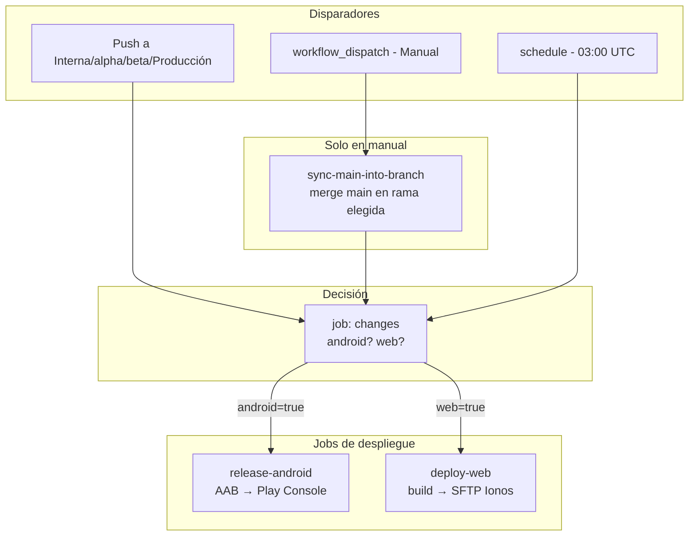
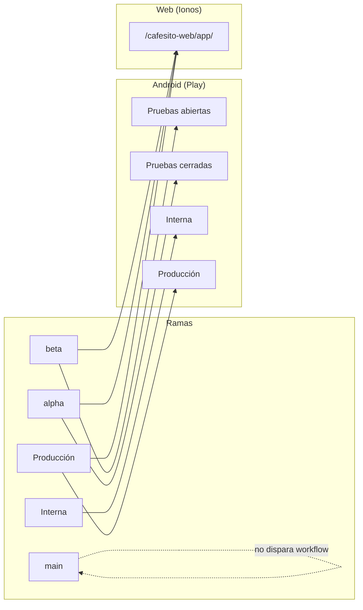

# Workflow Release & Deploy

**Estado:** vivo  
**Última actualización:** 2026-03-17  
**Fuente de verdad:** comportamiento por rama y despliegue (Android + Web).

Workflow único de GitHub Actions (`.github/workflows/release-deploy.yml`) que gestiona el release de Android en Google Play y el despliegue de la web en Ionos según la rama.

## Cuándo se ejecuta

- **Push** a ramas: `Interna`, `Interno`, `alpha`, `beta`, `Producción`, `Produccion` (las ramas canónicas son **alpha** y **beta** en minúsculas). **main** no está en la lista: un push a main no dispara el workflow (y el job `changes` tiene `if` que excluye push a main).
- **workflow_dispatch**: ejecución manual desde Actions → "Run workflow", eligiendo rama y opciones (solo Android, solo web, etc.). Antes de desplegar, el workflow **hace merge de `main` en la rama elegida** (y push), para que "Solo webapp" o "Solo Android" desplieguen **todos los cambios que hay en main** (ver más abajo).
- **Programado (schedule)**: todos los días a las **03:00 UTC** (deploy nocturno). La rama objetivo se define con la variable de repositorio `NIGHTLY_DEPLOY_BRANCH` (por defecto: `beta`).

### Si no quieres que se ejecute solo por cambios en cafés

- Entra en **Supabase Dashboard → Database → Webhooks**.
- Busca un webhook asociado a la tabla **`public.coffees`** que llame a la Edge Function **`trigger-coffees-build`**.
- **Opcional:** puedes dejarlo activo por trazabilidad, pero ya no lanza despliegues inmediatos.

Si lo dejas activo, la función responderá en modo diferido y el despliegue se aplicará en la ventana nocturna.

### Esquema del workflow: disparadores y jobs



### Esquema ramas → pistas



## Comportamiento por rama y por ficheros (push)

En **push a alpha o beta**: siempre se ejecutan **release-android** y **deploy-web** (así, al hacer merge de main en beta se despliega aunque el último commit solo toque docs o workflow).

En **push a otras ramas** (Interna, Producción): solo se ejecuta cada job si hay **ficheros modificados** que impactan a ese target (detección con `dorny/paths-filter`):

- **Release Android** se ejecuta solo si cambian ficheros de Android: `app/**`, `shared/**`, `gradle/**`, `build.gradle.kts`, `settings.gradle.kts`, `gradle.properties`, `gradle-wrapper.properties`, `libs.versions.toml`.
- **Deploy web** se ejecuta solo si cambian ficheros de la webapp: `webApp/**`.

En **workflow_dispatch** (manual) y en **schedule** (nocturno) no se usa filtro por ficheros: el usuario elige “solo Android” / “solo web” en manual, y en schedule la cola de Supabase decide si hay deploy web.

### Ejecución manual (workflow_dispatch): merge de main en la rama elegida

Cuando usas **Run workflow** con una rama (p. ej. **beta**) y marcas **Solo webapp** o **Solo Android**, el workflow hace lo siguiente para que el despliegue incluya **todos los cambios de main**:

1. **Job `sync-main-into-branch`** (solo en workflow_dispatch): hace checkout de la rama elegida, hace **merge de `origin/main`** en esa rama y hace **push**. Así la rama queda actualizada con el último código de main.
2. Los jobs **release-android** y **deploy-web** dependen de este job; hacen checkout de la rama ya actualizada y construyen/despliegan desde ahí.

Por tanto, no hace falta mergear main en beta a mano antes de pulsar "Run workflow": el propio workflow actualiza la rama con main y luego despliega solo el target que hayas elegido (webapp o Android) con todo el código actual de main.

| Rama         | Release Android (Play Console)     | Deploy web (Ionos)              |
|-------------|-------------------------------------|----------------------------------|
| **main**    | No se ejecuta el workflow           | —                                |
| **Interna** | Solo si hay ficheros que impactan Android → pruebas internas | No (rama no incluida en deploy web) |
| **alpha**   | **Siempre** en push → pruebas cerradas | **Siempre** en push → `/cafesito-web/app/` |
| **beta**    | **Siempre** en push → pruebas abiertas | **Siempre** en push → `/cafesito-web/app/` |
| **Producción** | Solo si hay ficheros que impactan Android → producción | Solo si hay ficheros que impactan webapp → `/cafesito-web/app/` |

- **alpha/beta**: en cada push se despliegan Android y web para que un merge desde main dispare el despliegue completo.
- **Otras ramas**: Android y web solo si el push incluye ficheros que impactan a cada uno (o en manual/schedule según configuración).

## Jobs del workflow

1. **sync-main-into-branch** (solo en workflow_dispatch)  
   Actualiza la rama elegida con `main` antes de desplegar: hace checkout de esa rama, `git merge origin/main` y push. Así, "Solo webapp" o "Solo Android" despliegan todos los cambios de main. En push y schedule este job no se ejecuta.

2. **changes**  
   Decide qué jobs ejecutar (`android` / `web`):
   - **Push a alpha o beta:** siempre `android=true` y `web=true` (siempre se despliegan ambos).
   - **Push a otras ramas:** usa `dorny/paths-filter` sobre los ficheros modificados: `android=true` si hay ficheros que impactan Android, `web=true` si hay ficheros que impactan `webApp/`.
   - **workflow_dispatch:** el usuario elige “solo Android”, “solo web” o ambos.
   - **schedule:** consulta `consume-deploy-changes` en Supabase; `web=true` solo si hay pendientes en la cola; `android=false` en schedule (evita releases diarios de Play sin push).

3. **release-android**  
   - Condición: rama en `Interna` / `alpha` / `beta` / `Producción` (según `NIGHTLY_DEPLOY_BRANCH`).
   - Configura keystore y `google-services.json`, hace bump de versión, build del AAB y subida a la pista de Play correspondiente.
   - Sube también los **símbolos nativos** (`debugSymbols`) generados por el build para que Play Console pueda mostrar ANR y crashes de forma legible.
   - **Notas de la versión (What’s new):** Se generan **solo con commits que tocan Android** (app/, shared/, gradle/, etc.), no con cambios solo de webApp. La referencia es **siempre la última versión desplegada a producción** (`deploy/android/production/*`) cuando exista: así, lo desplegado a beta/alpha recoge el "gap" con producción y cuando llegue a producción el usuario final ve **todas** las mejoras. Todo el texto de las notas está **en español**, con tono divertido y no técnico (ej. "Mejoras en tu despensa", "Retoques en tu diario"). Si no hay tag de producción (p. ej. primera vez), se usa el de la pista actual. Límite 500 caracteres (Play). Tras cada subida exitosa se crea el tag `deploy/android/<pista>/<versionCode>`. Así el usuario ve en “Qué hay de nuevo”    - **Tag de deploy:** Tras “Upload to Google Play” se hace push del tag `deploy/android/<track>/<versionCode>` para que la próxima ejecución pueda calcular las release notes.

   - **Migración AGP 9 (aplicada):** El proyecto usa AGP 9.0.1, Hilt 2.59.2, Gradle 9.1.0. En el módulo app no se aplica `org.jetbrains.kotlin.android` (Kotlin va integrado en AGP 9). En `gradle.properties` se usa `android.dependency.useConstraints=false` (la opción deprecada `excludeLibraryComponentsFromConstraints` se eliminó). El build sigue usando `--warning-mode none` para ocultar avisos menores restantes (anotaciones, safe calls, etc.). Referencia: [AGP 9](https://developer.android.com/build/releases/agp-9-0-0-release-notes), [Hilt 2.59 + AGP 9](https://github.com/google/dagger/releases).

4. **deploy-web**  
   - Condición: rama `alpha`, `beta` o `Producción` (según `NIGHTLY_DEPLOY_BRANCH`).
   - Ejecuta `npm ci`, `npm test`, `npm run build` en `webApp` y sube el contenido de `webApp/dist/` por **SFTP** (SSH) a Ionos en `/cafesito-web/app/`.

## Secretos necesarios

En **Settings → Secrets and variables → Actions**:

### Android / Play

- `GOOGLE_PLAY_JSON` – JSON del Service Account de Play.
- `ANDROID_KEYSTORE_BASE64` – Keystore en base64 (ver abajo).
- `ANDROID_KEYSTORE_PASSWORD`, `ANDROID_KEY_ALIAS`, `ANDROID_KEY_PASSWORD`.
- `GOOGLE_SERVICES_JSON` – Contenido de `google-services.json`.

**Configuración en Google Play Console (una vez):**

1. Google Play Console → **Configuración → Acceso a API**.
2. Crear **Service Account** desde el enlace a Google Cloud.
3. En Google Cloud, crear una **Key** tipo JSON para el Service Account.
4. En Play Console, **otorgar permisos** al Service Account (ej. Release Manager).

**Keystore en base64:** `base64 -w 0 your-release.keystore` (o en PowerShell: codificar el binario). Pegar como una sola línea sin espacios ni saltos.

**Notas (Android):** El workflow sube el release en estado **draft** para revisión manual en Play Console. El archivo `release-notes/whatsnew-es-ES` se genera con los mensajes de commit desde el último tag `deploy/android/<pista>/*` (límite 500 caracteres para Play). El checkout del job usa `fetch-tags: true` para disponer de esos tags. El commit de bump de versión usa `[skip ci]` para evitar loops.

**Declaración de Foreground Service (obligatoria una vez):** La app usa un servicio en primer plano (timer de elaboración en Brew Lab). Google Play exige declarar los tipos de foreground service en la consola. Si al subir el AAB aparece *"You must let us know whether your app uses any Foreground Service permissions"*, hay que completar la declaración en **Play Console → Tu app → Contenido de la app** (Monitor and improve → App content) → **Foreground service** (o equivalente). Declarar el tipo **Special use** y describir: "Timer de elaboración de café en curso: muestra tiempo restante y permite pausar/cancelar desde la notificación"; indicar el impacto si el sistema interrumpe o difiere la tarea (p. ej. el temporizador se detendría). En algunos casos la opción solo aparece tras una **primera subida manual** del AAB desde la consola; después, el workflow de GitHub Actions podrá subir sin ese error. Ver `docs/REGISTRO_DESARROLLO_E_INCIDENCIAS.md` §2.7.

### Web (Ionos, SFTP)

El deploy usa **SFTP** (no FTP); Ionos suele ofrecer acceso por SSH/SFTP.

- `IONOS_SSH_HOST` – Host del servidor (ej. `ssh.tudominio.com` o la IP).
- `IONOS_SSH_USER` – Usuario SFTP/SSH.
- `IONOS_SSH_PASSWORD` – Contraseña.
- `IONOS_SSH_PORT` – Puerto (opcional; por defecto 22).
- **`VITE_GOOGLE_CLIENT_ID`** – Client ID de tipo "Web" de Google Cloud (mismo que en Supabase → Auth → Google). Sin este secret/variable, el botón de login con Google no funcionará en la web desplegada.

El deploy web sube la app a **`/cafesito-web/app/`** y **`.well-known/assetlinks.json`** a **`/cafesito-web/.well-known/`** (App Links para Android). Para que `https://cafesitoapp.com/.well-known/assetlinks.json` responda, el servidor debe estar configurado para servir esa ruta (p. ej. alias o document root que incluya `/cafesito-web/.well-known/`).

**Problemas de hosting (500, document root, .htaccess, SPA fallback):** ver **`webApp/DEPLOY-IONOS.md`**.

### Error: `fatal: No url found for submodule path 'tmp/beta-check' in .gitmodules` (exit 128)

Si el workflow falla en **Post job cleanup** o en **sync-main-into-branch** / **deploy-web** con ese mensaje, hay un **submodule mal configurado** (p. ej. `tmp/beta-check` referenciado sin URL o sobrante). Corregir en tu clone local y hacer push:

```bash
# 1. Quitar el submodule del índice (no borra la carpeta local si existe)
git rm --cached tmp/beta-check 2>/dev/null || true

# 2. Si existe .gitmodules, editar y eliminar la sección [submodule "tmp/beta-check"]
# 3. Si la carpeta tmp/beta-check existe y no la necesitas, eliminarla
rm -rf tmp/beta-check

# 4. Confirmar y subir
git add .gitmodules 2>/dev/null || true
git status
git commit -m "fix(ci): remove invalid submodule tmp/beta-check"
git push origin <rama>
```

Tras el push, el siguiente run del workflow no debería encontrar el submodule roto.

### Cola de cambios Supabase (deploy nocturno)

- `SUPABASE_DEPLOY_QUEUE_URL` – URL de la Edge Function `consume-deploy-changes`.
- `SUPABASE_DEPLOY_QUEUE_TOKEN` – token compartido para proteger esa función (cabecera `x-deploy-token`).

### Revisión de crashes (manual, desde Cursor)

No hay workflow automático. Los crashes se revisan y resuelven **desde Cursor**: tú pones el informe en `.github/crash-reports/weekly.json` (o generas `docs/crash-fixes/pending-review.md` con el script), pides aquí que se revisen y resuelvan, y **tú subes a Git** cuando quieras. Ver `docs/CRASH_FIX_WEEKLY.md`.

## Resumen rápido

- **main**: no hace nada.
- **Push a Interna / alpha / beta / Producción**: release Android **solo si** hay ficheros que impactan Android; deploy web **solo si** hay ficheros que impactan la webapp (`webApp/`). Si cambian ficheros de ambos, se despliegan ambos.
- **workflow_dispatch**: eliges manualmente “solo Android”, “solo web” o ambos (sin filtro por ficheros). Antes de desplegar se hace merge de main en la rama elegida, así que el despliegue incluye todos los cambios de main.
- **schedule**: deploy web según cola Supabase; Android no se publica en schedule.
- Para cambiar la rama nocturna, ajusta `NIGHTLY_DEPLOY_BRANCH` en Variables de GitHub Actions.

## Registro de cambios de despliegue

Se documentan aquí los despliegues relevantes (push a main + Alpha/Beta/Producción) para trazabilidad.

| Fecha       | Ramas        | Descripción |
|------------|--------------|-------------|
| 2026-02-28 | main, Alpha  | **Webapp**: redirect OAuth con path completo (fix 500 PWA iOS), topbar hide on scroll down / show on scroll up, .htaccess excluye `registerSW.js`. Ver `docs/commit-notes/commit-20260228-webapp-main-alpha.md`. |
| 2026-03-16 | main, beta   | **Despensa/diario:** guardar y añadir desde elaboración y Home, stock restante en UI, método espresso títulos, fix 400 insert pantry (id UUID), modal "Café terminado" Android. **CI:** fix deploy-web (DiarySheets props, git 128 en job changes). Ver `docs/REGISTRO_DESARROLLO_E_INCIDENCIAS.md` §17 y `docs/commit-notes/commit-20260316-despensa-diario-deploy.md`. |
