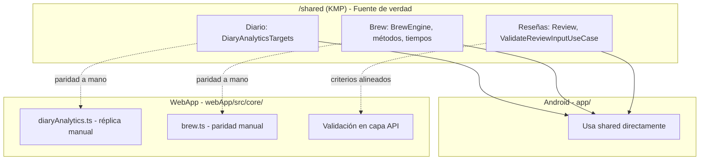

# Lógica de negocio compartida

**Propósito:** Documentar qué reglas de negocio son compartidas entre WebApp y Android (y dónde viven) para no duplicar ni divergir.

**Última actualización:** 2026-03-04  
**Ámbito:** WebApp (`webApp/`), Android (`app/`), módulo `shared/`.

---

## Esquema: dónde vive la lógica por área

**Regla:** Si existe en `/shared`, no duplicar en Web; si se replica en Web (diario, brew), mantener paridad de reglas de forma explícita.

---

## 1. Diario — objetivos y tendencias

### 1.1 Fuente de verdad (Android / iOS)

- **Módulo:** `shared/` (Kotlin multiplatform).
- **Clase:** `com.cafesito.shared.domain.diary.DiaryAnalyticsTargets`.
- **Contenido:**
  - Objetivos de hidratación por período: hoy 2000 ml, semana 14 000 ml, mes 60 000 ml.
  - Objetivos de cafeína: hoy 160 mg, semana 1120 mg, mes 4800 mg.
  - `trendPercent(actual, target)`: (actual - objetivo) / objetivo * 100.
  - `hydrationProgressPercent(actualMl, period)`: progreso 0..100.

### 1.2 Réplica en WebApp

- **Archivo:** `webApp/src/core/diaryAnalytics.ts`.
- **Contenido:** Mismas constantes y funciones (`hydrationTargetMl`, `caffeineTargetMg`, `trendPercent`, `hydrationProgressPercent`) para no depender del módulo Kotlin en web.
- **Mantenimiento:** Cualquier cambio en objetivos o fórmulas debe aplicarse en **ambos** sitios (shared y diaryAnalytics.ts) para que las tres plataformas coincidan.

### 1.3 Media últimos 30 días

- **Web:** `webApp/src/core/diaryAnalytics.ts` → `last30DaysDailyAverages(entries)`.
- **Android:** El ViewModel del diario calcula promedios por día en los últimos 30 días; la **media de mg** mostrada en la UI debe ser el promedio de un día en esos 30 días (alineado con la web). Tazas y progreso % son del día seleccionado.
- **Regla:** Un solo día de referencia (hoy o el seleccionado). Media mg = promedio diario en los últimos 30 días. Documentado también en `REGISTRO_DESARROLLO_E_INCIDENCIAS.md` (sección Diario).

---

## 2. Brew (elaboración)

- **Fuente de verdad:** `shared/` → `com.cafesito.shared.domain.brew` (BrewEngine, BrewCaffeineInput, BrewMethodProfile, BrewTimeProfile, etc.).
- **Android:** Usa directamente el shared (AddDiaryEntryScreen, BrewLab).
- **Web:** Lógica de Brew en `webApp/src/core/brew.ts` (tips, métodos, etc.). No comparte código con Kotlin; mantener paridad de reglas (tiempos, métodos, cafeína) de forma manual.

---

## 3. Reseñas y validación

- **Fuente de verdad:** `shared/` → `Review`, `ReviewRepository`, `ValidateReviewInputUseCase`.
- **Android:** `DetailViewModel` y repositorios usan shared.
- **Web:** Validación y envío de reseñas en la capa de datos/API; no hay módulo compartido con Kotlin. Mantener criterios de validación alineados (longitud, campos obligatorios).

---

## 4. Recomendaciones de café (timeline / “Recomendados para tu paladar”)

- **Android:** `app/.../timeline/TimelineViewModel.kt` → `buildCoffeeRecommendations(data)`. Basado en favoritos, reseñas y despensa del usuario; tags (origen, tueste, especialidad, formato); excluye los cafés ya interactuados; candidatos con tags en común, shuffle con seed.
- **Web:** La lista de recomendados puede venir del backend o de lógica en front (según implementación). Objetivo: mismo criterio (similares por tags, excluir ya favoritos/despensa/reseñas) para que la experiencia sea coherente.
- **Documentación:** Si la web tiene su propia función de recomendación, describirla aquí y mantener la misma regla de negocio (tags, exclusiones).

---

## 5. Formato de fechas y horas

- **Regla:** Fechas en diario: “Hoy” vs “dd/mm”; hora “HH:mm” o “dd/MM | HH:mm” según período. Consistencia entre web y Android en los mismos contextos (diario, posts, notificaciones).
- **Implementación:** Cada plataforma usa su API (Intl/Date en TS, SimpleDateFormat/Calendar en Kotlin). No hay módulo compartido; conviene documentar en este doc los formatos canónicos por contexto para no divergir.

---

## 6. Historial (cafés terminados)

- **Fuente de verdad:** Supabase tabla `pantry_historical` (`user_id`, `coffee_id`, `finished_at`). No hay tabla local como fuente; Room (Android) y estado en web son caché/sincronizados desde Supabase.
- **Android:** `SupabaseDataSource.getFinishedCoffees` / `insertFinishedCoffee`; `DiaryRepository.syncFinishedCoffees()` actualiza Room desde Supabase; al marcar "Café terminado" se inserta en Supabase, se borra de `pantry_items` (Supabase + local) y se re-sincroniza el historial.
- **WebApp:** `fetchUserData` incluye `pantry_historical`; `insertFinishedCoffee` al marcar terminado; se elimina de despensa (`pantry_items`) y el estado local se actualiza.
- **Coordinación:** Ambas plataformas leen/escriben la misma tabla; el historial se comparte entre dispositivos y se respalda en Supabase.

---

## 7. Resumen

| Área | Shared (Kotlin) | WebApp (TypeScript) | Notas |
|------|-----------------|----------------------|--------|
| Diario objetivos/tendencias | `DiaryAnalyticsTargets` | `diaryAnalytics.ts` | Mantener paridad a mano. |
| Media 30 días | — | `last30DaysDailyAverages` | Android calcula equivalente en ViewModel. |
| Brew | `shared/domain/brew` | `brew.ts` | Paridad manual. |
| Reseñas | shared (validación + repo) | API + validación en front | Criterios alineados. |
| Recomendaciones | `TimelineViewModel.buildCoffeeRecommendations` | Lógica front o API | Misma regla (tags, exclusiones). |
| Fechas/horas | — | — | Mismos formatos por contexto. |
| Historial (cafés terminados) | — | — | **Supabase** `pantry_historical`; Android y web sincronizados. |

Al cambiar una regla de negocio en uno de los lados, comprobar si debe reflejarse en el otro y actualizar este documento.
