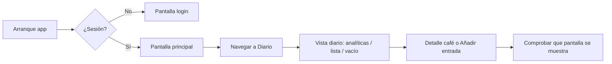

# Tests de humo críticos

**Propósito:** Definir el flujo mínimo que debe validarse para no romper lo básico al tocar estilos, máscaras o navegación. Un test por plataforma (o suite mínima) que cubra login → diario → detalle o añadir entrada.

**Última actualización:** 2026-03-04  
**Ámbito:** WebApp, Android.

---

## Esquema: flujo crítico de humo

Este flujo es el **mínimo** que debe validarse para no romper lo básico al tocar estilos, máscaras o navegación.

---

## 1. Flujo crítico a cubrir

1. **Login (o sesión existente):** La app muestra sesión iniciada o pantalla de login.
2. **Navegación a Diario:** El usuario puede abrir la pestaña/sección Diario.
3. **Vista diario:** Se muestra la pantalla del diario (analíticas, lista de entradas o estado vacío).
4. **Detalle de café o añadir entrada:** Desde el diario o desde explorar, el usuario puede abrir un detalle de café o añadir una entrada (café/agua).

No es obligatorio automatizar el login con Google (puede mockearse o usarse cuenta de prueba); el objetivo es que la navegación y las pantallas principales no se rompan.

---

## 2. WebApp

- **Stack:** Vitest + React Testing Library (ya en uso en `webApp/src/App.test.tsx`).
- **Ubicación sugerida:** `webApp/src/` — tests que rendericen `App` o contenedor principal con mocks de auth y datos (Supabase/API).
- **Casos mínimos:**
  - Render de la app y presencia de navegación (Inicio, Explorar, Elabora, Diario, Perfil) — **ya cubierto** en `App.test.tsx`.
  - (Opcional) Con sesión mockeada: cambiar a pestaña Diario y comprobar que se muestra la vista de diario (texto "MI DIARIO" o analíticas / lista vacía).
  - (Opcional) Navegar a Explorar, simular clic en un café y comprobar que se muestra detalle o panel de café.

Añadir estos casos en el mismo archivo o en `webApp/src/features/diary/DiaryView.test.tsx` / `AppContainer.test.tsx` según convenga, manteniendo mocks de Supabase y auth.

---

## 3. Android

- **Stack:** Instrumented tests (AndroidJUnit4) en `app/src/androidTest/`. Para Compose: `androidx.compose.ui.test.junit4` y `ComposeTestRule`.
- **Ubicación:** `app/src/androidTest/java/com/cafesito/app/` (renombrar paquete si sigue `com.example.app`).
- **Casos mínimos:**
  - Lanzar la app (HiltTestRunner si se usa inyección en tests) y comprobar que la pantalla principal se muestra (timeline o login según estado).
  - Con usuario ya logueado (o mock): navegar a la pestaña Diario (por contenido descrito "Diario" o testTag) y comprobar que aparece la pantalla del diario (por texto "Mi diario", "Sin café o agua registrada", o analíticas).
  - (Opcional) Abrir un detalle de café desde búsqueda o lista y comprobar que la pantalla de detalle se muestra.

Requisitos: `ContentDescription` o `testTag` en los elementos clave (tabs, botones de navegación) para que los tests sean estables. Ver `docs/ACCESIBILIDAD_WEBAPP_ANDROID.md`.

---

## 4. Ejecución

- **Web:** `cd webApp && npm run test` (o `pnpm test`).
- **Android:** `./gradlew :app:connectedDebugAndroidTest` (con dispositivo o emulador) o `:app:testDebugUnitTest` para unit tests; los flujos de humo anteriores son instrumentados.

---

## 5. Mantenimiento

Al cambiar la estructura de navegación, textos de pestañas o rutas, actualizar los tests de humo para que sigan encontrando la pantalla de Diario y, si aplica, la de detalle. Revisar también que los mocks (auth, API) sigan siendo válidos.
