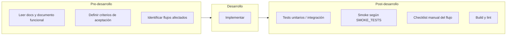

# Testing: pre-desarrollo y post-desarrollo

**Propósito:** Definir qué validar **antes** de codear (criterios, documentación, alcance) y **después** de implementar (tests, smoke, checklist manual) para garantizar el correcto funcionamiento y reducir regresiones.

**Estado:** vivo  
**Última actualización:** 2026-03-17  
**Ámbito:** Android, WebApp; desarrollo con o sin IA.

---

## 1. Esquema general

---

## 2. Pre-desarrollo (antes de escribir código)

### 2.1 Consultar documentación

- **Obligatorio:** Revisar `docs/README.md` (índice) y los documentos que impacten el cambio:
  - Flujo o pantalla afectada → `docs/DOCUMENTO_FUNCIONAL_CAFESITO.md` (flujos y criterios de aceptación).
  - Arquitectura / capas → `docs/MASTER_ARCHITECTURE_GOVERNANCE.md`, `docs/SHARED_BUSINESS_LOGIC.md`.
  - UI / diseño → `docs/DESIGN_TOKENS.md`, `docs/GUIA_UNIFICACION_COMPONENTES_UI.md`.
  - Rutas, pantallas o eventos de analíticas → `docs/ANALITICAS.md` (checklists §9; guías GTM en `docs/gtm/`).
  - UI interactiva o componentes (botones, modales, listas) → `docs/ACCESIBILIDAD_WEBAPP_ANDROID.md` (checklist a11y).
  - Deploy / CI → `docs/RELEASE_DEPLOY_WORKFLOW.md`, `docs/REGISTRO_DESARROLLO_E_INCIDENCIAS.md` (incidencias recientes).
- **Objetivo:** Evitar duplicar lógica, romper contratos o repetir errores ya documentados.

### 2.2 Definir criterios de aceptación

- Para cada cambio funcional, anotar **qué debe cumplirse** para dar por cerrada la tarea (ej.: "Al guardar en despensa desde Selecciona café, la elaboración muestra el café recién añadido").
- Si el comportamiento no está descrito en `DOCUMENTO_FUNCIONAL_CAFESITO.md`, considerar añadirlo tras el desarrollo (y actualizar el doc).

### 2.3 Identificar flujos y pruebas afectados

- Listar pantallas y flujos que tocan el cambio (ej.: Despensa desde Home, Despensa desde Elaboración, Diario).
- Revisar `docs/SMOKE_TESTS.md`: si el cambio afecta al flujo crítico (login → diario → detalle/añadir), el smoke debe seguir pasando después.

---

## 3. Post-desarrollo (después de implementar)

### 3.1 Build y análisis estático

| Plataforma | Comando | Qué valida |
|------------|--------|------------|
| WebApp | `cd webApp && npm run build` | TypeScript, bundling, sin errores de compilación. |
| WebApp | `cd webApp && npm test` | Tests unitarios/configurados. |
| Android | `./gradlew compileDebugKotlin` o `assembleDebug` | Compilación Kotlin/Compose. |
| Android | `./gradlew :app:testDebugUnitTest` | Unit tests. |

Si el cambio toca CI (workflow, tipos exportados), un push a una rama que dispare el workflow (p. ej. beta) sirve como validación de deploy.

### 3.2 Tests de humo (flujo crítico)

- Seguir **`docs/SMOKE_TESTS.md`**: al menos el flujo mínimo (arranque → sesión → Diario → detalle o añadir entrada) debe poder ejecutarse sin fallos.
- **WebApp:** `npm run test` (incluye cobertura básica de navegación y render).
- **Android:** tests instrumentados en `app/src/androidTest/` para el flujo crítico (cuando existan); comprobación manual en emulador/dispositivo si no están automatizados.

### 3.3 Checklist manual por flujo afectado

Comprobar manualmente los flujos que el cambio toca, usando los criterios del **documento funcional**:

- **Despensa:** Añadir desde Home y desde Elaboración; ver stock restante correcto; guardar sin error 400; elaboración queda con café/ítem correcto tras guardar.
- **Diario:** Añadir entrada café/agua; ver entradas; Cafés probados y vuelta atrás correcta.
- **Elaboración:** Selecciona café (página/pantalla); elegir café y cerrar; crear café y guardar en despensa y verlo en elaboración.
- **Perfil:** Actividad con estado de carga y listado/vacío.

Anotar cualquier incidencia para corregir o documentar.

### 3.4 Lint y convenciones

- WebApp: ejecutar lint si está configurado (`npm run lint` o similar).
- Android: revisar que no queden warnings críticos en el módulo tocado; respetar `libs.versions.toml` y convenciones del proyecto.

---

## 4. Resumen: checklist rápido post-cambio

- [ ] Build correcto (WebApp: `npm run build`; Android: `./gradlew compileDebugKotlin` o equivalente).
- [ ] Tests existentes pasan (WebApp: `npm test`; Android: unit tests del módulo).
- [ ] Flujo de humo crítico (login → Diario → detalle/añadir) comprobado (automático o manual).
- [ ] Flujos específicos del cambio probados a mano según documento funcional.
- [ ] Sin regresiones obvias en pantallas relacionadas (navegación, datos mostrados).
- [ ] Si aplica: documentación o registro actualizados (REGISTRO, documento funcional, commit-notes).

---

## 5. Referencias

- **Flujo crítico y ubicación de tests:** `docs/SMOKE_TESTS.md`
- **Criterios de aceptación por flujo:** `docs/DOCUMENTO_FUNCIONAL_CAFESITO.md`
- **Analíticas (rutas, eventos, GTM):** `docs/ANALITICAS.md`; guías paso a paso en `docs/gtm/`
- **Accesibilidad (checklist al cambiar UI):** `docs/ACCESIBILIDAD_WEBAPP_ANDROID.md`
- **Desarrollo con IA (consultar docs antes de código):** `docs/DEVELOPMENT_WORKFLOW_AI_CURSOR.md`
- **Incidencias recientes (evitar repetir):** `docs/REGISTRO_DESARROLLO_E_INCIDENCIAS.md`
