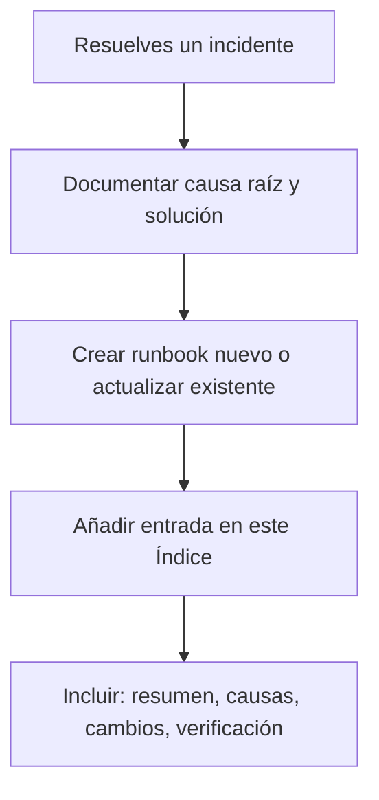

# Runbooks — Guías de resolución de incidentes

**Estado:** vivo  
**Última actualización:** 2026-03-04  

Runbooks documentan causas raíz, pasos de resolución y cambios permanentes aplicados para no repetir errores.

### Cuándo crear o actualizar un runbook

---

## Índice de runbooks

| Runbook | Ubicación | Ámbito |
|---------|-----------|--------|
| Revisión y resolución de crashes (manual, Cursor) | [../CRASH_FIX_WEEKLY.md](../CRASH_FIX_WEEKLY.md) | Android / multiplataforma |
| Notificaciones Timeline/Push (menciones, trigger push, FCM) | [../supabase/NOTIFICATIONS_RUNBOOK_2026-03-04.md](../supabase/NOTIFICATIONS_RUNBOOK_2026-03-04.md) | Supabase / backend / clientes |

---

## Convención

- **Nombre:** descriptivo + fecha si es por incidente concreto (ej. `NOTIFICATIONS_RUNBOOK_2026-03-04.md`).
- **Contenido mínimo:** resumen ejecutivo, causas raíz, cambios aplicados (scripts SQL, código, config), pasos de verificación.
- Al resolver un incidente nuevo: crear o actualizar runbook y añadir entrada aquí.
